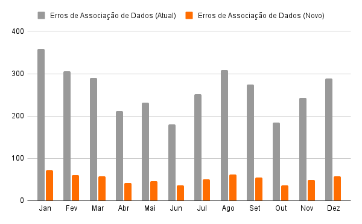

# SPRINT 1 

## 1 - Análise do parceiro de projeto e Business Drivers

&emsp;&emsp;O projeto é desenvolvido em parceria com o Instituto de Pesquisa e Tecnologia (IPT), uma instituição com 38% da sua infraestrutura sendo de total responsabilidade do governo federal, reconhecida por suas ótimas estratégias e planejamentos em inspeções técnicas, pesquisas e desenvolvimentos. O foco da colaboração é a revisão predial, onde o IPT, após ser acionado, envia uma equipe para realizar vistorias, fotografar e planejar estratégias de ação. O resultado dessas inspeções é um laudo técnico, que é posteriormente enviado para o cliente acionista ou a empresas responsáveis pela execução do planejamento. O objetivo é otimizar esse processo com soluções arquiteturais, tornando-o mais eficiente e ágil, ao mesmo tempo em que se mantém a alta qualidade e automação técnica do IPT.

### 1.1 - Setor de aplicação

&emsp;&emsp;O setor de aplicação deste projeto é focado em inspeções prediais, com o objetivo de melhorar a eficiência nas vistorias realizadas pelo Instituto de Pesquisa e Tecnologia (IPT). Essas inspeções abrangem a análise de edificações, com foco em identificar possíveis falhas estruturais e operacionais. O projeto visa otimizar o processo de geração de relatórios técnicos, desde a coleta de dados em campo até a emissão dos laudos que orientam as ações corretivas a serem executadas por outras empresas.

### 1.2 - Adição de Valor

&emsp;&emsp;O projeto oferece valor ao aprimorar a arquitetura de uma plataforma dedicada às inspeções prediais, simplificando o processo de coleta, análise e emissão de relatórios. A otimização agrega desde a fase inicial de vistorias até a geração de laudos técnicos, proporcionando maior agilidade na execução das inspeções e garantindo que os relatórios sejam produzidos com mais precisão e rapidez. Além disso, a automatização de etapas críticas reduz erros humanos, melhora a eficiência operacional e possibilita uma resposta mais rápida, segura, resiliente e confiável às necessidades do cliente, resultando em maior satisfação e confiabilidade nos serviços prestados.

### 1.3 - Processo de Negócio e Fluxos Críticos Suportados pelo Sistema 

<div style="text-align: center;">
    <div>
        
    </div>
</div>

&emsp;&emsp;A imagem mostra um fluxograma de processos que envolve três principais partes: Cliente, Pesquisador de Campo, e Sistema Interno, dividido entre "Pesquisador Analista" e "Sistema". O fluxo descreve as etapas do processo de inspeção predial, desde a requisição inicial do cliente até a finalização do documento.

&emsp;&emsp;Cliente:

- O cliente requisita o serviço, iniciando o processo.

&emsp;&emsp;Pesquisador de Campo:

- Após o pedido, o pesquisador de campo é acionado para realizar a inspeção. 
- Ele faz a coleta de provas e encaminha essas informações para o sistema interno.

&emsp;&emsp;Sistema Interno (Pesquisador Analista):

- O pesquisador analista valida e analisa a problemática recebida.
- As provas (imagens e anotações) são enviadas e digitalizadas no sistema.
- A análise das provas é feita, e o sistema atualiza os documentos relacionados ao caso de estudo.

&emsp;&emsp;Decisão de Finalização do Estudo:

&emsp;&emsp;Uma verificação é realizada para saber se o estudo está finalizado. Se não estiver, novas atualizações nos documentos são feitas, retornando para a fase de análise. Se o estudo estiver concluído, o documento é indexado e assinado nos servidores locais, encerrando o processo com a geração do documento finalizado.
O diagrama destaca o ciclo de validação, coleta e análise, além do ponto de decisão sobre a finalização do estudo, com a possibilidade de retornar etapas até que o processo esteja completo.

### 1.4 - Volumes 

&emsp;&emsp;Nesta seção, são analisados os volumes e vulnerabilidades associados ao sistema de inspeção predial, com foco nos pontos críticos que podem comprometer a eficiência e segurança do processo. O objetivo é identificar áreas de risco, como sobrecarga de requisições, falhas no envio de dados e problemas de integridade dos documentos, propondo melhorias que aumentem a resiliência do sistema. Esses pontos são importantes para garantir que o fluxo de informações entre clientes, pesquisadores e o sistema interno ocorra de forma estável, segura e sem interrupções.

&emsp;&emsp;Volume de Clientes e Requisições:

- Vulnerabilidade: O volume de clientes pode causar sobrecarga no sistema em momentos de picos de uploads dentro do Drive. Isso pode levar a lentidão ou falhas na etapa final do processo.
- Aprimoramento: Implementar mecanismos de escalabilidade automática para lidar com picos de demanda e garantir alta disponibilidade.

&emsp;&emsp;Coleta de Dados e Provas:

- Vulnerabilidade: A fase de "Realiza inspeção e coleta provas" envolve um volume significativo de dados, como imagens e notas. O envio de grandes volumes de dados pode sofrer com falhas de conectividade ou limitações de largura de banda.
- Aprimoramento: Implementar mecanismos de compressão de arquivos e verificação de integridade no envio de imagens e provas, garantindo que os dados não sejam corrompidos ou perdidos durante a transmissão.

&emsp;&emsp;Envio e Digitalização de Imagens e Anotações:

- Vulnerabilidade: O processo de "Faz o envio de imagens e digitalização" é sujeito a falhas durante a digitalização ou upload de documentos, especialmente em casos de baixa conectividade ou a falta de um padrão pré estabelecido. Isso pode resultar em perda de dados ou atrasos no processo.
- Aprimoramento: Adicionar validação de uploads e uma funcionalidade de recuperação automática em caso de falha, além de garantir que os documentos digitalizados estejam em conformidade com os padrões exigidos.

&emsp;&emsp;Análise de Provas:

- Vulnerabilidade: A etapa de "Análise de provas" depende da integridade dos dados coletados. Se as provas enviadas estiverem corrompidas ou incompletas, isso pode comprometer a qualidade da análise. Acarretando assim, em uma pilha de erros consecutivos.
- Aprimoramento: Implementar sistemas de monitoramento contínuo para verificar a completude e a integridade das provas antes da análise.

&emsp;&emsp;Atualizações de Documentos:

- Vulnerabilidade: Durante a etapa de "Atualizações de documentos acerca do caso de estudo", qualquer falha de sincronização ou inconsistência nos dados pode atrasar a conclusão dos estudos e afetar o processo de tomada de decisão.
- Aprimoramento: Usar versionamento de documentos e backups automáticos para garantir que as atualizações sejam realizadas sem perda de dados e com controle de versões.

&emsp;&emsp;Indexação e Assinatura em Servidores Locais:

- Vulnerabilidade: A etapa final de "Indexação e assinatura em servidores locais" representa um ponto crítico de vulnerabilidade, pois qualquer falha no armazenamento local e falsificação de assinatura pode resultar na perda permanente dos documentos finais.
- Aprimoramento: Implementar redundância nos servidores de armazenamento e adotar um sistema de replicação de dados em tempo real para minimizar o risco de perda de documentos.

&emsp;&emsp;Pontos Críticos Identificados:
- Sobrecarga e escalabilidade na requisição e uploads de serviços.
- Falhas no envio e coleta de dados devido à conectividade e volumes elevados.
- Perda ou corrupção de dados durante a digitalização e upload de documentos.
- Inconsistências e falhas de integridade durante a análise e atualização de provas.

&emsp;&emsp;Esses pontos são cruciais para garantir a estabilidade e a eficiência do sistema, e os aprimoramentos propostos visam mitigar essas vulnerabilidades diretamente.

### 1.5 - Estatégias de Crescimento

&emsp;&emsp;As estratégias de crescimento visam consolidar e expandir o alcance da plataforma de inspeção predial, garantindo eficiência operacional e diversificação de mercado. A implementação dessas ações permitirá escalar o sistema, atrair novos clientes e garantir a sustentabilidade a longo prazo:

- Automatização de Processos: Implementar automação para reduzir erros humanos e agilizar fluxos de trabalho.

- Parcerias Estratégicas: Firmar parcerias com empresas, órgãos reguladores e universidades para ganhar credibilidade e acessar novos mercados.

- Otimização Tecnológica: Melhorar a infraestrutura para lidar com maiores volumes de dados sem comprometer o desempenho.

- Expansão da Equipe: Ampliar a equipe de desenvolvimento para inovar e atender demandas de crescimento.

- Modelos de Monetização Flexíveis: Adotar planos personalizados e por uso para aumentar receita e atrair clientes de diferentes perfis.

&emsp;&emsp;Ao adotar essas estratégias, a plataforma estará preparada para crescer de forma sustentável, oferecendo soluções mais robustas, ampliando sua presença em diversos setores e aumentando a satisfação dos usuários por meio de inovações contínuas.

## 2 - Riscos e Oportunidades

&emsp;&emsp;Este tópico apresenta uma análise acerca dos principais riscos envolvidos na utilização do sistema atual de armazenamento e tratamento de documentos adotado pela IPT, com foco nos aspectos de integridade e não-repúdio. Adicionalmente, são exploradas as oportunidades de melhoria, considerando o impacto direto no cumprimento dos Acordos de Nível de Serviço (SLAs), como o aumento da confiabilidade, eficiência e segurança no tratamento das informações. O objetivo é identificar as vulnerabilidades que comprometem a integridade dos dados e a possibilidade de auditoria, além de propor soluções tecnológicas que garantam a segurança e a rastreabilidade dos documentos.

### 2.1 - Riscos ligados ao Sistema 

* Falta de Garantia de Integridade dos Documentos: O sistema atual baseado no One Drive não oferece mecanismos robustos para garantir a integridade dos documentos. Qualquer pessoa com acesso indevido ao arquivo pode alterá-lo sem gerar um registro claro e imutável das mudanças, comprometendo a confiabilidade das informações. Esse cenário expõe a empresa ao risco de manipulação de dados sem detecção, o que pode comprometer o processo de inspeção.

* Ausência de Não-Repúdio: No formato atual, não há uma trilha auditável que garanta o não-repúdio, ou seja, os responsáveis por modificações ou acessos aos documentos não são identificados de maneira inquestionável. Isso cria uma vulnerabilidade, já que qualquer pessoa com permissão pode alterar ou excluir arquivos sem deixar rastros de quem fez a modificação, dificultando a atribuição de responsabilidades.

* Histórico de Versões Insuficiente: Embora o One Drive ofereça uma funcionalidade básica de histórico de versões, ele não é suficientemente robusto para garantir a rastreabilidade necessária em um processo formal de inspeção predial. Não há garantias de que todas as alterações sejam registradas corretamente, e pode não ser possível determinar o estado exato de um documento em momentos específicos, comprometendo a capacidade de auditoria e verificação de conformidade com padrões normativos.

* Problemas na Garantia de Backups Adequados: O sistema atual depende do One Drive como única fonte de armazenamento, o que pode ser insuficiente em termos de backup e recuperação de dados. Em caso de falha no serviço ou de exclusão acidental, não há garantias de que as informações possam ser recuperadas de forma completa e íntegra. A falta de backups distribuídos e seguros representa um risco de perda irreparável de dados importantes para a empresa.

* Impossibilidade de Auditoria Completa: O modelo atual não permite uma auditoria completa e detalhada dos acessos e alterações realizadas nos documentos. A ausência de registros detalhados impede que seja possível verificar de maneira precisa quem fez o que, quando e por quê. Isso afeta diretamente a capacidade de controle sobre o fluxo de informações, o que é essencial em processos de inspeção predial para garantir a precisão dos registros.

* Vulnerabilidade à Corrupção de Dados: O uso de armazenamento em nuvem sem um sistema robusto de verificação de integridade periódica pode expor os documentos à corrupção de dados sem que isso seja detectado de forma imediata. A falta de mecanismos automatizados de verificação contínua dos arquivos compromete a capacidade da empresa de garantir que os documentos estejam sempre no estado correto e sem alterações maliciosas ou acidentais.

### 2.2 - Oportunidades de Melhorias dos SLAs 

* Implementação de Controle de Versão com Garantia de Integridade: Um sistema que registre automaticamente todas as alterações realizadas em um documento, garantindo a imutabilidade do histórico de versões, pode melhorar significativamente a integridade dos dados. Isso permite que a empresa saiba, com precisão, o que foi alterado, por quem e em que momento, oferecendo uma trilha auditável e clara para qualquer documento. Assim, qualquer alteração suspeita pode ser identificada, e a versão original pode ser recuperada de forma segura.

* Garantia de Não-Repúdio com Assinaturas Digitais: A adoção de um sistema que implemente assinaturas digitais para validar o acesso e a modificação de documentos garantiria o não-repúdio, atribuindo com segurança todas as ações a usuários específicos. Esse mecanismo impede que alguém negue ter realizado uma alteração, fortalecendo o controle sobre a manipulação dos dados e melhorando a responsabilidade no processo.

* Backup Automatizado e Seguro: A implementação de backups automatizados, com múltiplas camadas de segurança e redundância geográfica, assegura que os dados possam ser recuperados em caso de falha ou corrupção. Esse processo garante que os documentos críticos da empresa estejam sempre disponíveis e íntegros, mesmo em cenários de perda ou ataques maliciosos. A realização periódica de backups completos também permitiria à IPT manter um histórico seguro de todos os dados.

* Auditoria Completa e Detalhada: Um sistema com capacidade de auditoria total, registrando detalhadamente todas as ações relacionadas a cada documento, proporciona maior transparência e controle sobre os processos. Isso possibilitaria ao IPT gerar relatórios completos e detalhados de quem acessou ou modificou documentos, promovendo uma governança mais robusta e atendendo a requisitos de conformidade normativa e regulamentar.

* Verificação Automática de Integridade: A adoção de mecanismos automáticos de verificação de integridade para todos os documentos no sistema garante que qualquer corrupção ou modificação não autorizada seja detectada imediatamente. Isso eleva a confiança nos dados armazenados, uma vez que qualquer alteração indevida será rapidamente identificada e corrigida. Esse processo também ajuda a preservar a qualidade e confiabilidade dos registros de inspeção predial.

* Centralização e Padronização do Fluxo de Documentos: A centralização do armazenamento e tratamento de documentos em um sistema com padrões rigorosos de controle facilita o cumprimento de SLAs, ao garantir que todos os processos de manipulação de documentos sigam regras pré-definidas e auditáveis. Isso elimina o uso de métodos manuais e descentralizados, reduzindo o tempo de resposta e aumentando a confiabilidade das informações tratadas.


## 3 - Arquitetura do Sistema Novo - Especificação de Requisitos

### 3.1 - Requisitos Não-Funcionais 

&emsp;&emsp;Os requisitos não funcionais são aspectos que definem a qualidade e as restrições do sistema, focando em atributos como segurança, desempenho, usabilidade, e manutenibilidade, em vez de funcionalidades específicas. Eles determinam o "como" o sistema deve funcionar e são essenciais para garantir a eficácia e confiabilidade da solução.

&emsp;&emsp;Neste projeto, escolhemos focar em **não repúdio** e **integridade** devido à necessidade de garantir a confiabilidade e segurança dos documentos das inspeções prediais realizadas pelo IPT. O **não repúdio** é crucial para rastrear quem acessou, alterou ou compartilhou os documentos, evitando que responsáveis neguem suas ações. Já a **integridade** assegura que os dados permaneçam consistentes e livres de alterações não autorizadas. Essas melhorias são essenciais para mitigar riscos legais e operacionais, otimizando a autenticidade e precisão dos relatórios técnicos.

&emsp;&emsp;A norma [ISO 25010](https://www.iso25000.com/index.php/en/iso-25000-standards/iso-25010), que define os padrões para a avaliação da qualidade de sistemas e software, serve como referência para este projeto. Ela especifica diretrizes e atributos de qualidade de software, como segurança e integridade, que são diretamente abordados nos requisitos selecionados, garantindo que o sistema atenda aos padrões de qualidade e segurança necessários para a inspeção predial.

### RNF-01: Não Repúdio

&emsp;&emsp;O sistema deve implementar mecanismos que garantam que todas as ações realizadas (como envio, recebimento e modificação de documentos) sejam rastreáveis e autenticadas, assegurando a **responsabilidade** e **prestação de contas** de cada usuário.

**Estado Atual:**
- No sistema atual, que utiliza o OneDrive como repositório central, existe um histórico básico de versões, mas ele é incompleto. O histórico de versões do OneDrive não registra adequadamente algumas ações, como exclusões de arquivos ou substituições de documentos. Essas limitações comprometem a rastreabilidade total das ações, uma vez que alterações críticas ou exclusões podem ocorrer sem deixar um registro adequado. Essa falta de rastreamento completo permite que ações indevidas ocorram sem que seja possível identificar o responsável, gerando risco para a confiabilidade dos relatórios.

**Melhoria no Sistema Novo:**
  - O novo sistema garantirá que todas as ações realizadas sobre os documentos possam ser atribuídas a um responsável específico, eliminando a possibilidade de um usuário alegar que não foi o autor de uma modificação ou exclusão.
  - Espera-se um registro completo e auditável de todas as interações com os documentos, desde a coleta até o armazenamento final, incluindo todas as alterações, visualizações e transferências.
  - Além disso, será fundamental que o sistema consiga provar a autenticidade das ações realizadas, garantindo que ninguém possa modificar os registros de atividades ou negar suas ações. O objetivo é alcançar 98% de rastreabilidade nas ações documentadas, reduzindo incidentes de acesso não autorizado.

#### Justificativa:

1. **Necessidade de rastreabilidade, autenticidade e prestação de contas:** O fluxo atual envolve a coleta manual de fotos e laudos por várias equipes especializadas, o que pode resultar em falta de rastreamento preciso de quem capturou cada informação. A implementação de controle de acessos e logging detalhado garantirá que todas as ações sejam registradas, assegurando a responsabilidade individual, especialmente em casos onde há redundância de registros e múltiplas equipes envolvidas.
2. **Redução de riscos e aumento da confiança:** A centralização das informações em uma única pasta no OneDrive, acessível por várias equipes, cria vulnerabilidades em termos de controle de versões e integridade dos documentos. Com o novo sistema de versionamento e rastreamento de alterações, será possível identificar precisamente quem modificou ou adicionou cada item, reduzindo o risco de erros e aumentando a confiabilidade dos dados compartilhados.

### RNF-02: Integridade

&emsp;&emsp;O sistema deve garantir que os documentos e dados mantenham sua precisão e consistência, detectando qualquer alteração (autorizada ou não) ou dano aos arquivos. A meta é assegurar 99% de precisão dos dados após verificações automáticas.

**Estado Atual:**
- Atualmente, o sistema apresenta vulnerabilidades que afetam a integridade dos dados antes e depois da transferência para o OneDrive. Nos dispositivos locais, os arquivos podem ser alterados, corrompidos ou até mesmo perdidos antes de serem enviados à nuvem. Além disso, o controle de versão básico do OneDrive não oferece proteção adequada contra substituições ou exclusões, o que compromete a integridade dos documentos. Esse processo manual de coleta e associação de dados, feito pelos inspetores, também gera o risco de erro humano, como a associação incorreta de dados ao local da obra.

**Melhoria no Sistema Novo:**
  - O novo sistema deve garantir que todos os documentos e dados coletados permaneçam intactos, tanto nos dispositivos locais quanto após a transferência para a nuvem. Espera-se que o sistema consiga detectar qualquer modificação não autorizada ou perda de dados durante todas as etapas do processo de inspeção.
  - Técnicas como **hashing** e **checksums** serão aplicadas em 100% dos documentos, e as verificações automáticas de integridade devem detectar e sinalizar qualquer alteração suspeita para revisão. O objetivo é alcançar um nível de precisão de dados de 99%, minimizando ao máximo a possibilidade de alterações não autorizadas.

#### Justificativa:

1. **Garantia da precisão e confiabilidade dos dados:** Atualmente, os laudos escritos à mão e digitalizados posteriormente estão sujeitos a erros. A introdução de técnicas como hashing e checksums permitirá verificar automaticamente se os documentos sofreram alterações indesejadas ao longo do processo, garantindo que o conteúdo permaneça autêntico desde a coleta até o armazenamento final.
2. **Conformidade com padrões de segurança e integridade:** A ausência de uma padronização na organização das fotos e laudos em uma única pasta por prédio no OneDrive cria riscos de duplicação e inconsistência nos registros. A adoção de medidas de verificação de integridade e armazenamento seguro proporcionará um controle mais rigoroso, mantendo a conformidade com as diretrizes de segurança do IPT e evitando a utilização de informações corrompidas.
3. **Automatização de verificações:** Com o uso de hashing e checksums para verificar os arquivos automaticamente, será possível identificar rapidamente documentos duplicados ou corrompidos no sistema, otimizando o processo de digitalização e upload de laudos e fotos. Isso reduzirá significativamente o tempo gasto com tarefas manuais de verificação e aumentará a eficiência na gestão dos dados do IPT.

## 4 - Visão Modelo Comportamental (Simulação do Atual)

### 4.1 - Estrutura Estática do Modelo 

&emsp;&emsp;A estrutura estática do modelo de simulação do sistema atual de inspeção predial reflete a interação entre diferentes componentes que, juntos, suportam o fluxo de inspeção e o armazenamento dos dados coletados. O sistema atual apresenta os seguintes elementos principais:

**1. Elementos do Sistema**

- Inspetor de Campo: O profissional que realiza as inspeções prediais manualmente. Ele utiliza dispositivos locais, como câmeras digitais e pranchetas para anotar dados, capturar imagens, e realizar o registro de problemas encontrados. O inspetor é responsável por coletar todas as informações de campo e posteriormente transferi-las para o sistema digital.

- Dispositivos Locais: Ferramentas utilizadas pelo inspetor, como câmeras, tablets, ou laptops para capturar dados e armazenar temporariamente os itens de inspeção até que eles sejam transferidos para a nuvem.

- Drives na Nuvem: Repositórios onde os dados e itens de inspeção são armazenados após serem coletados no campo. Esse armazenamento é feito de forma descentralizada, com controle limitado sobre a integridade e rastreabilidade dos dados.

- Sistema Próprio de Laudos: Sistema próprio do IPT que armazena a versão final dos laudos de inspeção predial.

**2. Relações entre os Elementos**

- Inspetor de Campo e Dispositivos Locais: O inspetor de campo utiliza dispositivos locais para capturar dados e imagens durante a inspeção. Esses dispositivos são utilizados para armazenar temporariamente os itens de inspeção até que eles sejam transferidos para a nuvem.

- Dispositivos Locais e Drives na Nuvem: Os dispositivos locais são utilizados para transferir os itens de inspeção para os drives na nuvem. Essa transferência é feita manualmente, sem garantias de integridade e rastreabilidade dos dados.

- Drives na Nuvem e Sistema Próprio de Laudos: Os dados e itens de inspeção armazenados nos drives na nuvem são utilizados durante o processo de elaboração dos laudos de inspeção predial. Depois de finalizados, os laudos são armazenados no sistema próprio do IPT.

### 4.2 - Modelagem Comportamental e Simulação dos RNFs 
&emsp;&emsp;Nesta seção, será apresentada a modelagem comportamental e a simulação dos Requisitos Não-Funcionais (RNFs) definidos, com foco no comportamento do sistema atual e as vulnerabilidades envolvidas em cada etapa do processo de inspeção predial. As simulações buscam representar situações críticas enfrentadas pelo sistema, como tentativas de acesso indevido, modificação não autorizada de arquivos, exclusão e restauração de dados, além de falhas no fluxo manual de captura e transferência de informações. Essas simulações permitirão a identificação de problemas e a avaliação de melhorias necessárias para garantir a segurança, integridade e desempenho do sistema.

### Cenários de simulação
&emsp;&emsp;Os cenários de simulação foram criados para testar os aspectos cruciais da operação do sistema atual, abrangendo desde os processos manuais de coleta e armazenamento de dados até a segurança digital e o controle de versões. Cada cenário tem como objetivo identificar as vulnerabilidades e propor melhorias para a proteção e integridade dos dados.

#### 1. Acesso Indevido aos Dados
**Objetivo**: Simular o comportamento do sistema frente a tentativas de acesso, tanto legítimas quanto indevidas, nos dispositivos locais (utilizados pelos inspetores em campo) e nos OneDrives em nuvem.

**Condições**:
- Tentativas de acesso por usuários não autorizados nos OneDrives em nuvem, simulando credenciais comprometidas ou inválidas.

- Simulação de acessos indevidos diretamente nos dispositivos dos inspetores, antes mesmo da transferência dos dados para a nuvem, expondo vulnerabilidades no armazenamento temporário.

- Avaliação da presença de logs detalhados e mecanismos robustos de autenticação para garantir o controle de acessos nos OneDrives em nuvem.

#### 2. Modificações de Dados
**Objetivo**: Avaliar o controle de versões e a integridade dos dados frente a modificações realizadas, considerando os riscos de manipulação indevida nos dispositivos locais e armazenamento em nuvem.

**Condições**:
- Simulação de modificações simultâneas realizadas por diferentes usuários em arquivos compartilhados, tanto localmente quanto após a transferência para a nuvem.

- Tentativas de modificar arquivos localmente, sem a devida autorização, antes de serem sincronizados com o OneDrive na nuvem.

#### 3. Exclusão e Restauração de Arquivos
**Objetivo**:  Avaliar como o sistema atual lida com a exclusão indevida de arquivos e verificar a eficácia do processo de restauração.

**Condições**:
- Simulação de exclusão acidental ou indevida de arquivos diretamente nos dispositivos locais.

#### 4. Associação dos Dados com o Local da Obra

**Objetivo**: Simular o processo de associação manual dos dados coletados em campo (fotos e análises) com o local da obra, e identificar riscos relacionados a possíveis confusões ou erros na vinculação correta dos arquivos ao seu respectivo local.

**Condições**:
- Simulação da coleta de dados pelo inspetor utilizando dispositivos locais (como câmeras e tablets), onde as fotos e análises são manualmente associadas a diferentes locais de obra.

- Simulação de confusão ou erro na organização dos arquivos, demonstrando o risco de os dados coletados (fotos, relatórios) serem vinculados ao local de obra errado devido à ausência de um sistema de rastreamento automatizado.

### Dados de simulação
&emsp;&emsp; Cada cenário será executado para evidenciar as limitações do sistema atual e as melhorias propostas com base nos Requisitos Não-Funcionais (RNFs) definidos. Abaixo estão as sessões de simulação detalhadas textualmente com os dados, processamentos, resultados obtidos e melhorias esperadas.

#### 1. Acesso Indevido aos Dados

**Simulação**:

&emsp;&emsp;Durante uma inspeção de rotina, o inspetor realiza a coleta de dados em seu dispositivo local (tablet). No final do dia, ele transfere esses dados para o OneDrive em nuvem da empresa. No entanto, durante o intervalo entre a coleta e a transferência, o dispositivo do inspetor é temporariamente perdido e, após ser recuperado, é identificado que houve tentativas de acesso não autorizado ao dispositivo.

&emsp;&emsp;Simultaneamente, um acesso indevido também ocorre na conta do OneDrive em nuvem, utilizando credenciais comprometidas. Os arquivos ainda não foram transferidos, então os dados coletados no dispositivo local estavam em risco de modificação ou exclusão.

**Processamento**:
- Simulação de acessos indevidos ao dispositivo local com tentativas de visualizar ou modificar os dados.

- Tentativa de login não autorizado no OneDrive em nuvem com credenciais comprometidas.

- Verificação da ausência de logs detalhados de acesso, que possam rastrear tentativas de login.

**Resultados Obtidos**:
- Falta de um sistema robusto de autenticação e registro de tentativas de acesso indevido no dispositivo local e na nuvem.

- Exposição dos dados a riscos antes da transferência segura para a nuvem.

**Melhorias Esperadas**:
- Detecção e bloqueio eficientes de acessos indevidos, seja localmente ou na nuvem.

- Implementação de registros detalhados para cada tentativa de acesso, cobrindo todas as etapas, desde a coleta até o armazenamento final.

#### 2. Modificações de Dados

**Simulação**:

&emsp;&emsp;Durante o processo de coleta de dados, um inspetor realiza anotações e tira fotos no local da obra utilizando seu dispositivo local. Ao retornar para o escritório, antes de realizar a transferência dos arquivos para o OneDrive em nuvem, ele percebe que um de seus colegas acessou os mesmos arquivos e fez modificações sem autorização, alterando parte das anotações e removendo algumas fotos.

&emsp;&emsp;Ao realizar a transferência para o OneDrive em nuvem, o inspetor percebe que as alterações já foram salvas e que ele não tem como recuperar a versão original dos dados. Além disso, há a possibilidade de modificações maliciosas ocorrerem diretamente na nuvem, e, como demonstrado na imagem abaixo, o sistema atual não possui um controle de versões que permita restaurar os arquivos para o seu estado original, comprometendo a integridade das informações.

<div style="text-align: center;">
    <div>
        
    </div>
</div>
<p>

**Processamento**:
- Simulação de modificações realizadas por um usuário não autorizado nos arquivos armazenados temporariamente no dispositivo local.

- Tentativa de sincronização de versões não autorizadas dos arquivos com o OneDrive em nuvem.

- Verificação da ausência de um sistema de controle de versões que possa identificar as mudanças e restaurar a versão original dos arquivos.

**Resultados Obtidos**:
- Modificações indevidas e perda de informações valiosas coletadas no local da obra.

- Falta de controle de versões adequado para restaurar a versão original ou detectar quem realizou as modificações.

**Melhorias Esperadas**:
- Implementação de um controle de versões mais eficaz, que permita rastrear qualquer alteração realizada nos arquivos, tanto localmente quanto na nuvem.

- Auditoria robusta e detalhada, permitindo identificar com precisão os autores de modificações indevidas, reduzindo os riscos de inconsistências entre os dados coletados e os armazenados.

#### 3. Exclusão e Restauração de Arquivos

**Simulação**:

&emsp;&emsp;Durante o processo de coleta de dados, um inspetor acidentalmente exclui um conjunto de fotos importantes diretamente de seu dispositivo local, antes de transferi-las para a nuvem. Ao perceber o erro, ele tenta recuperar os arquivos, mas como eles ainda não foram sincronizados com a nuvem, a restauração se torna impossível.

&emsp;&emsp;Esse cenário demonstra a impossibilidade de recuperar arquivos excluídos localmente antes da sincronização com a nuvem, o que pode resultar na perda permanente de dados essenciais.

<div style="text-align: center;">
    <div>
        
    </div>
</div>
<p>

**Processamento**:
- Simulação de exclusão acidental de arquivos no dispositivo local, antes da transferência para a nuvem.

- Verificação da integridade dos arquivos.

**Resultados Obtidos**:
- Arquivos perdidos localmente sem possibilidade de recuperação.

**Melhorias Esperadas**:
- Maior confiabilidade e eficácia no processo de restauração de arquivos, com a preservação completa da integridade dos dados.

- Implementação de restrições de acesso, impedindo que usuários não autorizados possam excluir arquivos, mesmo que obtenham acesso aos dispositivos.

- Implementação de um sistema de rastreamento detalhado que identifique de forma precisa quem realizou as exclusões e quem executou as restaurações, aumentando a segurança e a transparência do processo.

#### 4. Associação dos Dados com o Local da Obra

**Simulação**:

&emsp;&emsp;Um inspetor está em campo, visitando duas obras diferentes no mesmo dia. Durante o processo de coleta de dados, ele tira fotos e realiza anotações em cada local. No entanto, devido ao ritmo acelerado do trabalho e à necessidade de alternar entre os locais, o inspetor acidentalmente mistura as fotos tiradas em uma obra com as anotações da outra. No momento da transferência dos arquivos para o OneDrive em nuvem, ele não percebe a confusão, e os dados são armazenados incorretamente.

&emsp;&emsp;Esse erro só é descoberto posteriormente, quando outro membro da equipe, ao revisar as informações no OneDrive, percebe que as fotos e as anotações não correspondem ao local certo, gerando inconsistências no relatório final da obra.

**Processamento**:
- Simulação de um cenário onde o inspetor precisa coletar dados de múltiplas obras em um curto período, sem um sistema automatizado para associar as fotos e anotações aos respectivos locais.

- Tentativa de organização manual dos arquivos antes da transferência para a nuvem, expondo o risco de confusão entre os dados.

- Verificação da dificuldade em detectar o erro imediatamente e a falta de um mecanismo para garantir que os dados sejam vinculados ao local correto.

**Resultados Obtidos**:
- Confusão e mistura dos dados coletados de diferentes locais de obra, resultando em relatórios incorretos e possivelmente comprometendo a qualidade da análise posterior.

- Ausência de um sistema eficiente de rastreamento automático que garanta a associação precisa entre os dados coletados e os locais de obra.

**Melhorias Esperadas**:
- Implementação de um sistema automatizado que associe automaticamente as fotos e análises ao local da obra, garantindo que o vínculo entre os arquivos e o local não dependa da organização manual do inspetor.

- Melhoria na rastreabilidade dos dados coletados, com registros detalhados para evitar confusões e garantir que os arquivos corretos sejam sempre vinculados ao local de obra apropriado.

# SPRINT 2

## 1 - Avaliação dos Mecanismos Utilizados no Sistema Atual (ATAM)

&emsp;&emsp;A Avaliação de Arquitetura baseada em Métodos de Análise de Tradeoff (ATAM) é uma abordagem estruturada para identificar, analisar e classificar os componentes de um sistema em relação aos seus **requisitos não funcionais**, que é o foco desse projeto. Essa avaliação é direcionada para entender como o sistema atual do IPT atende, ou deixa de atender, aos requisitos não funcionais detalhados na ISO 25010, mas, principalmente: **não repúdio** e **integridade**. A análise baseia-se na identificação das principais vulnerabilidades, componentes deficientes ou ausentes e limitações técnicas que impactam a rastreabilidade e a segurança dos dados nas inspeções prediais.

&emsp;&emsp;Atualmente, o sistema do IPT utiliza o **OneDrive** como principal repositório para armazenamento de documentos e **Microsoft Teams** como ferramenta colaborativa para comunicação. O controle de versões do OneDrive oferece apenas funcionalidades básicas, como histórico de alterações e substituições de documentos, mas não fornece um registro detalhado de ações específicas, como exclusões ou acessos realizados. Além disso, o fluxo de informações depende de processos manuais para monitoramento, com pouca automatização, o que torna o sistema suscetível a falhas e falta de rastreabilidade.

&emsp;&emsp;Nossa abordagem inclui o mapeamento de pontos críticos, como entradas, saídas e mecanismos de controle, que permitem avaliar a eficácia do sistema atual em atender aos requisitos não funcionais. Em seguida, destacaremos as táticas arquiteturais que poderiam aprimorar o sistema, criando uma base sólida para a implementação das melhorias previstas. Essa avaliação detalhada nos orienta na seleção de soluções adequadas, permitindo-nos propor melhorias de arquitetura que minimizem riscos e fortaleçam a confiabilidade e eficiência do sistema.

&emsp;&emsp;Para os stakeholders, em especial o IPT, essa análise é essencial, pois oferece uma visão aprofundada das limitações e oportunidades de melhoria do sistema atual, o que contribui para tomadas de decisão mais informadas. Já para a nossa equipe de desenvolvimento, a ATAM é uma ferramenta crítica para estruturar o plano de implementação, garantir alinhamento com os objetivos de qualidade e assegurar que as melhorias propostas atendam tanto aos padrões de segurança quanto às expectativas operacionais da instituição.

### 1.1 - Revisão do Mapa de Requisitos Não-Funcionais e Respectivas Vulnerabilidades

&emsp;&emsp;Para realizar uma análise completa dos requisitos não funcionais de **não repúdio** e **integridade** no sistema atual do IPT para inspeção predial, foi feito um mapeamento das principais vulnerabilidades associadas a cada um dos requisitos.

1. **RNF-01: Não Repúdio**  
   - **Entrada**: Transações de entrada incluem a coleta de documentos de inspeção predial e a transferência desses dados para o sistema central de armazenamento no OneDrive. Tais documentos podem incluir: fotos tiradas no local, observações escritas à mão, documentos oficiais como plantas e escrituras.  
   - **Saída**: Atualmente, o sistema não oferece um registro completo e detalhado de ações realizadas nos documentos. Isso inclui ausência de logs que identifiquem precisamente quem realizou alterações, substituições ou exclusões de documentos, deixando vulnerável o histórico de modificações.  
   - **Controle do RNF**: Não existe um controle sistemático de não repúdio para os documentos. O controle de ações sobre os documentos é manual e depende do monitoramento visual dos arquivos. Isso torna o sistema suscetível a manipulações, pois não há mecanismos robustos para verificar e autenticar a autoria e as alterações realizadas nos arquivos.  

2. **RNF-02: Integridade**  
   - **Entrada**: Dados de entrada incluem imagens, laudos e anotações digitais ou manuscritas, que são armazenadas em dispositivos locais antes de serem transferidos para a nuvem. Durante o processo de transferência, tudo é centralizado por um único indivíduo, que tem como objetivo fazer o upload desses dados ao OneDrive. Tais informações não possuem garantias de integridade, estando sujeitas a corrupção, alteração indesejada ou até perda.  
   - **Saída**: A saída do sistema inclui relatórios técnicos finais, mas com risco de alteração não autorizada, dados corrompidos ou duplicados devido à falta de controle de integridade ao longo do processo. Isso gera inconsistências que afetam diretamente a qualidade dos relatórios criados.  
   - **Controle do RNF**: A integridade dos dados é controlada de forma limitada. Não há mecanismos automatizados, como hashing ou checksums, para verificar alterações feitas aos documentos ou corrupção de dados. O controle é, portanto, insuficiente para garantir a preservação dos dados desde a coleta, a sua armazenagem final e o processo de saída dos documentos.

### 1.2 - Requisitos Não-Funcionais Selecionados

&emsp;&emsp;Os requisitos não funcionais selecionados para a melhoria do sistema atual do IPT incluem **não repúdio** e **integridade**. Estes foram escolhidos devido às vulnerabilidades críticas identificadas nos processos atuais de inspeção predial, que envolvem o armazenamento de informações sensíveis e a necessidade de rastrear as ações de cada usuário.

- **Não Repúdio**: Fundamental para garantir a prestação de contas (logs de acessos e/ou modificações) de cada usuário. O sistema atual falha em rastrear quem acessou, alterou ou excluiu documentos específicos, o que compromete a segurança e a confiabilidade das informações.  

- **Integridade**: Essencial para garantir que os dados coletados e armazenados permaneçam precisos e inalterados ao longo de todas as etapas do processo de inspeção. A falta de verificações de integridade expõe o sistema a dados corrompidos ou modificações não autorizadas, prejudicando a autenticidade dos relatórios técnicos.

### 1.3 - Táticas Arquiteturais e Componentes Adotados que Ajudam a Execução e o Controle dos RNFs do Sistema Atual

&emsp;&emsp;Nesta seção, abordamos como os Requisitos Não Funcionais (RNFs) são tratados no sistema atual. Dividimos a análise em três categorias principais: **Monitoramento dos RNFs**, **Resolução dos RNFs (Preventivo e Reativo)** e **Recuperação e Tratamento de Impactos em Caso de Quebra de Serviços**. Cada categoria detalha os componentes atuais e suas limitações. As melhorias que introduziremos serão descritas com maior profundidade na próxima seção **2 - Especificação da Solução Técnica do Sistema Novo**.

#### A. Monitoramento dos RNFs

1. **Não Repúdio**:  
   - **Componente Atual**: O OneDrive oferece um histórico de versões básico, mas sua cobertura é limitada a algumas ações, como substituições de documentos. Não há logs detalhados para monitorar exclusões ou modificações, e o rastreamento depende parcialmente de verificações manuais.  
   - **Limitação**: A falta de monitoramento completo impede a rastreabilidade total, dificultando auditorias eficazes e rastreamento de responsabilidades.  

2. **Integridade**:  
   - **Componente Atual**: O controle de versões do OneDrive não garante a integridade, já que alterações não autorizadas podem passar despercebidas. Não há verificações automáticas, como hashing ou checksums.  
   - **Limitação**: Alterações indesejadas ou corrupção de dados não são detectadas de forma sistemática, comprometendo a confiança nos relatórios.  

#### B. Resolução dos RNFs (Preventivo e Reativo)

1. **Não Repúdio**:  
   - **Componente Atual**: Não há soluções preventivas robustas, como logs detalhados ou autenticação multifator para garantir a autoria das ações.  
   - **Limitação Reativa**: Em disputas, não há como verificar com precisão as ações realizadas, prejudicando a atribuição de responsabilidades.  

2. **Integridade**:  
   - **Componente Atual**: Faltam mecanismos preventivos como hashing para detectar alterações durante o armazenamento ou transmissão.  
   - **Limitação Reativa**: Após uma modificação não autorizada, não há como restaurar o estado anterior ou validar a integridade dos dados.  

#### C. Recuperação e Tratamento de Impactos em Caso de Quebra de Serviços

1. **Não Repúdio**:  
   - **Componente Atual**: A dependência do histórico do OneDrive não garante uma trilha completa e confiável para recuperar informações de acessos ou alterações.  
   - **Limitação**: Em incidentes de exclusão ou modificação indevida, não há meios robustos para recuperar ações e validar autores, comprometendo a auditoria.  

2. **Integridade**:  
   - **Componente Atual**: O sistema depende exclusivamente do armazenamento em nuvem, sem backups frequentes ou verificações de integridade automatizadas.  
   - **Limitação**: Em casos de corrupção ou perda de dados, a recuperação é limitada, impactando diretamente a consistência e confiabilidade dos relatórios técnicos.

## 2 - Especificação da Solução Técnica do Sistema Novo

&emsp;&emsp; Este tópico visa detalhar as melhorias arquiteturais para o novo sistema, com foco em requisitos não funcionais relacionados à integridade, não-repúdio e segurança dos dados. As táticas e componentes foram reformulados para corrigir limitações do sistema atual e prevenir vulnerabilidades, priorizando um aprimoramento nas áreas de foco dos requisitos não funcionais escolhidos pelo grupo “Los Tigres”. A nova arquitetura foi planejada com estratégias que reforçam a resistência a invasões, detecção de atividades suspeitas e recuperação após eventos de comprometimento.

&emsp;&emsp; O novo sistema foi projetado para implementar táticas arquiteturais a fim de garantir que cada ação ou modificação realizada possa ser rastreada até seu autor, impedindo que qualquer usuário negue a autoria de operações realizadas. Além disso, as melhorias na arquitetura reforçam a integridade dos dados, assegurando que qualquer alteração ou tentativa de manipulação seja detectada de forma imediata. Esses princípios de não-repúdio e integridade elevam a confiabilidade do sistema, proporcionando um ambiente onde a segurança e a autenticidade das informações são preservadas e monitoradas continuamente.

### 2.1 - Revisão do Mapa de Requisitos Não-Funcionais do Sistema Novo

&emsp;&emsp; O objetivo desta seção é descrever detalhadamente os componentes e técnicas aplicadas para reforçar os requisitos de integridade e não-repúdio, que são essenciais para a segurança e confiabilidade do sistema proposto. Integridade assegura que os dados permaneçam consistentes e não sejam alterados indevidamente, enquanto o não-repúdio garante que nenhuma ação realizada no sistema possa ser negada por seu autor, impedindo disputas quanto à autoria de operações. Esses requisitos foram escolhidos por serem fundamentais em sistemas que exigem alta confiabilidade, onde a preservação do estado dos dados e a capacidade de rastrear operações são indispensáveis para prevenir fraudes e garantir a continuidade operacional em caso de falhas.

#### 2.1.1 - Não-repúdio

&emsp;&emsp;O não repúdio é um Requisito Não Funcional de segurança que assegura que uma ação ou transação realizada no sistema não possa ser negada ou repudiada posteriormente pelas partes envolvidas. Em outras palavras, ele garante que, uma vez que uma pessoa ou sistema execute uma ação (como o envio, alteração ou exclusão de um documento), essa ação seja registrada de maneira confiável e rastreável, para que não possa ser negada mais tarde.

**Falhas Identificadas**

&emsp;&emsp;No sistema atual, a falta de mecanismos robustos de rastreamento e verificação de imagens e documentos dificulta o cumprimento do requisito de não repúdio não inspeções prediais. O uso de ferramentas básicas, como o histórico de alterações no Drive, não oferece uma garantia sólida de rastreamento. Isso ocorre porque:

1. Ausência de logs confiáveis: Não há registros detalhados de quem acessou, modificou ou excluiu os documentos.

2. Histórico insuficiente: O histórico atual não documenta de forma segura e detalhada as ações realizadas, o que permite que usuários alterem ou excluam dados sem deixar rastros confiáveis.

3. Falta de versionamento: Não existe um sistema de versionamento adequado para rastrear mudanças e reverter alterações, se necessário.

**Importância do Não Repúdio**

&emsp;&emsp;O não repúdio é essencial para assegurar a integridade e a confiabilidade do sistema, especialmente em ambientes onde a autenticidade das ações é crítica. Em um sistema que lida com documentos sensíveis, a garantia de não repúdio protege contra manipulações e negações de ações que poderiam comprometer a confiança dos usuários. Com o não repúdio, é possível:

1. Assegurar a autoria das ações: Saber exatamente quem realizou cada ação e quando.

2. Prevenir manipulações maliciosas: Dificultar alterações sem responsabilidade ou rastreamento.

3. Fortalecer a segurança: Proteger o sistema contra negações ou tentativas de manipulação de dados, criando um ambiente de confiança e transparência.

**Conclusão**

&emsp;&emsp;A implementação do não repúdio no novo sistema é fundamental para garantir a segurança e a confiabilidade das transações realizadas. Por meio de mecanismos como controle de acesso, logging, versionamento e blockchain, o sistema será capaz de manter um registro inquestionável das ações, atendendo aos requisitos de segurança e fornecendo uma base sólida para a integridade dos dados. Essas melhorias trarão mais transparência e segurança, assegurando que o sistema suporte suas operações de maneira confiável e alinhada aos padrões de qualidade e confiabilidade exigidos.

#### 2.1.2 - Integridade

&emsp;&emsp; A integridade dos dados é um requisito não-funcional crítico para garantir que informações sejam confiáveis e precisas, essenciais para operações e tomadas de decisão. No sistema atual, várias falhas comprometem a integridade, permitindo que alterações indevidas, perdas e corrupção de dados ocorram sem controle eficaz. Esses problemas derivam de processos deficientes para evitar modificações não autorizadas ou erros durante falhas de sistema.

**Falhas Identificadas**

1. Ausência de Verificação de Alterações: O sistema atual não dispõe de mecanismos suficientes para detectar e registrar alterações não autorizadas nos dados, o que compromete a detecção de modificações inválidas. Isso dificulta o rastreamento de problemas e a recuperação de versões originais.

2. Falta de Histórico de Estados dos Dados: Sem um registro detalhado de versões anteriores, o sistema atual não permite reverter dados a um estado anterior caso ocorra uma modificação indesejada. Esse histórico é vital para garantir que dados possam ser recuperados em caso de erro ou auditoria.

3. Inexistência de Alertas para Mudanças: Não há alertas para informar sobre alterações, dificultando a identificação de problemas antes que danos ocorram, não sendo possível recuperar arquivos entre diferentes estados ao longo do tempo. Essa ausência aumenta o risco de perda de integridade sem que ações corretivas sejam tomadas a tempo.

4. Incapacidade de Rastrear Autoria de Alterações: O sistema atual não possui rastreamento efetivo de autoria de mudanças, dificultando a responsabilização e complicando a investigação de incidentes, uma vez que alterações podem ocorrer sem identificação do responsável.

5. Incapacidade de Manter integridade do arquivo: O sistema atual não possui verificação acerca de arquivos corrompidos, dificultando assim o manuseamento seguro destes documentos

**Importância da Integridade**

&emsp;&emsp; A integridade dos dados é essencial para a confiança dos usuários e a confiabilidade do sistema, garantindo que as informações armazenadas permaneçam inalteradas e qualquer modificação seja controlada e validada. Sem essas garantias, o sistema está vulnerável a fraudes, perdas de dados críticos e imprecisões que comprometem decisões. A integridade também é um requisito de conformidade para atender a regulamentações e padrões de segurança, que exigem a preservação e a precisão dos dados.

**Conclusão**

&emsp;&emsp; A integridade dos dados é um pilar fundamental para a confiabilidade e segurança de qualquer sistema, especialmente em contextos onde a precisão das informações é crucial para a operação e a tomada de decisões. O sistema atual, no entanto, apresenta lacunas que comprometem esse requisito essencial, permitindo que alterações indevidas, perdas e corrupção de dados ocorram sem que haja meios efetivos de controle, rastreamento e recuperação. Essas deficiências evidenciam a necessidade de uma reformulação estrutural que introduza processos e ferramentas robustas de verificação, auditoria e monitoramento.
Sem mecanismos que detectem e rastreiem alterações não autorizadas, o sistema atual não consegue distinguir mudanças válidas de intervenções indevidas, o que aumenta o risco de adulteração dos dados. A ausência de um histórico detalhado dos estados dos dados agrava esse problema, pois impede a recuperação de versões anteriores, essencial para auditorias, correções de erros e a confiabilidade do sistema. Além disso, a falta de alertas para mudanças suspeitas coloca em risco a integridade do sistema, pois qualquer intervenção prejudicial pode passar despercebida até que já tenha causado danos significativos. Por fim, a incapacidade de rastrear a autoria das alterações torna inviável a responsabilização, dificultando a investigação de incidentes e, consequentemente, a aplicação de medidas corretivas.
&emsp;&emsp; Essas falhas na integridade dos dados podem levar à perda de confiança dos usuários e comprometer seriamente a funcionalidade do sistema. Sem a garantia de que os dados são preservados com precisão e segurança, o sistema fica suscetível a fraudes, perda de informações vitais e inconsistências que podem afetar decisões críticas. Além disso, a integridade dos dados é um fator central para atender às exigências regulatórias e de conformidade com normas de segurança, especialmente em setores onde a preservação e a precisão das informações são essenciais.
Para corrigir essas vulnerabilidades, é fundamental implementar uma estrutura de monitoramento contínuo, controle de versões, sistemas de alertas e rastreamento de autoria que permitam uma visão completa e em tempo real da integridade dos dados. Com essas melhorias, o novo sistema não apenas eliminará os riscos atuais, mas também fortalecerá a confiança dos usuários e garantirá conformidade com padrões de segurança.


### 2.2 - Táticas Arquiteturais e Componentes Adotados que ajudam a Execução e o Controle dos RNFs do Sistema Novo

#### 2.2.1 - Não-repúdio

<div style="text-align: center;">
    <div>
        
    </div>
</div>

&emsp;&emsp;O não repúdio é um requisito de segurança que assegura que as ações realizadas em um sistema sejam rastreáveis e vinculadas ao autor de forma precisa. Em outras palavras, ele impede que alguém negue ter realizado uma ação ou acessado determinado dado. Para sistemas que monitoram arquivos, o não repúdio é essencial para garantir que toda ação — como leitura, edição ou exclusão de arquivos — seja registrada de forma confiável e acessível para auditoria.

**Para a implementação:**

<div style="text-align: center;">
    <div>
        
    </div>
</div>

&emsp;&emsp;Utilizaremos a Amazon Web Services (AWS) para a implementação da infraestrutura da nova arquitetura. AWS é uma plataforma de serviços em nuvem oferecida pela Amazon, que fornece uma variedade de soluções tecnológicas para empresas e desenvolvedores. Com a AWS, você pode acessar e gerenciar recursos computacionais, armazenamento, banco de dados, redes e diversas outras ferramentas diretamente pela internet. Os serviços da AWS são escaláveis e pagos conforme o uso, o que permite às empresas ajustar seus recursos de acordo com a demanda e reduzir custos. 

&emsp;&emsp;Para o requisito de Não Repúdio, utilizaremos arquitetura de nuvem da Amazon Web Services (AWS). A fim de fornecer cobertura completa ao requisito, utilizamos o CloudTrail , CloudWatch da AWS e o Amazon Simple Cloud Storage (S3).

&emsp;&emsp;Além desses, a AWS oferece ferramentas para segurança, inteligência artificial, machine learning, Internet das Coisas (IoT) e análises de dados. É amplamente usada por startups, grandes empresas e instituições públicas devido à sua confiabilidade, flexibilidade e alcance global.

**AWS CloudTrail:**

<div style="text-align: center;">
    <div>
        
    </div>
</div>

&emsp;&emsp;O AWS CloudTrail é um serviço de registro de auditoria que captura todas as chamadas de API realizadas em uma conta AWS. Ele grava quem executou determinada ação, quando, onde e como, garantindo a rastreabilidade das atividades. Em um sistema de monitoramento de arquivos, o CloudTrail pode registrar ações de leitura, modificação e exclusão de arquivos armazenados no Amazon S3, por exemplo, além de operações em outros serviços relacionados, como EC2 e IAM.

&emsp;&emsp;Esses registros do CloudTrail ajudam a atender ao requisito de não repúdio, pois fornecem um histórico completo de quem acessou ou alterou cada arquivo, incluindo detalhes como o endereço IP do usuário e o horário exato da ação. Esses dados podem ser armazenados em logs imutáveis para auditoria e verificação futura.

**AWS CloudWatch:**

<div style="text-align: center;">
    <div>
        
    </div>
</div>

&emsp;&emsp;AWS CloudWatch é um serviço de monitoramento que complementa o CloudTrail ao permitir a criação de métricas e alertas em tempo real baseados nos eventos registrados. Com o CloudWatch, você pode configurar alertas de atividade para notificá-lo sobre eventos críticos, como uma tentativa de acesso não autorizado ou modificações inesperadas em arquivos.

&emsp;&emsp;No contexto de não repúdio, o CloudWatch adiciona uma camada de segurança ao disparar alertas em tempo real sobre atividades suspeitas, oferecendo não apenas um registro das ações, mas também a possibilidade de agir rapidamente para mitigar possíveis violações. Esses alertas, combinados com os logs do CloudTrail, tornam o processo de auditoria mais robusto e permitem uma resposta rápida a eventos de segurança.

**Amazon S3:**

<div style="text-align: center;">
    <div>
        
    </div>
</div>

&emsp;&emsp;O Amazon S3 é o serviço de armazenamento da AWS e, para sistemas que precisam de não repúdio, ele traz funcionalidades essenciais, como:
Versionamento e Object Lock: O Amazon S3 permite o uso do versionamento e do S3 Object Lock para aplicar políticas de WORM (Write Once, Read Many). Isso significa que um arquivo pode ser gravado e lido várias vezes, mas não modificado ou excluído. Essa funcionalidade assegura que as versões originais dos arquivos permaneçam inalteradas, fornecendo rastreabilidade e integridade.
Armazenamento Seguro dos Logs: O S3 também pode armazenar logs do CloudTrail e do CloudWatch, garantindo que as trilhas de auditoria estejam seguras e sejam protegidas contra alterações.

<div style="text-align: center;">
    <div>
        
    </div>
</div>

&emsp;&emsp;Em conjunto, o AWS CloudTrail, AWS CloudWatch e Amazon S3 formam uma base robusta para o não repúdio em sistemas de monitoramento de arquivos. Enquanto o CloudTrail registra as atividades e garante uma trilha de auditoria detalhada, o CloudWatch monitora e alerta sobre eventos em tempo real, e o S3 assegura que os dados e logs estejam protegidos contra alterações não autorizadas. Esses serviços permitem que as organizações possam rastrear, verificar e auditar todas as ações realizadas em seus sistemas e dados, cumprindo os requisitos de segurança e integridade para garantir o não repúdio.

 **Decisão arquitetural**

<div style="text-align: center;">
    <div>
        
    </div>
</div>

&emsp;&emsp;O objetivo da decisão arquitetural é selecionar uma arquitetura em nuvem que atenda ao requisito de Não Repúdio, garantindo que todas as atividades no sistema sejam auditáveis e rastreáveis. A escolha dos serviços da AWS foi baseada em suas capacidades de rastreamento detalhado, monitoramento em tempo real, custos e armazenamento seguro.

**Decisão**

&emsp;&emsp;Optou-se pela utilização dos serviços AWS CloudTrail, AWS CloudWatch e Amazon S3, com apoio opcional do Amazon RDS Database Activity Streams para armazenar e monitorar logs de atividades no banco de dados.

**Justificativa**

- AWS CloudTrail foi escolhida como a solução de auditoria principal devido à sua capacidade de registrar todas as ações realizadas na conta AWS, fornecendo detalhes completos, como quem executa cada ação, quando e de onde. Isso garante que seja possível rastrear ações específicas de usuários e dispositivos, atendendo ao requisito de Não Repúdio.

- AWS CloudWatch complementa o CloudTrail, permitindo monitoramento em tempo real e configuração de alertas para atividades suspeitas ou não autorizadas. O CloudWatch permite reações imediatas a eventos críticos, aumentando a segurança do sistema e auxiliando no cumprimento do requisito de Não Repúdio.

- Amazon S3 foi escolhido como armazenamento seguro para logs e arquivos devido ao seu suporte ao versionamento e S3 Object Lock. Com o uso do S3 Object Lock em modo WORM (Write Once, Read Many), garantimos que os logs de auditoria e versões de arquivos não possam ser alterados, assegurando a integridade e rastreabilidade dos dados.

**Alternativas consideradas**

&emsp;&emsp;Outras plataformas de Cloud Computing: Embora outras plataformas de nuvem (como Microsoft Azure e Google Cloud) ofereçam soluções similares, a AWS foi escolhida devido à sua ampla documentação, conhecimento dos desenvolvedores acerca da ferramenta e conformidade com padrões de mercado.

**Impacto esperado**

&emsp;&emsp;Com essa arquitetura baseada nos serviços AWS, espera-se que o sistema seja capaz de: garantir a imutabilidade dos registros, cumprindo com o Não Repúdio; Monitorar atividades de forma contínua e notificar eventos críticos; Fornecer uma trilha de auditoria detalhada e segura para futuras verificações.

&emsp;&emsp;Dessa forma, a arquitetura AWS oferece uma solução robusta e confiável para o Não Repúdio em um sistema de monitoramento de arquivos. A integração do AWS CloudTrail, CloudWatch e Amazon S3 proporciona uma estrutura segura e auditável, enquanto o RDS Activity Streams fortalece o monitoramento em bancos de dados. Essa decisão visa não apenas atender ao requisito de Não Repúdio, mas também fornecer uma solução escalável, econômica e alinhada com as melhores práticas de segurança em nuvem.

**Conslusão**

&emsp;&emsp;Para atender ao requisito de Não Repúdio no sistema, nossa arquitetura foi planejada para garantir que todas as ações sejam rastreadas, vinculadas ao autor e estejam seguras para auditorias futuras. Para isso, escolhemos alguns componentes da AWS, que são bem documentados e amplamente usados no mercado.

**Sobre o monitoramento dos requisitos não funcionais**
Os serviços AWS CloudTrail e AWS CloudWatch foram escolhidos porque eles conseguem registrar e monitorar todas as ações feitas dentro da conta AWS, como leituras, edições e exclusões de arquivos. O CloudTrail faz a auditoria, garantindo uma trilha detalhada de quem fez o quê, enquanto o CloudWatch complementa com alertas em tempo real para atividades suspeitas. Dessa forma, é possível não só registrar tudo, mas também reagir rápido em caso de possíveis violações.

**Para prevenção e resposta a problemas**
Esses dois serviços (CloudTrail e CloudWatch) trabalham juntos para eliminar vulnerabilidades. O CloudTrail permite a auditoria completa, que ajuda a revisar e identificar qualquer problema de segurança que possa surgir. Já o CloudWatch permite monitoramento contínuo e alerta de atividades críticas, funcionando como uma camada de segurança ativa, o que é essencial para manter o sistema seguro de forma preventiva e reativa.

**Em caso de falhas e recuperação**
Se houver algum problema ou quebra de serviço, o Amazon S3, com versionamento e o Object Lock em modo WORM, garante que os dados e logs estejam protegidos contra alterações. Assim, podemos ter acesso a versões seguras e imutáveis dos arquivos e logs para auditorias futuras, o que ajuda a manter a integridade e a rastreabilidade dos dados, mesmo em situações de falha.

&emsp;&emsp;No geral, esses componentes da AWS formam uma estrutura segura e auditável para o sistema, ajudando a atender o requisito de Não Repúdio com prevenção, monitoramento e recuperação, cobrindo as possíveis limitações e vulnerabilidades.

#### 2.2.2 - Integridade

&emsp;&emsp; Para resolver os problemas de integridade, rastreamento, auditabilidade e confiabilidade dos dados, é essencial adotar uma abordagem arquitetural que incorpore táticas específicas para cada um desses aspectos. A escolha de usar blockchain, especificamente o **Internet Computer Protocol (ICP)**, traz vantagens significativas, proporcionando uma plataforma pública e descentralizada que permite integrar-se facilmente a outros serviços web, ampliando as possibilidades de uso e proteção contra agentes mal-intencionados. Abaixo, são detalhadas as táticas arquiteturais implementadas e como cada uma delas resolve problemas específicos do sistema, além de justificar o uso de blockchain e o ICP como a solução ideal para esta arquitetura.

 **O Uso do Hashing para Integridade dos Dados**

&emsp;&emsp; O hashing é uma tática arquitetural crucial para a garantia de integridade dos dados. Ao aplicar um algoritmo de hash, como o SHA-256, geramos uma "impressão digital" única para cada dado ou documento, de forma que qualquer alteração, por menor que seja, produz uma modificação radical no hash gerado. Essa característica permite que o sistema detecte qualquer modificação não autorizada ao simplesmente comparar o hash original com o hash atual.

&emsp;&emsp; Problemática Resolvida: Atualmente, o sistema é vulnerável a alterações indetectáveis, o que compromete a integridade dos dados. Se um documento ou arquivo for alterado de maneira não autorizada, o sistema atual não tem uma maneira eficaz de detectar essas modificações, o que pode levar a sérios problemas de confiabilidade e segurança.

&emsp;&emsp; Justificativa Técnica: O hashing resolve essa questão ao permitir que o sistema reconheça instantaneamente se um dado foi modificado. Ao calcular o hash a cada acesso e compará-lo com o hash armazenado, qualquer modificação não autorizada pode ser rapidamente detectada, garantindo que apenas as versões válidas e corretas dos dados sejam mantidas e utilizadas.

**Blockchain para Descentralização, Imutabilidade e Auditoria**

&emsp;&emsp; A utilização de uma blockchain, especialmente o Internet Computer Protocol (ICP), é uma das escolhas mais estratégicas para resolver problemas de integridade e confiabilidade dos dados. O ICP é uma blockchain pública que permite que aplicações descentralizadas interajam diretamente com a web, criando um ambiente transparente, auditável e seguro. Isso é particularmente importante para sistemas que exigem integridade e um histórico confiável de alterações, onde cada modificação pode ser rastreada de forma imutável.

**Vantagens do Uso de Blockchain no Sistema:**

1. Imutabilidade e Auditoria: Uma vez registrados, os dados na blockchain são permanentes e não podem ser alterados ou excluídos. Isso cria um registro imutável e auditável de todas as alterações feitas, essencial para sistemas que exigem rastreabilidade e onde a responsabilidade pelas modificações precisa ser claramente atribuída. No caso de auditorias internas ou externas, todos os registros podem ser facilmente verificados.

2. Descentralização como Proteção Contra Agentes Maliciosos: Em um sistema centralizado, qualquer agente interno (como um funcionário desonesto) ou externo (um invasor) que comprometa o servidor central pode modificar dados sem deixar rastros. Com a descentralização proporcionada pela blockchain, especialmente no ICP, as informações são replicadas e distribuídas entre vários nós. Isso significa que, mesmo que um nó seja comprometido, ele não pode alterar os dados em todos os nós, garantindo que as informações na rede sejam confiáveis e protegidas contra manipulações maliciosas.

3. Transparência e Acessibilidade: A blockchain do ICP é pública, o que significa que qualquer pessoa ou sistema autorizado pode verificar o histórico de alterações. Isso é especialmente útil para manter a confiança dos usuários e outros stakeholders, que podem confirmar que os dados não foram manipulados de forma indevida.

4. Escalabilidade e Baixo Custo: O ICP foi projetado para ser altamente escalável e com baixo custo de transação, o que torna viável o armazenamento de hashes, metadados e referências de backup sem onerar o sistema. Diferente de outras blockchains que podem ter custos altos por transação, o ICP oferece uma solução econômica para o registro de dados, permitindo sua integração com sistemas maiores sem comprometer o orçamento.

&emsp;&emsp; Problemática Resolvida: Em sistemas tradicionais, a ausência de um registro histórico confiável torna difícil auditar quem realizou cada modificação e em qual momento. Além disso, sem a descentralização, o sistema fica exposto a alterações indetectáveis feitas por agentes internos e externos. O ICP resolve essas dores ao armazenar cada alteração em um bloco imutável, garantindo rastreabilidade, segurança contra manipulações, e um histórico transparente de alterações.

&emsp;&emsp; Justificativa do ICP: A escolha do ICP é particularmente vantajosa neste caso porque ele é uma blockchain pública com fácil integração a serviços web, o que permite que APIs e outros sistemas interajam diretamente com os dados armazenados. Essa característica possibilita a construção de soluções interoperáveis e acessíveis para usuários e sistemas de fora da rede, facilitando a criação de um ecossistema conectado e transparente.

**Backups Automatizados para Recuperação e Continuidade**

&emsp;&emsp; A implementação de backups automatizados é uma tática essencial para garantir a continuidade do sistema em caso de falhas, corrupção ou modificações indesejadas. A cada alteração ou em intervalos regulares, uma cópia dos dados é salva em um local seguro, identificada com um timestamp e metadados relevantes, como autor e hash do conteúdo. Esse processo permite uma recuperação rápida dos dados, caso seja necessário.

&emsp;&emsp; Problemática Resolvida: Sem uma estratégia de backup confiável, o sistema atual está sujeito a falhas irreversíveis, onde a perda de dados pode ser catastrófica. Além disso, uma modificação indesejada ou um ataque que comprometa os dados não poderia ser revertido facilmente, resultando em interrupções e perda de confiança no sistema.

&emsp;&emsp;Justificativa Técnica: Com backups programados, o sistema assegura que sempre exista uma cópia segura e intacta dos dados para ser recuperada, caso ocorra uma falha. Essa tática minimiza o impacto de incidentes críticos, garantindo que o sistema possa ser restaurado ao seu estado correto com rapidez e eficiência.

&emsp;&emsp; Integração com Blockchain e Hashing: A cada backup, o hash correspondente é armazenado na blockchain do ICP, garantindo que a versão do backup seja autêntica e verificável. Essa integração com a blockchain e o hashing permite que o sistema valide rapidamente se um backup está em conformidade com o estado esperado, adicionando uma camada extra de segurança e confiança ao processo de recuperação.


**A Sinergia entre as Táticas: Hashing, Blockchain (ICP) e Backups**

&emsp;&emsp; A combinação de hashing, blockchain (ICP) e backups cria uma arquitetura sólida e resiliente contra uma variedade de problemas e ameaças. Esse sistema multifacetado permite que as alterações sejam monitoradas em tempo real, que o histórico seja preservado de forma imutável, e que o sistema possa ser restaurado com precisão em caso de falhas.

1. Processo de Alteração e Verificação: Toda vez que um usuário faz uma modificação, um novo hash é gerado e comparado com o hash original. Em seguida, o hash atualizado e os metadados (como a identidade do usuário) são registrados na blockchain ICP, criando um registro imutável.

2. Rastreabilidade e Responsabilidade: Com o ICP, qualquer usuário ou sistema autorizado pode acessar o histórico de alterações e verificar a autenticidade dos dados, garantindo que cada modificação é feita por um agente responsável. Isso resolve problemas de confiabilidade e torna o sistema auditável.

3. Recuperação Rápida e Confiável: Caso uma modificação indesejada seja detectada, o sistema pode rapidamente restaurar a versão mais recente do backup e verificar sua autenticidade pelo hash registrado na blockchain, garantindo que a recuperação seja segura e eficiente.

**Conclusão: Por que Blockchain e ICP são Essenciais**

&emsp;&emsp; O uso de blockchain, especificamente o ICP, não apenas resolve as vulnerabilidades atuais do sistema, mas também proporciona uma base robusta e escalável para o futuro. A descentralização do ICP protege os dados contra agentes internos e externos maliciosos, garantindo que nenhuma alteração passe despercebida. Além disso, a imutabilidade e a auditabilidade da blockchain fornecem uma trilha de auditoria confiável e transparente, crucial para sistemas que lidam com dados sensíveis.

&emsp;&emsp;Em resumo, o ICP é a escolha ideal por ser uma rede pública de fácil integração com serviços web, oferecendo segurança, custo reduzido e alta escalabilidade. A combinação de hashing, blockchain e backups transforma o sistema em uma solução de dados confiável, rastreável e resiliente contra falhas e ataques. Essas características permitem que o sistema resolva as dores atuais e construa uma base sólida para enfrentar desafios futuros.

<div style="text-align: center;">
    <div>
        
    </div>
</div>
<p>

**Funcionamento na prática**

&emsp;&emsp; Em resumo, o ICP é a escolha ideal por ser uma rede pública de fácil integração com serviços web, oferecendo segurança, custo reduzido e alta escalabilidade. A combinação de hashing, blockchain e backups transforma o sistema em uma solução de dados confiável, rastreável e resiliente contra falhas e ataques. Essas características permitem que o sistema resolva as dores atuais e construa uma base sólida para enfrentar desafios futuros.
A imagem ilustra um cenário ideal para garantir a integridade e a autenticidade de documentos por meio de uma infraestrutura baseada em blockchain. Nesse contexto, o Emissor Representa a origem dos documentos ou dados, que pode ser uma organização, aplicação ou sistema responsável por gerar e enviar informações. Entre o Emissor e a Blockchain, existe o TLSNotary (TLSN), um protocolo que autentica e valida a origem dos dados de maneira criptograficamente segura. O TLSN funciona como uma camada intermediária que certifica que os documentos são autênticos e inalterados desde sua emissão, garantindo que qualquer dado armazenado na Blockchain seja confiável e verificável. A Blockchain, por sua vez, atua como um registro imutável, onde os dados validados pelo TLSN são registrados de forma transparente e permanente, assegurando que qualquer consulta futura possa confirmar a legitimidade do conteúdo e sua procedência. Esse modelo é ideal para aplicações que exigem altos níveis de segurança e confiança, especialmente em cenários onde a autenticidade e integridade dos dados são cruciais.

<div style="text-align: center;">
    <div>
        
    </div>
</div>
<p>

**Desvantagens da utilização de Blockchain para o projeto**

&emsp;&emsp; Apesar das vantagens que o uso de blockchain traz para garantir integridade e segurança, existem alguns contras significativos que devem ser considerados. Um dos principais desafios é o **custo de transações**, especialmente em blockchains públicas, onde cada operação registrada pode implicar em taxas elevadas. Esses valores variam conforme a demanda na rede; por exemplo, redes como Ethereum podem ter taxas voláteis que aumentam em momentos de congestionamento. Além disso, a blockchain implica em **custos de armazenamento**: como os dados são registrados de maneira imutável, o tamanho da cadeia cresce constantemente, exigindo mais recursos para armazenamento e sincronização de nós, o que pode ser oneroso para organizações que precisam armazenar grandes quantidades de dados. 

&emsp;&emsp; Outro contra é a **latência**. Embora blockchains mais recentes, como o ICP, busquem reduzir esse tempo, redes tradicionais têm tempos de processamento que podem ser considerados lentos para aplicações que exigem resposta em tempo real. Por fim, há também o **desafio de regulamentação**: dependendo da jurisdição, o uso de blockchain pode estar sujeito a leis rígidas de privacidade e proteção de dados, o que limita a forma como as empresas podem usá-la para armazenar informações. Esses fatores fazem com que o uso de blockchain seja vantajoso apenas quando os requisitos de transparência e confiança são realmente cruciais para o funcionamento do sistema, compensando as dificuldades e os custos associados.

## 3 - Simulação do Sistema Novo


### 3.1 - Simulação do Sistema Atual

&emsp;&emsp;Nessa seção, simulamos o comportamento do sistema atual, focando nos requisitos de integridade e não repúdio. Embora os riscos de vulnerabilidade identificados no sistema atual apresentam uma probabilidade de ocorrência baixa, eles têm um alto impacto potencial quando ocorrem. Esses riscos incluem a perda de dados, alterações não autorizadas, erros de associação manual, além de visualizações, exclusões e edições sem rastreio adequado.

&emsp;&emsp;Para efeitos da simulação, adotamos um cenário em que essas vulnerabilidades ocorrem com uma frequência maior do que o observado normalmente. Esse ajuste permite visualizar e entender como o sistema atual responde em um contexto de falhas, servindo como referência para a comparação com o sistema novo, que se espera que implemente melhorias específicas para mitigar esses riscos.

#### 3.1.1 - Modelo de Simulação do Sistema Atual

**Objetivo**: Avaliar o desempenho do sistema atual em manter a integridade dos dados e garantir o não repúdio, considerando as limitações do processo manual e a falta de controles automáticos.

&emsp;&emsp;Abaixo, temos a planilha contendo dados mensais do sistema atual. Esses dados representam a quantidade de inspeções realizadas e de fotos e anotações coletadas, bem como a frequência de ocorrência de erros e vulnerabilidades mapeadas no sistema atual. Esses parâmetros incluem:

- **Erros de Associação de Dados**: Falhas no processo de associação manual, onde fotos e anotações são associadas ao local errado. 

- **Perda de Dados**: Ocorrências em que dados são perdidos. Isso pode ocorrer antes de serem transferidos para a nuvem, devido a falhas no armazenamento local ou exclusão acidental ou após a transferência, devido a exclusões não rastreadas.	

- **Alterações Não Autorizadas**: Casos onde dados foram modificados sem rastreamento, principalmente antes do upload para a nuvem.

- **Exclusão sem Rastreio**: Arquivos excluídos sem registro do responsável, podendo ocorrer antes da transferência para a nuvem ou após a exclusão e esvaziamento da lixeira na nuvem.

- **Edição sem Rastreio Completo**: Alterações feitas sem histórico completo de edição, com apenas o usuário identificado, mas sem detalhes completos sobre o que foi modificado.

- **Visualizações sem Registro**: Acessos aos dados que não são registrados, limitando o controle de quem visualizou as informações confidenciais.

&emsp;&emsp;Os valores apresentados refletem estimativas baseadas em cenários hipotéticos e na análise do sistema atual, com base nas informações fornecidas pelo parceiro. Estes dados simulados ajudam a entender como essas falhas podem impactar o sistema atual ao longo de um período de um ano.
<div style="text-align: center;">
    <div>
        
    </div>
</div>

#### Cadeia de Markov - Sistema Atual

&emsp;&emsp;Uma Cadeia de Markov é um modelo matemático que descreve uma sequência de eventos, na qual a probabilidade de cada evento depende apenas do estado alcançado no evento anterior. Neste contexto, a Cadeia de Markov é utilizada para simular um cenário de transição entre estados do sistema atual, considerando as vulnerabilidades identificadas e a probabilidade de ocorrência de cada uma delas.

##### Cadeia de Markov - Integridade

&emsp;&emsp;Abaixo, detalhamos a Cadeia de Markov aplicada ao requisito de integridade no sistema atual. Esta cadeia simula as transições entre estados que representam os processos de coleta, armazenamento e transferência de dados, identificando a ocorrência de perda de dados e erros de associação. 

- **Estados Considerados**:
  - **ColetaRealizadaLocalmente**: Dados coletados e armazenados no dispositivo local.

  - **ArmazenaLocalmente**: Dados mantidos localmente antes de serem transferidos.

  - **TransfereParaNuvem**: Dados transferidos para o armazenamento em nuvem.

  - **AssociacaoCorreta**: Dados associados ao local correto.

  - **AssociacaoIncorreta**: Dados associados incorretamente.

  - **PerdaDeDados**: Dados perdidos antes da associação correta devido a falhas ou exclusões acidentais.

<div style="text-align: center;">
    <div>
        
    </div>
</div>

&emsp;&emsp;Após a elaboração da cadeia de Markov, foram realizadas simulações das transições de estados para avaliar a probabilidade de ocorrência de perda de dados e erros de associação no sistema atual. Essas simulações foram projetadas para representar o comportamento real do sistema, permitindo observar como esses incidentes se acumulam ao longo do tempo e identificar possíveis pontos de fragilidade.

&emsp;&emsp;Durante as simulações, cada transição de estado foi repetida várias vezes para alcançar uma "convergência" ou estado estacionário, onde as probabilidades se estabilizam. O código utilizado para a simulação foi baseado em um modelo de Cadeia de Markov em Python, que calcula as probabilidades de transição entre os estados e simula o comportamento do sistema ao longo do tempo, que está disponibilizado no repositório do projeto em "src/notebooks/simulação_markov_integridade.ipynb".

<div style="text-align: center;">
    <div>
        
    </div>
</div>

&emsp;&emsp;Com base nos resultados da simulação, foi possível identificar quais estados finais — como "Associa ao Local Incorretamente" ou "Perda de Dados" — são mais prováveis no uso diário do sistema. Os resultados da simulação oferecem uma base sólida para entender a frequência com que o sistema atual está sujeito a falhas de integridade.

##### Cadeia de Markov - Não Repúdio

&emsp;&emsp;Abaixo, é detalhado a Cadeia de Markov aplicada ao requisito de não repúdio no sistema atual. Esta cadeia simula as transições entre estados que representam as interações dos usuários com arquivos, incluindo operações de visualização, edição e exclusão, e identificando a possibilidade de um incidente devido à falta de rastreabilidade nas ações realizadas.

- **Estados Considerados**:
    - **Interação com Arquivo**: Representa as ações do usuário, como visualização, edição e exclusão de arquivos.

    - **Ações Não Auditadas**: Estado em que as interações do usuário ocorrem sem registro ou controle adequado, aumentando o risco de falta de rastreabilidade.

    - **Incidente**: Resultado de ações sem controle e rastreabilidade adequados, levando a problemas como ausência de responsabilidade, impossibilidade de repúdio, e insuficiência lógica nas informações sobre ações realizadas (ex.: quando, onde, o que foi modificado, dispositivo usado).

<div style="text-align: center;">
    <div>
        
    </div>
</div>

### 3.2 - Simulação do Sistema Novo

&emsp;&emsp;Nesta seção, apresentamos a simulação do sistema novo, focando nos requisitos de integridade e não repúdio. O sistema novo foi projetado para mitigar os riscos de vulnerabilidade identificados no sistema atual, que, apesar de sua baixa probabilidade de ocorrência, têm um alto impacto potencial. As melhorias no sistema novo incluem mecanismos de automação e rastreamento para reduzir a perda de dados, erros de associação, e assegurar rastreamento completo de visualizações, exclusões e edições.

&emsp;&emsp;Para efeitos da simulação, aplicamos cenários de vulnerabilidade similares aos utilizados no sistema atual, porém, considerando a implementação de melhorias esperadas para o sistema novo. A simulação visa estabelecer expectativas de desempenho, permitindo uma comparação direta com o sistema atual e demonstrando a eficácia das melhorias.

#### 3.2.1 - Modelo de Simulação do Sistema Novo

**Objetivo**: Simular o comportamento do sistema novo em relação as vulnerabilidades de integridade e não repúdio, considerando as melhorias esperadas em relação ao sistema atual. Com isso, será possível avaliar a eficácia das melhorias propostas e estabelecer metas de desempenho para o novo sistema.

&emsp;&emsp;Abaixo, temos a planilha contendo os dados mensais projetados para o sistema novo. Estes dados refletem as metas de desempenho definidas para cada parâmetro de vulnerabilidade, com o objetivo de reduzir drasticamente a ocorrência de problemas/vulnerabilidades em comparação com o sistema atual. Esses parâmetros incluem:

- **Erros de Associação de Dados**: Redução esperada na taxa de erros devido à associação durante a coleta dentro da plataforma.
- **Perda de Dados**: Redução da perda de dados com a implementação de coleta de dados diretamente na plataforma e a garantia da integridade dos arquivos, através da geração de hash e recuperação de versões, mesmo após exclusões.
- **Alterações Não Autorizadas**: Implementação de rastreamento detalhado para identificar e registrar alterações não autorizadas.
- **Exclusão sem Rastreio**: Eliminação de exclusões sem rastreamento, com registro completo de todas as operações de exclusão.
- **Edição sem Rastreio Completo**: Controle detalhado de edições, garantindo histórico completo das alterações, incluindo o que foi modificado e por quem.
- **Visualizações sem Registro**: Rastreamento de todas as visualizações para garantir a segurança e privacidade dos dados, com registro de todos que acessaram todas as informações.

&emsp;&emsp;Os valores apresentados na planilha são metas estabelecidas para o sistema novo, com base nos cenários simulados e nas melhorias esperadas com a implementação das táticas arquiteturais e componentes selecionados.

<div style="text-align: center;">
    <div>
        
    </div>
</div>

#### Cadeia de Markov - Sistema Novo

&emsp;&emsp;A Cadeia de Markov para o sistema novo foi configurada para refletir as melhorias previstas. Com a coleta de dados diretamente na plataforma e a geração de hash para garantir a integridade, espera-se que a frequência de eventos críticos seja significativamente reduzida. 

##### Cadeia de Markov - Integridade

&emsp;&emsp;Abaixo, detalhamos a Cadeia de Markov aplicada ao requisito de integridade no sistema novo. Esta cadeia simula o processo de coleta e armazenamento dos dados, incorporando a coleta de dados diretamente na plataforma e a geração de hash para assegurar a integridade dos arquivos. A expectativa é que os erros de associação e perdas de dados sejam minimizados em comparação com o sistema atual, visto que o tempo de exposição dos dados a vulnerabilidades é reduzido, incentivando o usuário a coletar as informações diretamente na plataforma, que por sua vez, garante a integridade dos dados.

- **Estados Considerados**:
  - **ColetaRealizadaPlataforma**: Dados coletados diretamente na plataforma, reduzindo o risco de perda durante o armazenamento local.

  - **GeracaoDeHash**: Geração de hash para assegurar a integridade dos dados.

  - **AssociacaoCorreta**: Dados associados ao local correto.

  - **AssociacaoIncorreta**: Dados associados incorretamente.

  - **PerdaDeDados**: Dados perdidos, embora com menor probabilidade devido ao controle automatizado.

<div style="text-align: center;">
    <div>
        
    </div>
</div>

&emsp;&emsp;Após a elaboração da cadeia de Markov, foi realizada a simulação das transições de estados para avaliar a probabilidade de ocorrência de perda de dados e erros de associação no sistema novo. Essas simulações foram projetadas para representar o comportamento real do sistema, permitindo observar como esses incidentes se acumulam ao longo do tempo. O código utilizado para a simulação foi baseado em um modelo de Cadeia de Markov em Python, que calcula as probabilidades de transição entre os estados e simula o comportamento do sistema ao longo do tempo, que está disponibilizado no repositório do projeto em "src/notebooks/simulação_markov_integridade.ipynb".

<div style="text-align: center;">
    <div>
        
    </div>
</div>

&emsp;&emsp;Com base nos resultados da simulação, foi possível identificar quais estados finais — como "Associa ao Local Incorretamente" ou "Perda de Dados" — são mais prováveis no uso diário do sistema. Os resultados da simulação oferecem uma base sólida para entender a frequência com que o sistema novo está sujeito a falhas de integridade.

##### Cadeia de Markov - Não Repúdio

&emsp;&emsp;Abaixo, detalhamos a Cadeia de Markov aplicada ao requisito de não repúdio na nova arquitetura de monitoramento de arquivos utilizando serviços AWS. Esta cadeia simula as transições entre estados que representam as interações do usuário com arquivos e a auditoria dessas ações, assegurando rastreabilidade e prevenção de incidentes de não repúdio.

- **Estados Considerados**:
    - **Interação com Arquivo (Visualização, Edição e Exclusão)**: Representa as ações do usuário em arquivos, como visualização, edição e exclusão.

    - **Registros Auditados com CloudTrail**: Estado em que as interações com arquivos são registradas pelo AWS CloudTrail, capturando informações como usuário, ação realizada, data, horário e endereço IP. Esse estado assegura uma trilha de auditoria detalhada.

    - **Monitoramento em Tempo Real com CloudWatch**: Após o registro das ações no CloudTrail, as métricas e alertas em tempo real são configurados no AWS CloudWatch para detectar atividades incomuns ou tentativas de acesso não autorizado.

    - **Armazenamento Seguro dos Logs no Amazon S3**: Os logs do CloudTrail e do CloudWatch são armazenados no Amazon S3 com políticas de imutabilidade (WORM) para garantir que os registros de auditoria não possam ser modificados ou excluídos.

    - **Detecta incidente de  rastreabilidade**: Representa a ocorrência de ações que não são devidamente rastreadas ou protegidas, resultando em falhas de não repúdio, como acesso não autorizado ou modificação de registros de auditoria. Nessa etapa, os incidentes retornam para a etapa de registros auditados e são armazenados no banco de dados, garantindo assim o registro dos incidentes e permitindo a detecção de quaisquer inconsistências ou tentativas de alteração indevida dos registros.

<div style="text-align: center;">
    <div>
        
    </div>
</div>

### 3.3 - Análise Comparativa dos Resultados e Justificativa das Melhorias

&emsp;&emsp;Nesta seção, realizamos uma análise comparativa dos resultados obtidos nas simulações do sistema atual e do sistema novo, com foco nos requisitos de integridade e não repúdio. A comparação visa avaliar o desempenho de cada sistema em relação às vulnerabilidades identificadas e às melhorias propostas, permitindo identificar as diferenças significativas e justificar a eficácia das melhorias propostas para o sistema novo.

#### 3.3.1 - Comparação dos Resultados das Simulações na Planilha

&emsp;&emsp;Para comparar os resultados das simulações do sistema atual e do sistema novo, foram gerados gráficos comparativos com base nos dados da planilha. Esses gráficos permitem visualizar as diferenças nas taxas de ocorrência de erros, perdas de dados, alterações não autorizadas, exclusões e edições sem rastreio, e visualizações sem registro entre os dois sistemas.

&emsp;&emsp;O gráfico abaixo compara a ocorrência de erros na associação de dados entre o sistema atual e o novo. Ele permite observar como a nova arquitetura lida com o mapeamento e a vinculação de informações, evidenciando que houve uma redução na taxa de erros de associação na simulação do novo sistema.

<div style="text-align: center;">
    <div>
        
    </div>
</div>

&emsp;&emsp;No próximo gráfico foi analisado as perdas de dados que ocorreram no sistema atual em comparação com o novo sistema segundo a simulação realizada. O gráfico destaca a eficiência do novo sistema em mitigar as perdas de dados, proporcionando uma melhoria na integridade dos dados.

<div style="text-align: center;">
    <div>
        
    </div>
</div>

&emsp;&emsp;O próximo gráfico compara a frequência de alterações não autorizadas entre o sistema atual e o novo. O resultado é positivo para a integridade dos dados, pois demonstra que o novo sistema oferece maior proteção contra alterações indevidas, preservando a consistência e a confiabilidade das informações armazenadas.

<div style="text-align: center;">
    <div>
        
    </div>
</div>

&emsp;&emsp;O gráfico a seguir compara a ocorrência de exclusões de dados sem o devido rastreio entre os dois sistemas. O gráfico evidencia que o novo sistema é capaz de reduzir a eliminação de dados sem que essas ações sejam devidamente monitoradas e registradas, contribuindo para maior transparência e segurança no processo de exclusão.

<div style="text-align: center;">
    <div>
        
    </div>
</div>

&emsp;&emsp; O próximo gráfico foca na comparação da edição de registros sem o rastreio completo entre o sistema atual e o novo. Ele visa demonstrar que o novo sistema oferece melhor controle sobre as edições feitas nos dados, garantindo que as alterações sejam registradas e auditadas, aumentando a confiança nos processos de modificação.

<div style="text-align: center;">
    <div>
        
    </div>
</div>

&emsp;&emsp;Por fim, o último gráfico compara a quantidade de visualizações realizadas sem o devido registro entre os sistemas. A análise mostra se o novo sistema consegue garantir que todas as visualizações de dados sejam corretamente registradas, oferecendo uma maior rastreabilidade e auditoria das interações com os dados.

<div style="text-align: center;">
    <div>
        
    </div>
</div>

#### 3.3.2 - Comparação dos Resultados das Cadeias de Markov

&emsp;&emsp;Com base nas Cadeias de Markov apresentadas nas seções anteriores, é possível comparar os resultados obtidos para o sistema atual e o sistema novo. As Cadeias de Markov permitem visualizar as transições de estados e as probabilidades associadas a cada evento, evidenciando as melhorias implementadas no sistema novo em relação ao sistema atual.

&emsp;&emsp;Para a integridade dos dados, a comparação das Cadeias de Markov destaca a redução esperada na perda de dados e nos erros de associação, bem como a melhoria na integridade dos arquivos com a geração de hash. A comparação entre as probabilidades de cada estado final permite avaliar a eficácia das melhorias propostas para o sistema novo.

&emsp;&emsp;Na cadeia de Markov do sistema atual para a integridade dos dados, observamos os seguintes valores:

- A probabilidade de iniciar na coleta realizada localmente e terminar na perda de dados é de 5,41%.
- A probabilidade de iniciar na coleta realizada localmente e terminar na associação correta é de 85,78%.
- A probabilidade de iniciar na coleta realizada localmente e terminar na associação incorreta é de 8,81%.

&emsp;&emsp;Na cadeia de Markov do sistema novo para a integridade dos dados, observamos os seguintes valores:

- A probabilidade de iniciar na coleta realizada na plataforma e terminar na perda de dados é de 1,41%.
- A probabilidade de iniciar na coleta realizada na plataforma e terminar na associação correta é de 96,11%.
- A probabilidade de iniciar na coleta realizada na plataforma e terminar na associação incorreta é de 2,48%.

&emsp;&emsp;A comparação entre os resultados das Cadeias de Markov do sistema atual e do sistema novo permite observar a redução significativa na probabilidade de perda de dados e erros de associação no novo sistema, evidenciando a eficácia das melhorias propostas para garantir a integridade dos dados.

&emsp;&emsp;É importante destacar que, embora as probabilidades de ocorrência de perda de dados e erros de associação no sistema atual possam parecer baixas, elas refletem a realidade do sistema atual. A questão é que a probabilidade de ocorrência desses riscos de perda de dados e erros de associação no cenário do IPT é relativamente baixa, por conta da mão de obra qualificada e do controle manual que é feito. No entanto, o impacto potencial desses riscos é muito alto, podendo colocar em risco todo o trabalho de inspeção de obras e a integridade dos dados coletados, o que justifica a importância de implementar melhorias para mitigar essas vulnerabilidades.

&emsp;&emsp;Mesmo com os valores baixos do sistema atual, a simulação realizada para o sistema novo apresenta valores ainda menores para a probabilidade de perda de dados e erros de associação, o que demonstra a eficácia das melhorias esperadas para garantir a integridade dos dados e a confiabilidade do sistema.

&emsp;&emsp;A análise das Cadeias de Markov também se estende ao aspecto de não repúdio no sistema, visando garantir que as ações realizadas no ambiente sejam devidamente auditáveis e rastreáveis, de modo a evitar situações em que ações críticas sejam executadas sem a devida documentação ou rastreamento. A comparação entre o sistema atual e o sistema novo, no que tange ao não repúdio, evidencia melhorias consideráveis nas práticas de rastreabilidade e monitoramento.

&emsp;&emsp;Na cadeia de Markov do sistema atual para o não repúdio, foram observados os seguintes valores:
- A probabilidade de iniciar no estado "Interação com Arquivo" e terminar no estado "Interação com Arquivo" é de 1.67%
- A probabilidade de iniciar no estado "Interação com Arquivo" e terminar no estado "Ações Não Auditadas" é de 7.06%
- A probabilidade de iniciar no estado "Interação com Arquivo" e terminar no estado "Incidente sem Rastreabilidade" é de 91.27%

&emsp;&emsp;Para o sistema novo, os resultados obtidos com a cadeia de Markov mostram uma evolução significativa:

- A probabilidade de iniciar no estado "InteracaoArquivo" e terminar no mesmo estado é de 5.28%
- A probabilidade de iniciar no estado "InteracaoArquivo" e terminar em "Monitoramento em Tempo Real" é de 42.13%
- A probabilidade de iniciar no estado "InteracaoArquivo" e terminar em "Registros Auditados" é de 49.52%
- A probabilidade de iniciar no estado "InteracaoArquivo" e terminar em "Incidente de Rastreabilidade" é de 3.07%

&emsp;&emsp;A comparação entre os dois sistemas demonstra que, com as melhorias implementadas no sistema novo, houve uma eliminação quase completa das probabilidades de "Incidente sem Rastreabilidade". Isso indica que o novo sistema oferece monitoramento em tempo real e armazenamento seguro como alternativas para a documentação das ações, proporcionando uma rastreabilidade muito mais robusta. Além disso, o aumento na probabilidade de "Monitoramento em Tempo Real" reflete a inclusão de mecanismos que garantem um controle mais rigoroso sobre as atividades, promovendo o não repúdio e a segurança dos dados.

&emsp;&emsp;Dessa forma, o novo sistema não apenas reduz a ocorrência de eventos sem rastreabilidade, mas também fortalece as práticas de auditoria e integridade dos dados, estabelecendo uma estrutura mais confiável e segura para o armazenamento e monitoramento das ações realizadas no sistema.

#### 3.3.3 - Justificativa das Melhorias

&emsp;&emsp;Com base nos resultados das simulações e nas análises realizadas, foi possível identificar claramente as melhorias esperadas que o novo sistema deverá implementar para alcançar um nível mais elevado de segurança, focando em integridade e não repúdio. As simulações não apenas evidenciaram as vulnerabilidades do sistema atual, como também serviram como base prática para especificação da implementação posterior que o sistema novo deverá seguir, garantindo um desempenho superior e alinhado aos objetivos de integridade e não repúdio.

&emsp;&emsp;As melhorias propostas para o sistema novo incluem:

**Implementação de Coleta Direta no Sistema**

&emsp;&emsp;No novo sistema, a coleta de dados será realizada diretamente na plataforma, eliminando a necessidade de armazenamento temporário no dispositivo local. Esse processo reduz o risco de perda de dados antes do upload, pois os dados são imediatamente capturados e armazenados de maneira segura. A coleta direta também minimiza a possibilidade de dados ficarem fora de sincronia com o sistema central, proporcionando um fluxo mais seguro e controlado, desde a coleta até o armazenamento final na nuvem.

**Redução de Erros de Associação**

&emsp;&emsp;Com o novo fluxo, o inspetor selecionará o local da inspeção diretamente no sistema antes de iniciar a coleta de dados. Isso garante que todas as fotos e anotações sejam automaticamente associadas ao local correto, reduzindo significativamente a margem para erros de associação, que era uma vulnerabilidade no sistema anterior. A dependência de controle manual para associar dados ao local é reduzida, o que contribui para uma maior precisão e consistência nas informações registradas.

**Geração de Hash dos Arquivos**

&emsp;&emsp;Para assegurar a integridade dos dados, será implementada a geração de hash dos arquivos logo após a coleta. Essa medida permite verificar se os arquivos mantêm sua integridade ao longo do tempo, detectando qualquer alteração não autorizada. Além disso, a geração de hash possibilita a recuperação de versões anteriores em caso de exclusão acidental ou modificação indevida, oferecendo um nível adicional de proteção para os dados.

**Otimização do Trabalho do Inspetor e Eficiência Operacional**

&emsp;&emsp;A coleta direta e associada ao local no novo sistema simplifica significativamente o fluxo de trabalho do inspetor, eliminando a necessidade de armazenamento local e reduzindo várias etapas manuais propensas a erros. No sistema anterior, o inspetor precisava contar com sua própria memória para lembrar o local correto de cada coleta, além de organizar manualmente os arquivos para assegurar que fossem armazenados e posteriormente associados corretamente. Isso exigia atenção constante para evitar que fotos e anotações fossem acidentalmente ligadas a locais incorretos ou mesmo deixadas sem upload para a nuvem. 

&emsp;&emsp;Com o novo sistema, essas responsabilidades são minimizadas: a coleta é feita diretamente na plataforma, o que elimina a necessidade de armazenamento local e posterior associação manual. Assim, o inspetor pode focar na qualidade da inspeção, sem a pressão de gerenciar e verificar cada detalhe administrativo. Isso resulta em um processo mais seguro, confiável e ágil, com menores riscos de falha humana e uma eficiência operacional aprimorada.

**Monitoramento em Tempo Real**

&emsp;&emsp;Uma das melhorias centrais no novo sistema é a implementação de monitoramento em tempo real, o que significa que todas as interações com os arquivos são imediatamente registradas e analisadas enquanto ocorrem. Esse monitoramento contínuo permite que qualquer ação suspeita ou não autorizada seja identificada e registrada instantaneamente, reduzindo a probabilidade de incidentes que poderiam comprometer a rastreabilidade dos dados. Com isso, o sistema assegura que as atividades estão sob supervisão constante, promovendo maior segurança e confiabilidade.

**Armazenamento Seguro e Rastreamento de Ações**

&emsp;&emsp;O novo sistema incorpora um armazenamento seguro e rastreável para cada ação realizada. Cada interação é registrada de maneira segura, e o sistema utiliza registros que garantem que todas as ações ficam associadas a um identificador único. Isso impede que uma ação crítica seja executada sem que seja possível identificar o usuário responsável e a natureza exata da interação. Com essa implementação, o sistema elimina qualquer possibilidade de ações não auditadas, uma das vulnerabilidades identificadas no sistema atual.

**Eliminação de Incidentes sem Rastreabilidade**

 &emsp;&emsp;Diferente do sistema anterior, no qual 91,27% das interações corriam o risco de gerar um “Incidente sem Rastreabilidade”, o novo sistema elimina parcialmente essa possibilidade. Isso é possível graças à combinação de monitoramento em tempo real, registros de hash e uma arquitetura robusta de rastreamento. Agora, qualquer modificação ou acesso é devidamente auditado, eliminando a chance de perda de dados não rastreada e garantindo que, caso ocorra uma falha, é possível identificar e corrigir a origem do problema.

&emsp;&emsp;Em suma, o novo sistema implementa uma abordagem robusta para garantir tanto o não repúdio quanto a integridade dos dados, com foco em monitoramento contínuo, segurança dos registros e rastreabilidade das ações. A integração de mecanismos de verificação de integridade, como a geração de hash para cada arquivo, assegura que os dados permaneçam inalterados ao longo do tempo, permitindo a detecção de qualquer modificação não autorizada.

&emsp;&emsp;As melhorias propostas criam um ambiente onde cada ação é auditável e onde qualquer tentativa de alteração ou perda de dados é prontamente identificada e registrada, reforçando a confiabilidade do sistema. Assim, com o monitoramento em tempo real e o controle de auditoria ampliado, o sistema promove um ambiente seguro e controlado, alinhado aos requisitos de integridade e não repúdio essenciais para o sucesso das operações e para a proteção dos dados no longo prazo.

&emsp;&emsp;Dessa forma, o sistema atende a altos padrões de segurança e qualidade, minimizando vulnerabilidades e assegurando que todas as operações sejam conduzidas com máxima transparência e precisão, contribuindo para um processo seguro, eficiente e confiável para o usuário final e para a organização.

# SPRINT 3

## 1 - Implementação dos Mecanismos Arquiteturais

&emsp;&emsp;A implementação dos mecanismos arquiteturais tem como objetivo garantir a eficácia, confiabilidade e robustez do sistema, por meio da construção de uma infraestrutura capaz de atender aos requisitos de desempenho, segurança e integridade dos dados. Nesse processo, foram incorporadas soluções que asseguram a rastreabilidade, a imutabilidade e a proteção das informações, permitindo que o sistema opere de forma eficiente, mesmo em cenários de alta demanda. Cada componente foi desenvolvido de forma a interagir de maneira coesa, criando um fluxo contínuo que assegura a qualidade dos dados, a transparência nas operações e a escalabilidade do sistema, permitindo a adaptação a futuras necessidades e desafios.

### 1.1 - **Especificação e Codificação dos Testes Não-Funcionais dos Componentes (TDD)**

#### 1.1.1 - Integridade
&emsp;&emsp;A abordagem adotada para garantir a qualidade e a robustez do sistema foi a aplicação de Test-Driven Development (TDD) especificamente voltada para testes não-funcionais. O uso do TDD permitiu que os componentes fossem desenvolvidos com uma estrutura de testes automatizados, garantindo que o sistema atendesse aos requisitos não apenas funcionais, mas também de desempenho, escalabilidade, segurança e usabilidade. Essa metodologia assegurou que, à medida que o sistema fosse sendo desenvolvido, fossem identificados e resolvidos problemas de eficiência, confiabilidade e integridade, antes de qualquer integração ou entrega para produção.

#### **Componentes Testados**

- **Algoritmo de Verificação de Hashes**: O algoritmo responsável pela verificação da integridade dos documentos baseia-se no cálculo e comparação de hashes utilizando o algoritmo SHA-256, que garante que o conteúdo de qualquer documento enviado, seja ele original ou modificado, seja verificado quanto à sua integridade de forma eficaz. A principal função do teste de performance foi garantir que o sistema fosse capaz de gerar e comparar hashes com precisão e dentro de tempos aceitáveis, independentemente do tamanho do documento. O teste de desempenho envolveu a verificação do tempo de resposta para o cálculo do hash, a comparabilidade de hashes armazenados na blockchain e o impacto de múltiplas requisições simultâneas.

- **Processamento de Transações e Interações com a Blockchain**: As interações com a blockchain foram um aspecto crítico, pois envolvem a comunicação com a rede ICP para registrar e validar hashes. Foram realizados testes para avaliar a latência das transações, o custo das interações com a blockchain e a escalabilidade do sistema. O objetivo era garantir que as transações não causassem lentidão perceptível na aplicação e que o custo por transação fosse otimizado, principalmente quando o volume de documentos registrados aumentasse. Além disso, os testes garantiram que o sistema fosse capaz de lidar com um número crescente de usuários sem impactar a performance das transações.

### 1.1.2 - Não Repúdio
&emsp;&emsp;Para assegurar o requisito de não-repúdio, foi adotada a abordagem de Test-Driven Development (TDD) focada na validação de rastreabilidade e evidências em interações críticas do sistema. Durante o desenvolvimento, foram criados testes automatizados que verificam a geração e armazenamento seguro de logs de auditoria, assinaturas digitais e registros de transações. Esses testes garantem que cada operação realizada no sistema possa ser vinculada de forma confiável ao autor, impedindo a negação de ações realizadas. Essa abordagem contribuiu para a robustez do sistema e assegurou que os requisitos de não-repúdio fossem atendidos antes da integração e liberação para produção.

### **Componentes testados**

- **Testes de Envio de Arquivos para o Bucket S3**: O endpoint de upload foi testado extensivamente para garantir a funcionalidade e a integridade dos dados enviados ao bucket S3. Os testes avaliaram a capacidade do sistema de aceitar diferentes tipos de arquivos, assegurando que fossem armazenados com sucesso e sem qualquer perda ou modificação no conteúdo original.

- **Testes com Arquivos Corrompidos**: Foram realizados cenários específicos para envio de arquivos corrompidos, com o objetivo de verificar se o sistema detectava falhas na integridade dos dados e rejeitava adequadamente esses uploads. Esses testes reforçaram a confiabilidade do sistema, garantindo que apenas arquivos válidos fossem aceitos para armazenamento.

- **Confirmação de Armazenamento no Bucket S3**: Após o upload, foram verificadas a chegada e a integridade dos arquivos no bucket S3. Essa etapa incluiu a validação de metadados, como nome, tamanho e conteúdo do arquivo, garantindo que os dados fossem armazenados corretamente e estivessem disponíveis para uso.

- **Geração de Logs pelo CloudTrail**: Testes foram realizados para assegurar que o AWS CloudTrail gerasse logs detalhados das operações realizadas no bucket S3. Esses logs incluíram informações como o tipo de ação, identificação do usuário responsável e timestamps, proporcionando total rastreabilidade das operações.

- **Validação de Logs no Bucket S3 de Auditoria**: Por fim, foi confirmado que os logs gerados pelo CloudTrail estavam sendo enviados e armazenados corretamente no bucket S3 designado para auditoria. Essa validação garantiu que os registros fossem mantidos de forma segura e centralizada, atendendo aos requisitos de não-repúdio e possibilitando análises posteriores com confiança.

#### **Codificação dos Testes Não-Funcionais**

&emsp;&emsp;A codificação dos testes foi realizada utilizando frameworks de testes automatizados. O DFX toolkit, ferramenta oficial do ICP, foi utilizado para automatizar os testes no ambiente de blockchain, permitindo simular interações com a rede e verificar a performance do sistema em tempo real.

&emsp;&emsp;Em relação ao Requisito Não Funcional de Não Repúdio a codificação dos testes foi realizada utilizando o framework unittest do Python, permitindo a criação de testes automatizados para validar as funcionalidades e os requisitos não-funcionais do sistema. Com o unittest, foram implementados scripts para testar o envio de arquivos ao bucket S3, verificar a rejeição de arquivos corrompidos, e validar a integridade e rastreabilidade dos dados. Além disso, as operações foram verificadas manualmente no console da AWS para garantir que o comportamento do sistema estava alinhado com os objetivos esperados. A abordagem incluiu a execução de testes automatizados para confirmar a chegada dos arquivos no bucket S3 e a geração de logs pelo CloudTrail. Complementarmente, foi validado manualmente, no console da AWS, se os logs estavam sendo armazenados no bucket específico designado para auditoria. Essa combinação de testes automatizados e verificações manuais assegurou precisão nos resultados e garantiu a conformidade com os requisitos de segurança e rastreabilidade do projeto.

### 1.2 - **Especificação e Codificação dos Componentes que Compõem os Mecanismos Indicados nas Táticas**

#### 1.2.1 - Integridade

#### **Componentes de Implementação**

- **Algoritmo de Verificação de Igualdade entre Hashes**: O algoritmo de verificação foi implementado para garantir que a comparação entre os hashes gerados para cada documento e os armazenados na blockchain fosse feita de maneira eficiente e precisa. O algoritmo é baseado no uso do SHA-256, um algoritmo de hash amplamente utilizado e reconhecido por sua segurança. O processo de verificação funciona da seguinte maneira: o sistema gera um hash do conteúdo do documento e o compara com o hash armazenado na blockchain do ICP. Se os hashes coincidirem, isso indica que o documento não foi alterado; caso contrário, um alerta é gerado informando que houve alteração no conteúdo.

    **Especificação**:
    - **Entrada**: Documento em formato digital JSON.
    - **Processo**: Geração de um hash SHA-256 do conteúdo do documento.
    - **Verificação**: Comparação do hash gerado com o hash previamente registrado na blockchain.
    - **Saída**: Resultado booleano indicando se os hashes são iguais ou diferentes.

    **Codificação**: O algoritmo foi implementado utilizando a linguagem Motoko, uma linguagem de programação projetada para trabalhar com a blockchain do ICP. A função de verificação foi estruturada para calcular o hash do documento e comparar esse valor com o hash armazenado na blockchain. Abaixo está a implementação básica do código:

    ```motoko
    import Hash "mo:hash";

    let generateHash = func(document: Text) : Text {
        return Hash.sha256(document);
    };
    ```

&emsp;&emsp;O processo de comparação de hashes é automatizado, garantindo que o sistema realize essa verificação de forma eficiente sem a necessidade de intervenção manual.

- **Interface de Usuário (UI)**: A interface foi projetada para ser simples, responsiva e intuitiva, utilizando frameworks modernos como React.js e bibliotecas como Material-UI. A UI permite aos usuários fazer upload de documentos, editar seu conteúdo, gerar novos hashes a partir de documentos alterados e comparar esses hashes com os armazenados na blockchain. A interface também exibe o resultado da comparação, informando ao usuário se o documento foi alterado ou se permanece igual.

    **Especificação**:
    - **Funcionalidade**: O usuário deve ser capaz de fazer o upload de documentos, editar seus conteúdos, gerar hashes, realizar comparações e visualizar o resultado.
    - **Interface**: A interface é projetada para ser limpa e direta, com áreas específicas para o upload de arquivos, a exibição de resultados de hash e a opção de realizar modificações no documento.

    **Codificação**: O código para a geração de hashes a partir de conteúdo do documento é feito de forma assíncrona para garantir que a experiência do usuário não seja prejudicada enquanto o sistema processa grandes arquivos. A função abaixo exemplifica como a geração de hashes é feita em JavaScript:

    ```javascript
    async function generateHash(content) {
        const encoder = new TextEncoder();
        const data = encoder.encode(content);
        const hashBuffer = await crypto.subtle.digest('SHA-256', data);
        const hashArray = Array.from(new Uint8Array(hashBuffer));
        const hashHex = hashArray.map(b => b.toString(16).padStart(2, '0')).join('');
        return hashHex;
    }

    async function handleSaveContent() {
        if (jsonContent) {
            const updatedJSON = { ...jsonContent, content: editedContent };
            setJsonContent(updatedJSON);
    
            // Gera o hash novamente com o JSON atualizado
            const updatedHash = await generateHash(JSON.stringify(updatedJSON));
            setHash1(updatedHash);
    
            alert("Conteúdo atualizado com sucesso e hash regenerado!");
        }
    }
    ```
&emsp;&emsp;O código acima permite que os usuários editem o conteúdo dos documentos e, em seguida, registem um novo hash para o conteúdo alterado. A interface exibe uma mensagem confirmando a atualização.

- **Integração com Blockchain ICP**: A integração com a blockchain do ICP foi projetada para garantir que os hashes dos documentos sejam armazenados de forma imutável e auditável. A comunicação com a blockchain é feita utilizando a linguagem Motoko, que interage diretamente com os contratos inteligentes do ICP. A verificação e o registro de hashes na blockchain são feitos por meio de funções específicas que garantem que os dados sejam gravados e recuperados de forma segura.

    **Especificação**:
    - **Entrada**: Hash gerado a partir do documento ou arquivo.
    - **Processo**: Registro do hash na blockchain do ICP e verificação de integridade do documento ao comparar com o hash previamente registrado.
    - **Saída**: Confirmar que o hash foi registrado corretamente e permitir a consulta futura dos dados para comparação.

    **Codificação**: Utilização de Motoko para integrar o sistema com a blockchain ICP. Abaixo está um exemplo de como a comparação de hashes pode ser realizada na rede:

    ```motoko
    import Types "types";

    actor {
        public query func compare_hashes(prev_hash: Text, new_hash: Text) : async Types.Result<Text, Text> {
            if (prev_hash == new_hash) { return #ok("Same document"); }
            else { return #err("Different documents"); };
        };
    };
    ```

&emsp;&emsp;A função `compare_hashes` recebe dois hashes como entrada (o hash anterior armazenado e o novo hash gerado) e retorna um resultado que indica se os documentos são iguais ou diferentes. Essa funcionalidade é crucial para validar a integridade dos documentos e garantir que a aplicação continue fornecendo resultados confiáveis.

&emsp;&emsp;A combinação da abordagem TDD, a implementação do algoritmo de verificação de hashes, a criação de uma interface de usuário eficiente e a integração com a blockchain ICP formam a espinha dorsal de um sistema robusto e seguro. A arquitetura do sistema foi projetada para garantir que os dados fossem tratados com o mais alto nível de segurança e imutabilidade, enquanto a experiência do usuário foi simplificada para garantir acessibilidade e eficiência. A realização de testes não-funcionais foi crucial para garantir que o sistema fosse escalável, seguro e capaz de lidar com grandes volumes de dados, sem comprometer sua performance ou integridade.

### 1.2.2 - Não Repúdio

- **Endpoint para Envio de Arquivos para o Bucket S3:** O endpoint responsável pelo envio de arquivos para o bucket S3 foi implementado para garantir que os documentos fossem carregados de forma segura e eficiente. O processo de envio foi estruturado para aceitar arquivos em diversos formatos, validando antes o tipo de arquivo e seu tamanho. Após a validação, os arquivos são enviados para o S3 de maneira assíncrona, utilizando a API da AWS. Esse componente é essencial para assegurar que os dados estejam disponíveis de forma segura e pronta para serem auditados.

    **Especificação**:
    -**Entrada**: Arquivo digital enviado pelo usuário.
    -**Processo**: Validação do arquivo (tipo e tamanho), seguida pelo envio ao bucket S3.
    -**Saída**: Confirmação do sucesso ou falha no envio do arquivo.
    
    -**Codificação**: A codificação do endpoint foi feita em Python utilizando o framework Flask para o gerenciamento de requisições HTTP. O código abaixo exemplifica como o arquivo é enviado ao S3:

    ```Python
    import boto3
    from flask import Flask, request

    app = Flask(__name__)
    s3_client = boto3.client('s3')

    @app.route('/upload', methods=['POST'])
    def upload_file():
        file = request.files['file']
        s3_client.upload_fileobj(file, 'bucket-name', file.filename)
        return "Arquivo enviado com sucesso!"
    ```

- **Teste de Envio de Arquivos Corrompidos**: Um dos testes importantes foi validar o comportamento do sistema quando um arquivo corrompido era enviado. Para isso, foi simulada a corrupção de arquivos durante o envio para garantir que o sistema identificasse e bloqueasse tais arquivos, prevenindo a inclusão de dados inválidos no S3. Esse teste é crucial para garantir a integridade dos dados armazenados.

    **Especificação**:
    -**Entrada**: Arquivo corrompido enviado pelo usuário.
    -**Processo**: Detecção de corrupção de arquivos durante o envio ao S3.
    -**Saída**: Bloqueio do envio do arquivo corrompido com retorno de mensagem de erro.

    -**Codificação**: O teste foi automatizado com o uso do unittest do Python, onde foi criada uma função para simular a corrupção de arquivos e verificar a falha no processo de envio

    ```Python
    def test_upload_file_no_file(self):
    # Envia uma requisição sem arquivo
    response = self.app.post('/upload', content_type='multipart/form-data', data={})
    self.assertEqual(response.status_code, 400)
    self.assertIn("Nenhum arquivo enviado", response.get_json()["error"])
    ```

- **Verificação se o Arquivo Chegou no S3**: Após o envio de um arquivo para o bucket S3, foi implementado um teste para garantir que o arquivo estivesse efetivamente presente no bucket. Este teste é realizado utilizando a AWS SDK para verificar a existência do arquivo através do nome e da chave do arquivo.

    **Especificação**:
    **Entrada**: Nome do arquivo enviado.
    -**Processo**: Verificação da presença do arquivo no bucket S3.
    -**Saída**: Confirmação da presença do arquivo no S3.

    -**Codificação**: O código de verificação foi escrito utilizando o unittest para automatizar o processo, com o uso do boto3 para interagir com o S3:

    ```Python
    def test_file_exists_in_s3(self):
        file_name = 'testfile.txt'
        result = s3_client.list_objects_v2(Bucket='bucket-name', Prefix=file_name)
        self.assertTrue('Contents' in result)
    ```

- **Verificação se o CloudTrail Criou o Log**: Após a execução de qualquer ação no S3, como o envio de arquivos, o AWS CloudTrail registra automaticamente um log da atividade. O teste foi implementado para garantir que o log de eventos fosse gerado corretamente no CloudTrail, permitindo o rastreamento e a auditoria de ações no S3.

    **Especificação**:
    -**Entrada**: Ação realizada no S3.
    -**Processo**: Geração de log no CloudTrail.
    -**Saída**: Confirmação de que o log foi gerado.

    -**Verificação**: O teste foi realizado verificando a presença do log no CloudTrail usando a AWS SDK. Foi criada uma rotina de testes para monitorar os logs gerados após o envio de arquivos ao S3.

- **Verificação se o Log foi para o Bucket S3 Específico de Log**: Por fim, foi validado se os logs gerados pelo CloudTrail estavam sendo armazenados no bucket S3 específico de logs. O objetivo foi garantir que os registros de auditoria fossem devidamente direcionados para o local correto, facilitando a consulta e o monitoramento das ações realizadas no S3.

    **Especificação**:
    -**Entrada**: Log gerado pelo CloudTrail.
    -**Processo**: Verificação se o log foi armazenado no bucket de logs.
    -**Saída**: Confirmação de que o log foi direcionado corretamente para o bucket de logs.

    -**Verificação**: O código de verificação foi desenvolvido para acessar o bucket específico de logs e validar a presença dos arquivos gerados pelo CloudTrail. A AWS SDK foi utilizada para acessar e consultar o bucket de logs.

&emsp;&emsp;Esses componentes implementados garantem a correta operação do sistema e a integridade dos dados, com testes rigorosos para validar o processo de upload, auditoria e rastreamento de arquivos no AWS S3. O uso de unittest do Python assegura que todos os cenários de testes sejam automatizados, enquanto a verificação manual no console da AWS complementa a validação da integridade e conformidade dos logs.

**Demonstração prática e verificação dos testes**

<div style="text-align: center;">
    <div>
        <video width="640" height="360" controls>
            <source src="./assets/video-demonstracao-nao-repudio.mp4" type="video/mp4">
        </video>
    </div>
</div>


**Link**: https://drive.google.com/file/d/1Y4apPCqBur0uZ3utSmC2MoQhn4YOGKnA/view?usp=drive_link

**Observalçao**: Caso o vídeo se encontre sem som em seu navegador, o Github disponibiliza a opção de download no canto inferior direito da lista de controles do vídeo.


## 2 - Testes Automatizados Não-Funcionais

&emsp;&emsp;Nesta seção, são documentados os testes automatizados realizados para validar os mecanismos implementados. Os mecenismos implementados que foram apresentados na seção anterior foram desenvolvidos seguindo uma abordagem de TDD (Desenvolvimento Orientado a Testes), garantindo a cobertura dos testes necessários para validar o funcionamento correto dos componentes. Aqui serão apresentados os resultados dos testes realizados para os requisitos não funcionais de **Integridade** e **Não Repúdio**, bem como a avaliação dos resultados obtidos e os limites do sistema.

### 2.1 - Mapa de Testes Automatizados

&emsp;&emsp;O mapa de testes automatizados foi elaborado com base nos requisitos de integridade e não repúdio, abrangendo os cenários de teste necessários para validar os mecanismos implementados.

#### Cenários de Teste

&emsp;&emsp;Os testes implementados com o TDD nesta sprint abordam os seguintes aspectos: 

##### **Integridade**:

- **Verificação de Integridade com Hashing**:

  &emsp;&emsp;1. Cenário: Comparação de hashes iguais.
  
  &emsp;&emsp;&emsp;&emsp;- **Objetivo**: Validar que dois hashes idênticos indicam que o documento não sofreu alterações.
  
  &emsp;&emsp;&emsp;&emsp;- **Critério de Sucesso**: Retorno `ok = "Same document"`.

  &emsp;&emsp;2. Cenário: Comparação de hashes diferentes.
  
  &emsp;&emsp;&emsp;&emsp;- **Objetivo**: Detectar que hashes diferentes indicam documentos alterados.
  
  &emsp;&emsp;&emsp;&emsp;- **Critério de Sucesso**: Retorno `err = "Different documents"`.

##### **Não Repúdio**:

- **Validação de Upload e Registro de Logs**:

  &emsp;&emsp;1. Cenário: Upload bem-sucedido de um arquivo para o Bucket AWS S3.  
  &emsp;&emsp;&emsp;&emsp;- **Objetivo**: Garantir que, ao realizar o upload, uma URL única e verificável seja gerada, comprovando a existência do arquivo no Bucket.  
  &emsp;&emsp;&emsp;&emsp;- **Critério de Sucesso**: Retorno da URL do arquivo após o upload.

  &emsp;&emsp;2. Cenário: Tentativa de upload sem envio de arquivo.  
  &emsp;&emsp;&emsp;&emsp;- **Objetivo**: Confirmar que o sistema rejeita requisições de upload inválidas (sem arquivo anexado).  
  &emsp;&emsp;&emsp;&emsp;- **Critério de Sucesso**: Retorno de um erro com a mensagem `Nenhum arquivo enviado`.

- **Verificação de Logs no CloudTrail**:

  &emsp;&emsp;1. Cenário: Verificar a entrada de logs após o upload de um arquivo.  
  &emsp;&emsp;&emsp;&emsp;- **Objetivo**: Garantir que todas as ações realizadas no Bucket sejam registradas no CloudTrail, incluindo informações como ID do usuário, horário, tipo de ação e IP de origem.  
  &emsp;&emsp;&emsp;&emsp;- **Critério de Sucesso**: Registro da ação no log com as informações detalhadas.

  &emsp;&emsp;2. Cenário: Verificação de logs após exclusão de um arquivo.  
  &emsp;&emsp;&emsp;&emsp;- **Objetivo**: Confirmar que a exclusão de um arquivo gera um registro no CloudTrail, incluindo o ID do arquivo e a ação realizada.  
  &emsp;&emsp;&emsp;&emsp;- **Critério de Sucesso**: Presença de um log de exclusão detalhando a ação.


#### Massa de Testes Utilizada

##### **Integridade**:

&emsp;&emsp;Os testes foram realizados utilizando um script Bash que chama as funções desenvolvidas para o backend da blockchain. Esse script testa os cenários de comparação de hashes, verificando se os retornos seguem os critérios esperados (`"Same document"` ou `"Different documents"`). O código detalhado encontra-se no repositório do projeto.

&emsp;&emsp;Os exemplos de massa de teste incluíram:
- Dois hashes idênticos (`"abc123", "abc123"`) representando um documento inalterado.
- Dois hashes diferentes (`"abc123", "xyz789"`) simulando um documento modificado.

##### **Não Repúdio**:

&emsp;&emsp;Os testes foram realizados utilizando arquivos simulados e métodos do SDK da AWS para interagir com o S3 e o CloudTrail. A massa de teste incluiu:  
- Upload de um arquivo fictício (`teste_upload.txt`) com conteúdo pré-definido para validação da URL gerada.  
- Execução de uma requisição de upload sem arquivo anexado para verificar o tratamento de erros.  
- Acompanhamento dos logs gerados no CloudTrail para confirmar o registro de ações como upload e exclusão.

&emsp;&emsp;Os logs capturados incluíram informações como:  
- **ID da conta AWS**: Identificação única do usuário que realizou a ação.  
- **Nome do Bucket**: Bucket onde a ação foi executada.  
- **Nome do arquivo**: Nome do arquivo enviado ou excluído.  
- **Horário e data**: Momento exato da ação.  
- **Região e IP de origem**: Local de origem da solicitação.

### 2.2 - Registros de Testes Automatizados

#### Resultados

##### **Integridade**:

&emsp;&emsp;Os testes executados validaram com sucesso os cenários previstos. Abaixo, os resultados:

| **Teste**                         | **Descrição**                                     | **Status** | **Resultado**                     |
|-----------------------------------|-------------------------------------------------|------------|------------------------------------|
| Comparação de Hashes Iguais       | Confirma que hashes iguais indicam mesmo documento | Passou     | Retorno: `ok = "Same document"`   |
| Comparação de Hashes Diferentes   | Confirma que hashes diferentes indicam alterações | Passou     | Retorno: `err = "Different documents"` |

&emsp;&emsp;Os testes demonstraram que o mecanismo de comparação de hashes é eficaz para detectar alterações em documentos. Todos os critérios de sucesso foram atendidos sem falhas.

##### **Não Repúdio**:

&emsp;&emsp;Os testes executados validaram com sucesso os cenários previstos para garantir o requisito de não repúdio. Abaixo, os resultados:

| **Teste**                                | **Descrição**                                                        | **Status** | **Resultado**                                     |
|------------------------------------------|----------------------------------------------------------------------|------------|--------------------------------------------------|
| Upload com Sucesso                       | Garante que um arquivo enviado gera uma URL única no Bucket AWS S3    | Passou     | Retorno: URL do arquivo gerado com sucesso       |
| Upload sem Arquivo                       | Confirma o tratamento de erro ao tentar realizar upload vazio         | Passou     | Retorno: `error = "Nenhum arquivo enviado"`      |
| Verificação de Logs após Upload          | Confirma a entrada de logs detalhados no CloudTrail após upload       | Passou     | Log registrado com informações completas         |
| Verificação de Logs após Exclusão        | Valida que a exclusão de um arquivo gera um log no CloudTrail         | Passou     | Log registrado detalhando a ação de exclusão     |

&emsp;&emsp;Os testes demonstraram que o sistema é capaz de garantir não repúdio, fornecendo provas documentais detalhadas para todas as ações realizadas nos arquivos armazenados. Informações críticas, como data, hora, IP de origem e tipo de ação, foram capturadas nos logs do CloudTrail sem falhas ou omissões.

### 2.3 - Avaliação dos Resultados e Limites do Sistema

##### **Integridade**:

&emsp;&emsp;A implementação da verificação de integridade utilizando hashing, aliada ao armazenamento descentralizado via blockchain, demonstrou ser eficaz para identificar alterações em documentos. A abordagem descentralizada reduz riscos relacionados à manipulação centralizada, garantindo que os dados não possam ser alterados de forma unilateral ou sem registro. 

&emsp;&emsp;Os testes realizados validaram que o sistema é capaz de detectar de forma confiável alterações em documentos ao comparar seus hashes. Este mecanismo cumpre o papel essencial de preservar a integridade dos arquivos no momento da verificação e de fornecer transparência para qualquer tentativa de manipulação de dados.

&emsp;&emsp;A blockchain se mostrou um componente crucial para a solução, oferecendo benefícios importantes, como:
- **Imutabilidade dos Dados**: Os registros relacionados às comparações de hash são armazenados de forma permanente e não podem ser alterados, aumentando a confiabilidade do sistema.
- **Resiliência e Descentralização**: Por estar em um ambiente distribuído, a blockchain elimina o risco de manipulação centralizada ou falhas únicas no sistema.
- **Transparência e Auditoria**: As operações realizadas podem ser rastreadas e auditadas de maneira independente, fornecendo um histórico confiável das interações.

&emsp;&emsp;Apesar desses benefícios, a blockchain tem limitações inerentes, como custo de transações, latência e o crescimento contínuo dos dados armazenados, o que pode impactar a escalabilidade em longo prazo. Esses fatores precisam ser avaliados continuamente para garantir que a solução permaneça eficiente e alinhada às necessidades práticas do sistema. Aqui no projeto escolhemos a blockchain como uma solução para garantir a integridade dos dados, mas é importante considerar que existem outras alternativas que podem ser também adequadas dependendo do contexto e dos requisitos específicos.

##### **Não Repúdio**:

&emsp;&emsp;A implementação dos mecanismos de não repúdio, suportada pela integração entre AWS S3 e CloudTrail, se provou eficaz ao garantir a rastreabilidade completa das ações realizadas nos documentos. Os testes realizados validaram que qualquer modificação, exclusão ou upload gera logs detalhados que podem ser utilizados como evidências confiáveis em auditorias.

&emsp;&emsp;O sistema oferece benefícios importantes para o requisito de não repúdio:
- **Prova Documental**: Cada ação realizada é registrada com informações detalhadas, como o ID do usuário, horário, tipo de operação, IP de origem e o nome do arquivo, garantindo a autoria e rastreabilidade de todas as interações.
- **Logs Imutáveis**: Os registros armazenados no CloudTrail são protegidos contra alterações, aumentando a confiabilidade do histórico de atividades.
- **URL Única para Arquivos**: O uso de URLs únicas para cada arquivo no bucket AWS S3 garante que a existência e o acesso ao documento possam ser comprovados de forma inequívoca.

#### Limitações

&emsp;&emsp;Embora a solução seja funcional e confiável para identificar alterações em documentos, algumas limitações foram identificadas no cenário atual:

##### **Integridade**:

1. **Ausência de Histórico de Alterações**:
   
   &emsp;&emsp;O sistema detecta que um documento foi alterado, mas não possui mecanismos para manter ou recuperar versões anteriores. Esse é um mecanismo que identificamos como importante para o cenário, dito isso, está previsto para ser implementado nas próximas sprints.

2. **Dependência de Hashes como Único Indicador**:
   
   &emsp;&emsp;O sistema depende exclusivamente da comparação de hashes para validar a integridade. Cenários onde os hashes são regenerados por erros ou ataques sofisticados (como colisões em algoritmos de hash) podem comprometer a confiança no mecanismo.

3. **Latência e Custo na Blockchain**:
   &emsp;&emsp;Embora a blockchain proporcione resiliência e imutabilidade, ela pode introduzir latência no registro de operações e custos adicionais conforme o volume de dados e transações cresce.

4. **Impacto em Ambientes Colaborativos**:
   
   &emsp;&emsp;O sistema não possui ainda uma lógica refinada para suportar ambientes com múltiplos usuários que podem acessar e alterar os mesmos documentos simultaneamente. Isso pode levar a problemas de sincronização e concorrência no futuro.

5. **Alterações Indevidas por Usuários com Credenciais Roubadas**:
   
   &emsp;&emsp;Embora o sistema detecte alterações em documentos, ele não identifica se tais alterações foram realizadas de maneira legítima. Em cenários onde um usuário mal-intencionado obtém credenciais válidas, não há mecanismos que analisem o contexto da modificação para determinar se ela foi apropriada. Este problema compromete a integridade porque:
   - A alteração, mesmo detectada, pode ser vista como legítima, já que o sistema não avalia se foi realizada por quem tinha a intenção adequada.
   - Não há análise complementar do comportamento, como horários atípicos ou padrões de uso, que poderiam indicar atividade suspeita.

##### **Não Repúdio**:

1. **Tempo de Atualização dos Logs**:
   
   &emsp;&emsp;Há uma latência de alguns minutos para que os registros sejam atualizados no CloudTrail, o que pode impactar análises em tempo real e a resposta a incidentes críticos.

2. **Dependência de Configuração do CloudTrail**:
   
   &emsp;&emsp;A eficácia do sistema depende de configurações adequadas no CloudTrail e no S3. Configurações incorretas ou desatualizadas podem comprometer a rastreabilidade, exigindo monitoramento contínuo para evitar falhas humanas ou técnicas.

3. **Contexto das Ações**:
   
   &emsp;&emsp;Embora os logs registrem as ações realizadas, o sistema não analisa o contexto dessas ações (por exemplo, horários incomuns ou padrões de acesso anormais). A ausência dessa análise limita a capacidade de identificar proativamente atividades mal-intencionadas.


&emsp;&emsp;Essas limitações destacam áreas críticas que podem ser abordadas em implementações futuras, visando aprimorar a eficácia e a escalabilidade da solução, focando nos requisitos não funcionais abordados aqui nas implementações.

### 2.4 - Avaliação dos Riscos Resultantes

&emsp;&emsp;Com base nos resultados dos testes e na análise das limitações, é possível identificar riscos que ainda podem impactar a integridade e não repúdio dos documentos, mesmo após as implementações realizadas nesta sprint. Abaixo, estão os principais riscos mapeados, com explicações e implicações:

#### Riscos Identificados

1. **Dependência Exclusiva de Hashes**:
   
   &emsp;&emsp;O sistema depende completamente da verificação de hashes para identificar alterações. Caso um hash seja corrompido ou um ataque sofisticado aproveite colisões em algoritmos de hash, há risco de alterações não detectadas, comprometendo a integridade dos documentos.

2. **Alterações Indevidas por Credenciais Roubadas**:
   
   &emsp;&emsp;Usuários mal-intencionados com acesso a credenciais válidas podem modificar documentos de maneira indevida, e o sistema atual não possui capacidade para diferenciar essas ações de modificações legítimas. Este é um risco grave, pois compromete não apenas a integridade dos dados, mas também a confiabilidade geral do sistema.

3. **Latência e Custos da Blockchain**:
   
   &emsp;&emsp;O uso da blockchain, embora traga imutabilidade, pode gerar atrasos no registro de operações, especialmente em momentos de alta demanda. Além disso, o custo de transações em blockchains distribuídas pode aumentar significativamente à medida que o volume de dados cresce, impactando a viabilidade financeira do sistema a longo prazo.

4. **Ausência de Histórico de Alterações**:
   
   &emsp;&emsp;A impossibilidade de manter versões anteriores dos documentos limita a capacidade do sistema de restaurar informações em caso de alterações acidentais ou mal-intencionadas. Isso pode levar à perda de dados críticos, afetando negativamente a operação e a confiança no sistema.

5. **Falta de Mecanismos de Monitoramento Comportamental**:
   
   &emsp;&emsp;O sistema atual não realiza análises de padrões comportamentais, como geolocalização ou horários de modificação, que poderiam ser utilizados para identificar ações suspeitas. Isso deixa em aberto um vetor importante para ataques ou alterações indevidas que poderiam ser detectadas com monitoramento mais avançado.

6. **Latência na Atualização de Logs no CloudTrail**:

    &emsp;&emsp;Os logs do CloudTrail, embora forneçam uma rastreabilidade detalhada das ações realizadas, têm uma latência natural entre a ocorrência do evento e sua disponibilidade nos registros. Isso pode limitar o uso dos logs para análises em tempo real ou respostas rápidas a incidentes críticos. Esse atraso pode ser um impeditivo em situações que demandam reações imediatas, como acessos não autorizados ou ações maliciosas.

7. **Dependência de Configuração Adequada do CloudTrail e S3**:

    &emsp;&emsp;A eficácia do monitoramento de ações depende de uma configuração robusta e contínua tanto no CloudTrail quanto no bucket S3. Erros de configuração ou a ausência de manutenção preventiva podem gerar falhas nos registros, comprometendo a rastreabilidade e o cumprimento do requisito de não repúdio.

8. **Falta de Contexto das Ações Registradas**:

    &emsp;&emsp;Embora o CloudTrail registre de forma abrangente informações como IP de origem, timestamp e tipo de operação, o sistema atual não avalia o contexto das ações. Por exemplo, não são analisados padrões comportamentais (como horários anormais de acesso ou localização geográfica atípica), o que limita a identificação de acessos maliciosos realizados com credenciais legítimas.

9. **Dependência de um Sistema Centralizado de Logs**:

    &emsp;&emsp;Os logs do CloudTrail e S3 são armazenados em buckets centralizados. Isso representa um ponto único de falha no sistema. Caso esses logs sejam comprometidos ou inacessíveis por alguma razão, as auditorias e investigações podem ser prejudicadas, impactando diretamente o atendimento ao requisito de não repúdio.

#### Análise dos Riscos

&emsp;&emsp;Os riscos acima indicam que, embora o sistema seja eficaz para verificar a integridade e não repúdio dos documentos por meio do hashing, blockchain e CloudTrail existem lacunas em situações mais complexas ou sofisticadas. A ausência de um histórico robusto, aliada à dependência exclusiva de hashes e à falta de análise comportamental, cria cenários onde a integridade pode ser comprometida sem possibilidade de recuperação. Além disso, a latência inerente do CloudTrail e a dependência de configurações adequadas podem gerar falhas operacionais ou atrasos na detecção de ações, comprometendo a capacidade de reação e o cumprimento dos requisitos não funcionais.

&emsp;&emsp;Adicionalmente, o custo e a latência da blockchain representam um risco operacional, especialmente em aplicações de maior escala. Esses fatores precisam ser monitorados e ajustados conforme o sistema evolui, para evitar problemas de performance ou inviabilidade econômica.

#### Mitigações Propostas

&emsp;&emsp;Algumas mitigações para esses riscos podem ser implementadas em sprints futuras ou consideradas em revisões do projeto:
- Introdução de mecanismos de versionamento para armazenar e restaurar versões anteriores de documentos.
- Implementação de análise comportamental para identificar alterações suspeitas com base em padrões de acesso e modificação.
- Avaliação contínua de alternativas ou otimizações na blockchain para reduzir latência e custos.
- Exploração de algoritmos de hash mais resilientes contra colisões.
- Desenvolvimento de análise contextual para identificar padrões anômalos, como geolocalização incomum, frequência de acessos e horários atípicos.
- Integração com serviços que forneçam logs em tempo real, como AWS CloudWatch Logs Insights, para reduzir a latência no acesso às informações críticas.
- Configuração de redundâncias para os buckets que armazenam os logs do CloudTrail, utilizando replicação entre regiões ou backups automáticos.
- Implementação de notificações automáticas para ações sensíveis, como deleção de arquivos ou acessos fora do padrão, utilizando serviços como AWS SNS ou AWS Lambda.
- Estabelecimento de rotinas de auditoria periódicas para revisar e corrigir possíveis falhas de configuração no CloudTrail e nos buckets S3.

&emsp;&emsp;Na próxima sprint focaremos em continuar trabalhando na implementação de mecanismos que possam mitigar esses riscos, garantindo a integridade, não repúdio e a confiabilidade do sistema em cenários mais complexos e desafiadores. De todo modo, principalmente com o prazo e escopo limitados, é natural que algumas limitações e riscos permaneçam, sendo essencial a evolução contínua do sistema para atender às demandas e exigências do ambiente.

## 3 - Revisão do Modelo de Simulação do Sistema Novo

### 3.1 - Simulação das Melhorias
&emsp;&emsp;Nesta seção, são apresentados os avanços realizados no modelo de simulação para atender aos requisitos de integridade e não repúdio. Além disso, são descritos os próximos passos para consolidar as melhorias e garantir que o sistema opere com segurança e eficiência.

#### 3.1.1 - Revisão do Modelo de Simulação em Relação à Implementação
&emsp;&emsp;A revisão do modelo de simulação busca avaliar se as funcionalidades implementadas estão de acordo com os requisitos de integridade e não repúdio estabelecidos. Essa análise considera tanto os avanços técnicos já realizados quanto os próximos passos necessários para alcançar os objetivos definidos.

#### Integridade

&emsp;&emsp; A integridade foi abordada com a implementação de uma função para gerar hashes de documentos armazenados em uma blockchain. Essa abordagem assegura que qualquer alteração nos arquivos possa ser detectada de forma descentralizada, impedindo que uma única entidade ou sistema tenha poder exclusivo para modificar os dados. Os hashes gerados são armazenados em um ambiente distribuído e resiliente, reforçando a confiabilidade do sistema.

&emsp;&emsp;Como próximo passo, será feita a integração com as funcionalidades associadas ao não repúdio, permitindo a criação de um histórico e o versionamento dos arquivos, além de implementar um sistema de votação para evitar que um único usuário, mesmo com credenciais válidas, altere documentos de maneira prejudicial.

#### Não Repúdio

&emsp;&emsp;Para garantir o requisito de não repúdio, foi utilizada a infraestrutura da AWS, especificamente o S3 Bucket para armazenamento de arquivos e o CloudTrail para monitoramento de atividades. O sistema já conta com um endpoint backend funcional para envio de arquivos, testado atualmente via Postman devido à ausência de um frontend. O CloudTrail registra todas as ações realizadas no S3, armazenando logs em um bucket dedicado, permitindo rastreabilidade detalhada.

&emsp;&emsp;Como evolução, será implementado o CloudWatch, que monitorará os logs gerados e disparará ações automáticas em caso de eventos críticos, como exclusões de arquivos. Isso garantirá uma resposta imediata e manterá o sistema em conformidade com os requisitos de não repúdio.

#### 3.1.2 - Simulação dos Cenários Normais
&emsp;&emsp;A simulação dos cenários normais concentrou-se em validar que, com as melhorias implementadas, os fluxos de atividades habituais operam corretamente, assegurando tanto a integridade quanto o não repúdio dos documentos. A detecção de alterações descentralizada foi testada para permitir que os usuários verifiquem facilmente se seus documentos sofreram modificações, utilizando os hashes gerados e armazenados de forma segura na blockchain. Além disso, o mecanismo de não repúdio foi avaliado para garantir que todas as ações, como o upload e a manipulação de arquivos, fossem registradas de maneira confiável no AWS S3, com monitoramento detalhado pelo CloudTrail, promovendo a rastreabilidade e a responsabilidade sobre as operações realizadas.

**Implementações Realizadas e Testadas**:

- **Integridade**:
    - Foi implementado uma funcionalidade para gerar hashes a partir de documentos e salvá-los na blockchain.
    - Foi garantido a detecção de alterações nesses arquivos de maneira descentralizada.
    - A comparação de hashes entre arquivos diferentes está implementada.

&emsp;&emsp;Esses mecanismos asseguram que nenhuma pessoa ou sistema isolado possa alterar dados, já que tudo é validado em um ambiente distribuído e resiliente à falha de uma única parte.

- **Não Repúdio**:
    - Foi utilizado a AWS S3 Bucket para armazenar imagens e arquivos, garantindo que os dados não sejam perdidos ou alterados sem registro.
    - Foi configurado o AWS CloudTrail para monitorar ações no S3, como uploads e exclusões de arquivos, com os logs armazenados em um Bucket dedicado.
    - Foram criados endpoints no backend para envio de arquivos, testados via Postman, já que o frontend ainda não está disponível.

### 3.2 - Simulação das Condições de Exceção
&emsp;&emsp;Nesse tópico, são discutidos os cenários de exceção que podem comprometer o funcionamento do sistema, com destaque para os possíveis impactos e estratégias de mitigação. O objetivo é assegurar que o sistema mantenha sua resiliência mesmo diante de falhas inesperadas ou condições adversas.
#### 3.2.1 - Cenários de Exceção
&emsp;&emsp;Foram identificados cenários de exceção relacionados a falhas em serviços internos ou condições adversas inesperadas no sistema.

**Cenário 1: Interrupção na geração ou comparação de hashes.**

&emsp;&emsp;Uma possível falha no serviço de geração ou comparação de hashes pode comprometer a integridade do sistema, dificultando a detecção de alterações nos documentos armazenados. Para mitigar este risco, planejamos implementar mecanismos de detecção e registro automático dessas falhas diretamente na blockchain, acompanhados de alertas para administradores.

**Cenário 2: Acesso indevido ou alterações prejudiciais.**

&emsp;&emsp;Usuários com credenciais válidas, mas com intenções maliciosas, poderiam realizar edições críticas em documentos. Como solução, está planejada a implementação de um sistema de votação descentralizado, no qual múltiplos usuários autorizados precisarão aprovar alterações críticas antes que elas sejam aplicadas.

**Cenário 3: Monitoramento e reação a atividades suspeitas.**

&emsp;&emsp;A ausência de uma resposta rápida a atividades incomuns, como exclusões de arquivos no bucket S3, pode expor o sistema a riscos operacionais. Para tratar esse cenário, será integrado o AWS CloudWatch para monitorar logs gerados pelo CloudTrail e disparar alertas automáticos em situações suspeitas, assegurando uma resposta ágil.

#### 3.2.2 - Simulação dos Cenários de Exceção
&emsp;&emsp;Os cenários de exceção desempenham um papel crítico na garantia da robustez e resiliência do sistema, permitindo que ele se mantenha operacional mesmo em condições adversas. Neste contexto, planejamos uma série de implementações e testes para mitigar possíveis falhas e assegurar que as funcionalidades relacionadas à integridade e ao não repúdio sejam mantidas.

&emsp;&emsp;Como parte dos planos futuros, será realizada a simulação de falhas controladas em serviços internos, como interrupções momentâneas no processo de geração e comparação de hashes descentralizados. Esses testes têm o objetivo de avaliar a capacidade do sistema de se recuperar de erros sem comprometer os dados armazenados na blockchain ou no AWS S3. Além disso, com o uso do CloudTrail, será possível monitorar ações suspeitas e identificar rapidamente inconsistências nos registros.

&emsp;&emsp;Para complementar, a implementação da ferramenta AWS CloudWatch permitirá o disparo automático de alertas baseados nos logs armazenados, garantindo que qualquer falha seja reportada em tempo hábil para os administradores do sistema. Paralelamente, o sistema de votação será projetado e integrado para evitar que alterações indevidas sejam realizadas, protegendo o ambiente contra acessos mal-intencionados. Com essas medidas, buscamos tratar efetivamente os cenários de exceção, consolidando um sistema robusto e confiável.

### 3.3 - Simulação das Condições Limites do Sistema com as Melhorias
&emsp;&emsp;Esta seção aborda os cenários de utilização extrema que podem colocar o sistema sob grande pressão. São apresentados os desafios previstos, bem como os planos para realizar simulações e implementar melhorias que garantam o desempenho ideal em situações críticas.

#### 3.3.1 - Cenários Limites de Utilização
&emsp;&emsp;Cenários de utilização extrema foram levantados como potenciais riscos para o desempenho do sistema.

**Cenário 1: Processamento de arquivos de grande tamanho.**

&emsp;&emsp;Arquivos JSON acima de 100MB podem representar um desafio para o sistema, tanto no processamento quanto no armazenamento e geração de hashes.

**Cenário 2: Altas taxas de requisições simultâneas.**

&emsp;&emsp;O sistema pode enfrentar dificuldades ao lidar com múltiplas comparações de hashes ou uploads simultâneos, especialmente acima de 50 requisições concorrentes.

**Cenário 3: Desempenho em ambientes distribuídos.**

&emsp;&emsp;Cenários onde várias instâncias da aplicação estão conectadas em rede e sincronizando dados podem criar gargalos ou inconsistências caso não sejam otimizados.

#### 3.3.2 - Simulação dos Cenários Limites
&emsp;&emsp;Como planos futuros para mitigar os cenários descritos, serão implementadas e realizadas simulações específicas que permitam avaliar o comportamento do sistema em situações de utilização extrema. O objetivo é identificar gargalos, otimizar processos e garantir que o sistema possa operar de maneira eficiente e confiável mesmo em condições desafiadoras.

&emsp;&emsp;Para lidar com os desafios de processar arquivos JSON acima de 100MB, será desenvolvida uma estratégia que inclui testes com arquivos de tamanhos variados. Esses testes irão avaliar a capacidade do sistema de gerar hashes e armazená-los de forma eficiente. Como parte das melhorias, será analisada a viabilidade de implementar compressão de arquivos e feedbacks ao usuário sobre o estado de upload do arquivo.

&emsp;&emsp;Para mitigar problemas relacionados a múltiplas requisições concorrentes, é planejado a realização de simulações que reproduzam cenários de alta concorrência, com mais de 50 requisições simultâneas. Durante os testes, métricas de desempenho como tempo de resposta e taxa de erros serão monitoradas. Com base nesses resultados, serão implementadas soluções como  otimizações nos endpoints para garantir maior estabilidade.

&emsp;&emsp;Em cenários onde diversas instâncias do sistema operam em rede, será realizada uma simulação focada em sincronização de dados e consistência entre os nós. O objetivo é identificar e corrigir gargalos que possam surgir devido a atrasos ou falhas de comunicação.

&emsp;&emsp;Essas simulações e medidas planejadas têm como finalidade preparar o sistema para os desafios impostos por cenários limites, assegurando sua resiliência e confiabilidade em condições extremas.

# SPRINT 4 

## 1 - Ajustes de Implementação

&emsp;&emsp;Nesta seção, são apresentados os ajustes e melhorias realizadas no sistema durante a Sprint 4, com foco na evolução de suas funcionalidades e na segurança das operações. As modificações implementadas visam otimizar o manuseio e a integridade dos dados, além de fortalecer o controle de acesso e o rastreamento das interações do sistema. As atualizações abordam desde a criação e gestão de usuários até a segurança no envio de documentos e a integração com serviços externos, sempre com o objetivo de garantir um fluxo de dados seguro, auditável e confiável. A seguir, detalharemos as principais alterações e as funcionalidades adicionais introduzidas para atender a esses requisitos.

## 1.1 - Ajustes de Implementação Integridade

### 1.1.1 - Identificação de Ajustes a serem Implementados

&emsp;&emsp;Durante o desenvolvimento do projeto, foram implementadas novas funcionalidades e ajustes com o objetivo de melhorar a integridade e a flexibilidade do sistema. Entretanto, algumas melhorias ainda são necessárias para alcançar um design mais robusto e alinhado aos princípios da blockchain.

#### Funcionalidades adicionadas:
1. **Função `get_raw_data`**:
   - Permite recuperar dados JSON de um endpoint remoto e armazená-los na variável estável `stable_decoded_raw_text`.
   - Inclui o suporte para transformação de headers HTTP, utilizando a função `transform` para garantir segurança adicional.

2. **Função `get_stable_raw_json`**:
   - Retorna os dados armazenados em `stable_decoded_raw_text` após uma chamada a `get_raw_data`, permitindo o acesso ao conteúdo mais recente recuperado.

3. **Função `send_post_request`**:
   - Envia dados formatados como JSON a um endpoint remoto através de uma requisição HTTP POST.
   - Suporte para headers personalizados e corpo da requisição codificado em UTF-8.

4. **Validação de `compare_hashes`**:
   - Permanece como uma função central para verificar a integridade do documento, comparando os hashes de diferentes versões.

#### Melhorias pendentes:
1. **Refatoração da Estrutura de Dados em Stable**:
   - Atualmente, a variável `stable_decoded_raw_text` armazena apenas o último JSON recuperado. É necessário refatorar para uma estrutura de dados em forma de *linked list*.
   - A linked list permitirá iterar através de índices, armazenando múltiplas versões do link S3 dentro do JSON, facilitando o rastreamento histórico de documentos.

2. **Otimização da Transformação de Dados**:
   - A função `transform` pode ser expandida para incluir mais políticas de segurança e adaptação dinâmica de headers baseados em diferentes endpoints.

### 1.1.2 - Códigos dos Ajustes

**1. Função `get_raw_data`**
```motoko
public func get_raw_data(url: Text) : async Text {
    let ic : Types.IC = actor ("aaaaa-aa");

    let request_headers = [
        { name = "Host"; value = "raw.githubusercontent.com" },
        { name = "User-Agent"; value = "lostigres" },
    ];

    let transform_context : Types.TransformContext = {
        function = transform;
        context = Blob.fromArray([]);
    };

    let http_request : Types.HttpRequestArgs = {
        url = url;
        max_response_bytes = null;
        headers = request_headers;
        body = null;
        method = #get;
        transform = ?transform_context;
    };

    Cycles.add(230_949_972_000);

    let http_response : Types.HttpResponsePayload = await ic.http_request(http_request);

    let response_body: Blob = Blob.fromArray(http_response.body);
    let decoded_text: Text = switch (Text.decodeUtf8(response_body)) {
        case (null) { "No value returned" };
        case (?y) { y };
    };

    stable_decoded_raw_text := decoded_text;

    decoded_text
};
```

**2. Função `get_stable_raw_json`**
```motoko
public query func get_stable_raw_json() : async Text {
    return stable_decoded_raw_text;
};
```

**3. Função `send_post_request`**
```motoko
public func send_post_request(target_url: Text, user_input: Text) : async Text {
    let ic : Types.IC = actor ("aaaaa-aa");

    let request_headers = [
        { name = "Host"; value = "example.com" },
        { name = "User-Agent"; value = "lostigres-post" },
        { name = "Content-Type"; value = "application/json" },
    ];

    let request_body_as_blob: Blob = Text.encodeUtf8(user_input);
    let request_body_as_nat8: [Nat8] = Blob.toArray(request_body_as_blob);

    let http_request : Types.HttpRequestArgs = {
        url = target_url;
        max_response_bytes = null;
        headers = request_headers;
        body = ?request_body_as_nat8;
        method = #post;
        transform = null;
    };

    Cycles.add(230_949_972_000);

    let http_response : Types.HttpResponsePayload = await ic.http_request(http_request);

    let response_body: Blob = Blob.fromArray(http_response.body);
    let decoded_text: Text = switch (Text.decodeUtf8(response_body)) {
        case (null) { "No value returned" };
        case (?y) { y };
    };

    decoded_text
};
```

&emsp;&emsp;Com as recentes implementações, o sistema foi ampliado com funcionalidades cruciais que reforçam a integridade dos dados e melhoram o manuseio seguro de documentos dentro do contexto da blockchain. Dentre as principais novidades está a função **get_raw_data**, que desempenha o papel de buscar dados diretamente de URLs especificadas pelo usuário. Essa função decodifica o conteúdo obtido, geralmente em formato JSON, e o armazena em uma memória estável para garantir sua persistência e acessibilidade futura. A importância dessa funcionalidade reside na capacidade de integrar dados externos ao sistema de forma confiável, permitindo a criação de um repositório de informações verificáveis. Complementando essa funcionalidade, foi introduzida a função **get_stable_raw_json**, que permite recuperar o conteúdo armazenado na memória estável. Isso assegura que os dados mais recentes, provenientes de fontes externas, possam ser facilmente acessados e reutilizados, mantendo consistência e rastreabilidade.

&emsp;&emsp;Além dessas funcionalidades, a adição da função **send_post_request** representa um avanço significativo na capacidade do sistema de interagir com serviços externos. Essa função habilita o envio de requisições HTTP POST para endpoints externos, permitindo a integração com outras APIs e serviços. Isso é particularmente útil para automação de processos e comunicação entre sistemas, expandindo o escopo de utilização do sistema para incluir cenários onde a interação em tempo real ou a sincronização de dados com plataformas externas seja necessária. A implementação dessas funções oferece um fluxo completo que abrange a aquisição de dados externos, sua validação, armazenamento estável e a capacidade de interagir com outros serviços, tornando o sistema mais robusto e preparado para lidar com aplicações complexas.

&emsp;&emsp;Essas novas funcionalidades não apenas expandem a flexibilidade e usabilidade do sistema, mas também fortalecem sua confiabilidade ao oferecer um conjunto integrado de ferramentas para manipulação segura de dados. Ao estabelecer uma base sólida para a validação e rastreamento de informações, essas melhorias permitem o desenvolvimento de novos recursos, como a criação de históricos detalhados de alterações e a comparação entre versões diferentes de documentos. Esse conjunto de capacidades é essencial para aplicações que dependem de alta confiança nas informações armazenadas, como em contratos digitais, registros sensíveis e sistemas descentralizados.

&emsp;&emsp;A próxima etapa no aprimoramento do sistema é a refatoração planejada para transformar a estrutura de dados estável em uma linked list. Essa mudança será fundamental para introduzir um mecanismo eficiente de rastreamento de múltiplas versões de documentos, em que cada versão estará vinculada à anterior, formando uma cadeia histórica imutável. Esse modelo permitirá que o sistema armazene e recupere versões específicas de documentos de maneira transparente, garantindo que nenhuma informação seja perdida ou sobrescrita. A combinação de cada documento com seu hash e o respectivo link S3 criará um sistema descentralizado e confiável para autenticação e verificação de dados. Essa abordagem não só previne adulterações, mas também assegura total rastreabilidade e auditabilidade das informações. Com isso, o sistema será capaz de atender a exigências rigorosas de integridade e segurança, tornando-se uma solução ideal para cenários que demandam confiança absoluta nos dados armazenados e processados.

### 1.2.1 - Ajustes de Implementação Não Repúdio

&emsp;&emsp;Na Sprint 4, foram identificadas correções e novas funcionalidades em relação à Sprint 3. O foco principal foi no requisito de segurança no envio de documentos, com validações sobre quem realiza o envio e suas tentativas. Essas ações foram registradas no arquivo app.log, que monitora todas as interações na API. Para fins de teste, foram criados endpoints que permitem o gerenciamento de usuários e seu principal grupo de segurança: credenciais e projetos. Não basta que o usuário possua credenciais válidas; ele também deve estar vinculado ao projeto para o qual deseja enviar documentos. Por fim, a implementação prática do CloudWatch será descrita apenas na documentação, pois não temos acesso à ferramenta na conta da AWS Academy. 

### Funcionalidades adicionadas:
1. **Função `create_user_service`**:
   - Permite criar usuários ao banco de dados do PostgreSQL. Foram adicionados parâmetros de segurança a fim de orientarmos o controle de acesso. Nesse sentido, além do `username` e `password`, agora os usuários estão ligados aos `projetos`, limitando que usuários fora dos seus projetos possam fazer upload de arquivos.

2. **Função `upload_file`**:
   - Faz o envio de dados para o Bucket S3, `IPT-LOS-TIGRES`. 

### Melhorias pendentes:
1.  **Implementação da Amazon CloudWatch**:
Por conta das limitações da conta AWS Academy disponibilizada para o nosso time, não tivemos acesso ao CloudWatch. No entanto, detalhamos na documentação nossos planos e o planejamento da arquitetura para seu uso futuro. O CloudWatch poderia nos ajudar monitorando métricas importantes, como o desempenho da API, taxas de erro, e uso de recursos. Além disso, ele permitiria configurar alertas para situações críticas e centralizar os logs, facilitando a análise e a rastreabilidade de eventos no sistema. 

### 1.2.2 Códigos de implementação:
**1. Função `upload_file`**
```Python
    def upload_file(self, file, key, content_type=None):
        try:
            if isinstance(file, dict):
                file_data = json.dumps(file).encode('utf-8')  
                self.s3_client.put_object(
                    Bucket=self.bucket_name,
                    Key=key,
                    Body=file_data,
                    ContentType=content_type or "application/json"
                )
            else:  # Para arquivos normais
                self.s3_client.upload_fileobj(file, self.bucket_name, key)
            
            return f"https://{self.bucket_name}.s3.amazonaws.com/{key}"
        except (BotoCoreError, ClientError) as e:
            print(f"Erro ao fazer upload: {e}")
            return None
```

**2. Função `create_user_servie`**
```Python
    def create_user_service(db: Session, username: str, password: str, project: dict, name:str):
        # Verificar se o usuário já existe
        existing_user = db.query(User).filter(User.username == username).first()
        if existing_user:
            return {"error": "Username already exists"}, 400

        # Encriptar a senha
        hashed_password = bcrypt.hashpw(password.encode("utf-8"), bcrypt.gensalt())

        # Criar o usuário
        new_user = User(username=username, password=hashed_password.decode("utf-8"), project=project, name=name)
        db.add(new_user)
        db.commit()
        db.refresh(new_user)

        return {"message": "User created successfully", "user": {"username": username}, "project":{"project":project}}, 201
```

**3. Função `send_log_to_s3`**
```Python
    def send_log_to_s3():
        try:
            timestamp = datetime.now().strftime("%Y-%m-%d_%H-%M-%S")

            with open('app.log', 'r') as log_file:
                log_content = log_file.read()

            log_filename = f"app_logs_{timestamp}.txt"

            s3_service.s3_client.put_object(
                Bucket="ipt-los-tigres-logs-system",  
                Key=f'logs/{log_filename}', 
                Body=log_content,
                ContentType='text/plain'
            )

            return jsonify({"message": "Logs enviados para o S3 com sucesso!"}), 200

        except Exception as e:
            app.logger.error(f"Erro ao enviar logs para o S3: {str(e)}")
            return jsonify({"error": "Erro ao enviar logs para o S3"}), 500
```

&emsp;&emsp;A implementação das novas funcionalidades e ajustes realizados na Sprint 4 reforça o compromisso do sistema com o requisito de Não Repúdio, garantindo que todas as interações com a API sejam registradas de maneira segura e transparente. A introdução de mecanismos de autenticação rigorosos, como o vínculo dos usuários aos seus projetos, e a criação de logs detalhados através da função send_log_to_s3, asseguram que todas as ações possam ser rastreadas e verificadas em caso de necessidade de auditoria.

&emsp;&emsp;Além disso, o controle rigoroso sobre quem pode enviar arquivos e o registro contínuo das interações no arquivo app.log proporciona um histórico imutável de atividades, protegendo contra alegações falsas ou manipulações de dados. A estrutura de logs integrada com o S3 e a validação da associação do usuário ao projeto, combinada com o controle das credenciais, garante que apenas usuários autorizados possam realizar ações específicas dentro do sistema, proporcionando uma camada adicional de segurança.

&emsp;&emsp;Embora a implementação do Amazon CloudWatch esteja pendente devido às limitações da conta AWS Academy, sua inclusão futura permitirá um monitoramento ainda mais robusto das operações do sistema, com alertas em tempo real e maior rastreabilidade das interações. Em conjunto com a futura refatoração para utilização de uma linked list para rastreamento de versões de documentos, o sistema estará preparado para garantir a integridade e segurança das informações, reforçando os princípios de Não Repúdio e oferecendo um ambiente de alta confiança para os usuários e stakeholders.

## 2 - Evidências de Testes Não-Funcionais para Ajustes

&emsp;&emsp;Nesta seção, são apresentadas as evidências dos testes não funcionais realizados para avaliar os mecanismos implementados no sistema. Com base nos feedbacks da sprint anterior e do planejamento para esta sprint, trabalhamos em melhorias e ajustes para garantir a integridade e o não repúdio dos documentos armazenados. Para esses ajustes de implementação, foram realizados novos testes automatizados para validar os requisitos não funcionais estabelecidos, com foco em integridade e não repúdio.

&emsp;&emsp;Os códigos-fonte dos testes apresentados encontram-se no repositório do projeto, disponíveis na pasta `src`, separados em pastas por requisitos. 

### 2.1 - Implementação dos Testes Automatizados

&emsp;&emsp;Os testes automatizados foram desenvolvidos para validar a integridade e o não repúdio dos documentos armazenados no sistema. A seguir, são apresentados os detalhes da implementação dos testes, incluindo ferramentas e ambiente de teste, cenários abordados e resultados obtidos.

#### **2.1.1 - Ferramentas e Ambiente de Teste**

&emsp;&emsp;Para garantir que os testes automatizados atendam aos requisitos de integridade e não repúdio, foram utilizadas ferramentas específicas e configurado um ambiente de teste adequado. A seguir, são detalhadas as ferramentas e o ambiente utilizados para a implementação dos testes.

**Integridade**:

- **Ferramentas**:
  - **DFX Toolchain**: Utilizada para compilar e implantar os canisters da blockchain.

- **Ambiente de Teste**:
  - **Internet Computer (ICP)**: Plataforma configurada para executar os canisters de testes.
  - **Rede Local**: Configurada via `dfx start` para isolar os testes do ambiente de produção.

**Não Repúdio**:

- **Ferramentas**:
  - `unittest`: Framework para execução de testes em Python.
  - **Flask Testing**: Ferramenta embutida no Flask (`test_client()`) para simulação de requisições HTTP.

- **Ambiente de Teste**:
  - **Flask Application Context**: Configuração de um contexto de aplicação Flask para os testes (`app.test_client()`), simulando um servidor web local.

#### **2.1.2 - Cenários de Teste**

&emsp;&emsp;Os cenários de teste foram elaborados para abranger os mecanismos implementados para garantir a integridade e o não repúdio dos documentos armazenados no sistema. A seguir, são detalhados os cenários de teste abordados em cada requisito.

**Integridade**:

- **Cenário 1: Comparação de Hashes Iguais**
  - **Objetivo**: Validar que a função `compare_hashes` identifica corretamente dois hashes iguais como representando o mesmo documento.
  - **Ferramentas Utilizadas**: Função `compare_hashes` no backend da blockchain.
  - **Execução**:
    - Chamada da função `compare_hashes` com dois hashes idênticos: `"abc123"` e `"abc123"`.
    - Verificação do retorno para confirmar a mensagem esperada.
  - **Critério de Sucesso**:
    - Retorno esperado: `ok = "Same document"`.
  - **Resultado Obtido**:
    - O teste passou com sucesso. A função retornou `ok = "Same document"` conforme esperado.

- **Cenário 2: Comparação de Hashes Diferentes**
  - **Objetivo**: Validar que a função `compare_hashes` identifica corretamente dois hashes diferentes como representando documentos distintos.
  - **Ferramentas Utilizadas**: Função `compare_hashes` no backend da blockchain.
  - **Execução**:
    - Chamada da função `compare_hashes` com dois hashes diferentes: `"abc123"` e `"xyz789"`.
    - Verificação do retorno para confirmar a mensagem esperada.
  - **Critério de Sucesso**:
    - Retorno esperado: `err = "Different documents"`.
  - **Resultado Obtido**:
    - O teste passou com sucesso. A função retornou `err = "Different documents"` conforme esperado.

- **Cenário 3: Recuperação de Dados Brutos**
  - **Objetivo**: Validar que a função `get_raw_data` recupera o conteúdo correto de uma URL válida.
  - **Ferramentas Utilizadas**: Função `get_raw_data` no backend da blockchain.
  - **Execução**:
    - Chamada da função `get_raw_data` com uma URL válida apontando para um arquivo JSON.
    - Verificação do conteúdo retornado para garantir a correspondência com os dados esperados.
  - **Critério de Sucesso**:
    - O conteúdo retornado pela função deve corresponder ao JSON esperado.
  - **Resultado Obtido**:
    - O teste passou com sucesso. O conteúdo retornado correspondeu ao JSON esperado.

- **Cenário 4: Recuperação de Dados Estáveis**
  - **Objetivo**: Garantir que a função `get_stable_raw_json` retorna os mesmos dados após uma chamada bem-sucedida à `get_raw_data`.
  - **Ferramentas Utilizadas**: Funções `get_raw_data` e `get_stable_raw_json` no backend da blockchain.
  - **Execução**:
    - Chamada da função `get_raw_data` para carregar os dados.
    - Chamada subsequente à função `get_stable_raw_json` para verificar a consistência dos dados.
    - Comparação entre os dados carregados e retornados.
  - **Critério de Sucesso**:
    - Os dados retornados por `get_stable_raw_json` devem ser consistentes com os carregados por `get_raw_data`.
  - **Resultado Obtido**:
    - O teste passou com sucesso. Os dados retornados foram consistentes e correspondentes.

- **Cenário 5: Envio de Dados para URL**
  - **Objetivo**: Validar que a função `send_post_request` envia dados JSON corretamente para uma URL e recebe a resposta esperada.
  - **Ferramentas Utilizadas**: Função `send_post_request` no backend da blockchain.
  - **Execução**:
    - Chamada da função `send_post_request` com uma URL válida e um corpo JSON.
    - Verificação da resposta para confirmar a mensagem esperada.
  - **Critério de Sucesso**:
    - A resposta da função deve conter a mensagem esperada do servidor.
  - **Resultado Obtido**:
    - O teste passou com sucesso. A função retornou a resposta esperada do servidor.

**Não Repúdio**:

- **Cenário 1: Upload com Sucesso**
  - **Objetivo**: Validar que o upload de um arquivo JSON gera uma URL única no bucket S3 e registra a ação com sucesso.
  - **Ferramentas Utilizadas**: Endpoint `/upload` integrado ao AWS S3.
  - **Execução**:
    - Arquivo enviado com credenciais válidas e projeto correto.
    - Verificação da resposta HTTP e da geração de URL no retorno.
  - **Critério de Sucesso**: 
    - Retorno HTTP 200.
    - Resposta contendo o campo `url`.
  - **Resultado Obtido**: 
    - O teste passou com sucesso. Retorno HTTP 200 foi recebido e a URL gerada foi verificada.

- **Cenário 2: Upload com Falha**
  - **Objetivo**: Testar o comportamento do sistema ao realizar upload com credenciais válidas, mas projeto inválido.
  - **Ferramentas Utilizadas**: Endpoint `/upload`.
  - **Execução**:
    - Arquivo enviado com credenciais válidas, mas com um projeto que não está associado ao usuário.
    - Verificação de mensagens de erro e código HTTP de resposta.
  - **Critério de Sucesso**:
    - Retorno HTTP 400, 401, ou 403.
    - Resposta contendo o campo `error`.
  - **Resultado Obtido**:
    - O teste passou com sucesso. Retorno HTTP esperado foi recebido com a mensagem de erro.

- **Cenário 3: Registro de Logs**
  - **Objetivo**: Garantir que o sistema registra logs após operações realizadas, como uploads.
  - **Ferramentas Utilizadas**: Endpoint `/send-log`.
  - **Execução**:
    - Simulação de envio de log utilizando a API.
    - Verificação do retorno da API e do registro da operação.
  - **Critério de Sucesso**:
    - Retorno HTTP 200.
    - Resposta contendo a mensagem de sucesso no campo `message`.
  - **Resultado Obtido**:
    - O teste passou com sucesso. Logs foram registrados corretamente e confirmados pelo retorno da API.

- **Cenário 4: Criação de Usuário com Sucesso**
  - **Objetivo**: Validar que o sistema permite criar usuários únicos com credenciais válidas.
  - **Ferramentas Utilizadas**: Endpoint `/user`.
  - **Execução**:
    - Envio de dados válidos para criar um novo usuário.
    - Verificação do retorno HTTP e da confirmação de sucesso.
  - **Critério de Sucesso**:
    - Retorno HTTP 201.
    - Mensagem de confirmação.
  - **Resultado Obtido**:
    - O teste passou com sucesso. Usuário foi criado e retorno HTTP 201 foi recebido.

- **Cenário 5: Criação de Usuário com Erro**
  - **Objetivo**: Testar o comportamento do sistema ao tentar criar um usuário com nome duplicado.
  - **Ferramentas Utilizadas**: Endpoint `/user`.
  - **Execução**:
    - Envio de dados para criar um usuário com nome já existente.
    - Verificação do retorno HTTP e da mensagem de erro.
  - **Critério de Sucesso**:
    - Retorno HTTP 400.
    - Resposta contendo a mensagem de erro.
  - **Resultado Obtido**:
    - O teste passou com sucesso. Retorno HTTP 400 foi recebido com a mensagem de erro esperada.

- **Cenário 6: Listagem de Usuários**
  - **Objetivo**: Garantir que o sistema retorna uma lista de usuários registrados.
  - **Ferramentas Utilizadas**: Endpoint `/user`.
  - **Execução**:
    - Requisição de listagem de usuários registrados no sistema.
    - Verificação do retorno HTTP e da lista de usuários.
  - **Critério de Sucesso**:
    - Retorno HTTP 200.
    - Resposta contendo a lista de usuários no campo `response_json`.
  - **Resultado Obtido**:
    - O teste passou com sucesso. Lista de usuários foi retornada corretamente.

### 2.2 - Análise dos Registros de Testes Automatizados

&emsp;&emsp;Os registros dos testes automatizados garantem que as funcionalidades implementadas atendam aos requisitos de integridade e não repúdio. A análise desses registros fornece insights sobre o desempenho do sistema e a eficácia das melhorias realizadas, garantindo que o sistema opere da maneira esperada. 

#### **2.2.1 - Resultados dos Testes de Integridade**

&emsp;&emsp;Os testes realizados para o requisito de **integridade** confirmaram que as funções implementadas para comparação de hashes e recuperação de dados estão funcionando conforme esperado. O sistema foi testado em múltiplos cenários para assegurar que alterações em documentos sejam identificadas de forma confiável e que os dados sejam recuperados com consistência.

| **Teste**                         | **Descrição**                                      | **Status** | **Resultado**                     |
|-----------------------------------|--------------------------------------------------|------------|------------------------------------|
| Comparação de Hashes Iguais       | Valida que dois hashes iguais representam o mesmo documento | Passou     | Retorno `ok = "Same document"`    |
| Comparação de Hashes Diferentes   | Valida que dois hashes diferentes indicam documentos distintos | Passou     | Retorno `err = "Different documents"` |
| Recuperação de Dados Brutos       | Garante que os dados são recuperados corretamente de uma URL válida | Passou     | Conteúdo JSON retornado corretamente |
| Recuperação de Dados Estáveis     | Garante consistência dos dados entre chamadas subsequentes | Passou     | Dados retornados de forma consistente |
| Envio de Dados para URL           | Valida o envio de dados JSON para uma URL         | Passou     | Resposta do servidor retornada corretamente |

&emsp;&emsp;Abaixo está a imagem que apresenta os resultados dos testes após serem executados no terminal:

<div style="text-align: center;">
    <div>
        
    </div>
</div>

**Análise**:

&emsp;&emsp;Os resultados confirmam que o sistema é eficaz em identificar alterações nos documentos e garantir a recuperação consistente de dados. O uso de hashing demonstrou ser confiável para verificar a integridade dos documentos, enquanto as funções de recuperação de dados asseguram a consistência ao longo de múltiplas chamadas. 

&emsp;&emsp;No entanto, algumas limitações foram observadas:

- **Colisões de Hashes**: Embora o teste confirme a eficiência do algoritmo, cenários extremos como ataques de colisão não foram simulados.

- **Dependência Exclusiva de Hashes**: A integridade é baseada unicamente na comparação de hashes, o que pode ser um ponto vulnerável em situações de manipulação avançada.

&emsp;&emsp;Como melhoria, sugere-se aumentar a cobertura dos testes para incluir cenários de falhas externas, como interrupções na rede, e explorar mecanismos complementares de validação.

#### **2.2.2 - Resultados dos Testes de Não Repúdio**

&emsp;&emsp;Os testes realizados para o requisito de **não repúdio** garantiram que operações críticas, como upload de arquivos e registro de usuários, são rastreadas e registradas com sucesso. A tabela abaixo resume os resultados obtidos:

| **Teste**                         | **Descrição**                                      | **Status** | **Resultado**                     |
|-----------------------------------|--------------------------------------------------|------------|------------------------------------|
| Upload com Sucesso                | Valida a geração de URL única no bucket S3        | Passou     | Retorno HTTP 200 com URL gerada   |
| Upload com Falha                  | Testa o tratamento de erros em uploads inválidos  | Passou     | Retorno HTTP 400 com mensagem de erro |
| Registro de Logs                  | Confirma a geração de logs após operação          | Passou     | Retorno HTTP 200 com mensagem     |
| Criação de Usuário com Sucesso    | Testa a criação de usuários válidos               | Passou     | Retorno HTTP 201 com confirmação  |
| Criação de Usuário com Erro       | Valida erros em criação de usuários duplicados    | Passou     | Retorno HTTP 400 com mensagem     |
| Listagem de Usuários              | Testa a recuperação da lista de usuários          | Passou     | Retorno HTTP 200 com lista        |

&emsp;&emsp;Abaixo estão as imagens que apresentam os resultados dos testes após serem executados no terminal:

<div style="text-align: center;">
    <div>
        
    </div>
</div>

<div style="text-align: center;">
    <div>
        
    </div>
</div>

**Análise**:

&emsp;&emsp;Os resultados indicam que o sistema está atendendo ao escopo de **não repúdio**, garantindo a rastreabilidade de ações e registros confiáveis de operações. A geração de logs e o rastreamento de uploads demonstraram ser eficazes para documentar eventos críticos.

&emsp;&emsp;Entre as possíveis melhorias, destaca-se:

- Integração com serviços de monitoramento em tempo real, como AWS CloudWatch, para alertas imediatos em eventos críticos, que como explicado no tópico anterior, não pudemos integrar por limitações do uso da conta acadêmica.

- Implementação de análise comportamental para identificar padrões suspeitos e reagir automaticamente a ações maliciosas.

&emsp;&emsp;Apesar das limitações, os resultados dos testes confirmam que o sistema oferece uma base sólida para atender ao requisito de não repúdio, com potencial para evolução em iterações futuras.

## 3 - Medir o Sistema Novo

### 3.1 - Modelo de Medição

&emsp;&emsp;O modelo de medição do sistema novo é estruturado para avaliar a eficácia dos mecanismos implementados para os Requisitos Não Funcionais (RNFs) de **integridade** e **não repúdio**. As medições são realizadas por meio de dois métodos principais: análise estática da arquitetura (estrutura do código e seus componentes) e análise dinâmica (cenários de teste). A seguir, são detalhados os mecanismos e como eles contribuem para atender aos RNFs.

&emsp;&emsp;Para o **não repúdio**, a arquitetura inclui serviços como `S3Service` para upload de arquivos com geração de URLs únicas e logs detalhados no **AWS CloudTrail**. Já a **integridade** é garantida pelo uso de funções como `compare_hashes`, que verifica alterações em documentos por meio de hashes armazenados em blockchain.

### 3.2 - Coleta dos Dados da Estrutura - Medição Estática

#### 3.2.1 - Medição Estática (Estrutural)

&emsp;&emsp;A arquitetura estática do sistema é composta por serviços e endpoints específicos que suportam os RNFs:

- **Não Repúdio:**
  - `S3Service`:
    ```python
    def upload_file(self, file, key):
        try:
            self.s3_client.upload_fileobj(file, self.bucket_name, key)
            return f"https://{self.bucket_name}.s3.amazonaws.com/{key}"
        except (BotoCoreError, ClientError) as e:
            print(f"Erro ao fazer upload: {e}")
            return None
    ```
    Serviço responsável por realizar o upload de arquivos para o bucket S3, gerando URLs únicas que servem como prova de existência dos documentos no sistema.
  - **Logs via CloudTrail:**
    A integração com o AWS CloudTrail permite rastrear todas as interações com o bucket S3, garantindo um registro completo de quem realizou cada ação.

- **Integridade:**
  - Função `compare_hashes`:
    ```typescript
    public query func compare_hashes(prev_hash: Text, new_hash: Text): async Result<Text, Text> {
        if (prev_hash == new_hash) { return #ok("Same document"); }
        else { return #err("Different documents"); }
    }
    ```
    Compara hashes de documentos para identificar se houve alteração.
  - **Frontend React:**
    Interface que permite ao usuário carregar arquivos JSON, gerar hashes e compará-los diretamente:
    ```javascript
    async function generateHash(content) {
        const encoder = new TextEncoder();
        const data = encoder.encode(content);
        const hashBuffer = await crypto.subtle.digest('SHA-256', data);
        const hashArray = Array.from(new Uint8Array(hashBuffer));
        return hashArray.map(b => b.toString(16).padStart(2, '0')).join('');
    }
    ```

#### 3.2.2 - Avaliação das Decisões Arquiteturais

&emsp;&emsp;As decisões arquiteturais focaram em:
- Uso do **AWS S3** para garantir persistência de dados e URLs únicas.
- Integração com **CloudTrail** para registro de logs e rastreabilidade.
- Implementação de **blockchain** para garantir imutabilidade e validação de integridade dos documentos.
- Ferramentas como **React**, para criar interfaces intuitivas que facilitam a interação com os mecanismos de integridade e não repúdio.

### 3.3 - Coleta de Dados do Comportamento - Medição Dinâmica

#### 3.3.1 - Medição Dinâmica (Comportamental)

&emsp;&emsp;Os testes comportamentais foram projetados para validar a funcionalidade e confiabilidade dos mecanismos implementados:

- **Não Repúdio:**
  - Upload de arquivos:
    ```python
    def test_upload_file_success(self):
        data = {
            'file': (BytesIO(b'Conteudo de teste'), 'teste_upload.txt')
        }
        response = self.app.post('/upload', content_type='multipart/form-data', data=data)
        self.assertEqual(response.status_code, 200)
        self.assertIn("Upload bem-sucedido!", response.get_json()["message"])
    ```
    Valida que arquivos são enviados corretamente e URLs únicas são geradas.
  - Verificação de existência no S3:
    ```python
    def test_file_exists_in_s3(self):
        file_name = 'teste_upload.txt'
        result = s3_service.list_objects_v2(Bucket='ipt-los-tigres', Prefix=file_name)
        self.assertTrue('Contents' in result)
    ```

- **Integridade:**
  - Teste de comparação de hashes iguais:
    ```bash
    RESPONSE=$(dfx canister call blockchain-integridad-backend compare_hashes '("abc123", "abc123")')
    if [[ "$RESPONSE" == *"ok = \"Same document\""* ]]; then
        echo "Test passed: Same document"
    fi
    ```
  - Teste de hashes diferentes:
    ```bash
    RESPONSE=$(dfx canister call blockchain-integridad-backend compare_hashes '("abc123", "xyz789")')
    if [[ "$RESPONSE" == *"err = \"Different documents\""* ]]; then
        echo "Test passed: Different documents"
    fi
    ```

#### 3.3.2 - Avaliação das Coletas de Dados

&emsp;&emsp;Os dados coletados nos testes demonstraram:
- **Confiabilidade dos logs:** Todas as ações realizadas nos arquivos enviados foram devidamente registradas.
- **Precisão na verificação de integridade:** Os testes de comparação de hashes confirmaram a eficácia do sistema em detectar alterações.
- **Eficiência do upload:** Arquivos foram enviados e URLs únicas geradas sem erros.

### 3.4 - Avaliação das Medições

&emsp;&emsp;As medições realizadas mostraram que a arquitetura do sistema novo atende aos RNFs de integridade e não repúdio, garantindo rastreabilidade, imutabilidade e detecção de alterações em documentos.

&emsp;&emsp;Dentre os destaques, estão:
- **Imutabilidade com blockchain:** Validada por meio de testes de comparação de hashes.
- **Rastreabilidade com CloudTrail:** Garantindo registros confiáveis de todas as ações realizadas nos arquivos.

&emsp;&emsp;Áreas de melhoria incluem a redução da latência nos logs do CloudTrail e a implementação de análises comportamentais mais avançadas para identificar ações suspeitas.

## 4 - Identificar os Tradeoffs Arquiteturais
&emsp;&emsp;Ao projetar sistemas complexos, tradeoffs arquiteturais surgem como o resultado natural das decisões tomadas para atender a diferentes requisitos, muitas vezes conflitantes, como segurança, desempenho, escalabilidade e custos. Esses tradeoffs representam o equilíbrio entre os benefícios e os custos de uma escolha arquitetural em detrimento de outra.

&emsp;&emsp;A análise de tradeoffs é essencial porque permite compreender como as decisões impactam o sistema como um todo, identificando não apenas os ganhos, mas também as perdas associadas a cada escolha. Além disso, essa análise fornece uma visão clara sobre os impactos financeiros, operacionais e estratégicos, ajudando na tomada de decisões alinhadas aos objetivos do negócio.

&emsp;&emsp;Nesta seção, serão explorados os principais tradeoffs arquiteturais associados ao sistema, destacando as relações custo-benefício e como essas escolhas impactam tanto o sistema atual quanto o futuro, considerando os requisitos de integridade e não repúdio como pilares fundamentais.

### 4.1 - Mapeamento de Tradeoffs de Arquitetura de Acordo com Requisitos Conflitantes

&emsp;&emsp;Os requisitos de não repúdio e integridade frequentemente entram em conflito com outros fatores, como desempenho, custos operacionais e tempo de resposta. Abaixo estão os principais tradeoffs identificados:

**1. Segurança (Integridade e Não Repúdio) vs. Desempenho:**

&emsp;&emsp;A implementação de mecanismos como hashing, criptografia e logs de auditoria é essencial para assegurar a integridade dos dados e o não repúdio, mas pode gerar um impacto significativo no desempenho do sistema, especialmente em cenários de alta demanda.

**Custo:**
- Redução de desempenho: Operações simultâneas e o processamento de grandes volumes de dados sofrem maior latência devido à complexidade das verificações de segurança.

- Aumento do tempo de resposta: O tempo necessário para validar e registrar operações afeta diretamente a experiência do usuário e a agilidade dos processos.

**Benefício:**
- Confiabilidade e rastreabilidade: Garante que os dados estejam protegidos contra alterações ou adulterações, permitindo auditorias completas e seguras.

- Segurança robusta: Eleva o nível de proteção contra ataques e manipulações indesejadas, assegurando a integridade do sistema.

- Credibilidade: A rastreabilidade fortalece a confiança nos dados, essencial para decisões estratégicas e operacionais.

**2. Segurança (Integridade e Não Repúdio) vs. Custo Operacional:**

&emsp;&emsp;A adoção de tecnologias avançadas, como blockchain, sistemas de logs robustos e backups automatizados, é fundamental para garantir a integridade e o não repúdio dos dados. No entanto, essa evolução tecnológica acarreta um aumento significativo nos custos de infraestrutura.

**Custo:**
- Investimento inicial: Exige aquisição de equipamentos e licenças para softwares especializados.

- Custos recorrentes: Incluem manutenção, atualizações regulares e monitoramento contínuo, além de potenciais aumentos no consumo de energia e na necessidade de equipe técnica qualificada.

**Benefício:**
- Proteção de dados: Garante que informações críticas estejam protegidas contra adulterações ou exclusões indevidas.

- Conformidade legal: Reduz a exposição a riscos legais e financeiros associados a falhas de segurança, protegendo a organização contra litígios e danos à reputação.

- Confiabilidade do processo: Eleva a confiança nos dados gerados e armazenados, essencial para decisões estratégicas e operações críticas.
Apesar do impacto nos custos, os benefícios resultantes em segurança, confiabilidade e conformidade tornam o investimento estratégico e altamente justificável no longo prazo.

**3. Segurança (Integridade e Não Repúdio) vs. Tempo de Resposta:**

&emsp;&emsp;O processamento de grandes volumes de fotos aliado a verificações de integridade e registros em logs pode impactar significativamente o tempo de resposta do sistema, especialmente em operações simultâneas.

**Custo:**
- Aumento do tempo de processamento: A inclusão de etapas de validação e registro reduz a agilidade para acessar ou processar os dados.

- Impacto em operações simultâneas: Pode causar lentidão em picos de utilização, afetando a produtividade da equipe e a eficiência do sistema.

**Benefício:**
- Consistência e confiabilidade: As verificações garantem que os dados sejam processados de maneira uniforme e estejam livres de erros ou adulterações.

- Auditorias completas: Registros detalhados aumentam a rastreabilidade, possibilitando revisões e investigações seguras quando necessário.

- Proteção robusta: Eleva a segurança dos dados processados, reduzindo riscos operacionais e legais.

#### Destaque dos Impactos nos Negócios
&emsp;&emsp; Os tradeoffs apontados impactam o negócio nos seguintes aspectos:

**Financeiros:**
- Custos elevados: A arquitetura proposta pode exigir maior investimento inicial em infraestrutura de TI, como servidores, ferramentas de monitoramento e sistemas de logs.

- Benefício financeiro: Redução do risco de processos judiciais ou retrabalho devido a dados corrompidos ou não rastreáveis.

**Operacionais:**
- Maior complexidade: A implementação de novos sistemas pode exigir treinamento para equipes de campo e suporte adicional.

- Benefício operacional: Redução de falhas manuais, retrabalho e inconsistências no envio de dados.

**Estratégicos:**
- Impacto na escalabilidade: Investimentos iniciais podem limitar a capacidade de expansão rápida.

- Benefício estratégico: Fortalece a credibilidade e confiança no processo de análise, oferecendo vantagem competitiva.

### 4.2 - Evidência dos Tradeoffs com base em Medidas Realizadas
&emsp;&emsp;A análise dos tradeoffs de arquitetura com base nas medições realizadas nos sistemas atual e novo permite avaliar de maneira concreta os impactos das decisões arquiteturais em termos de segurança, desempenho e custo. A seguir, é apresentado a evidência empírica desses tradeoffs com base nas simulações realizadas no sistema atual e novo.

**1. Segurança (Integridade e Não Repúdio) vs. Desempenho:**

#### Medições de Desempenho e Integridade:
- **Sistema Atual:**
    - No sistema atual, a probabilidade de perda de dados é de 5.41%, indicando que, embora existam verificações de segurança, elas são limitadas em robustez, não garantindo totalmente a integridade dos dados. Esse cenário reflete a escolha arquitetural de manter um sistema menos complexo, o que beneficia o desempenho geral ao reduzir latências e tempos de resposta em situações de alta demanda, embora haja uma redução significativa na segurança dos dados.

    - O não repúdio no sistema atual também apresenta limitações significativas, como evidenciado pela cadeia de markov a alta probabilidade de 91.27% de incidentes sem rastreabilidade. Esse dado reflete a ausência de uma auditoria completa e robusta, indicando que a arquitetura atual prioriza simplicidade, mas não oferece garantias adequadas de segurança a longo prazo.

- **Sistema Novo:**
    - A probabilidade de perda de dados no sistema novo cai para 1.41%, segundo pontuado na cadeia de markov, evidenciando um aumento significativo na segurança, com uma arquitetura mais robusta que prioriza a integridade dos dados, mesmo que isso signifique um sistema com um menor desempenho.

    - A probabilidade de monitoramento em tempo real nas interações, com 42.13% de ocorrência, e registros auditados de 49.52% sugere uma implementação de auditoria mais rigorosa, porém com impactos potenciais no desempenho devido ao monitoramento constante.

#### Evidência dos Tradeoffs:
&emsp;&emsp; O desempenho no sistema novo é impactado pelo aumento da segurança e monitoramento, o que interfere a latência e o tempo de resposta, especialmente em operações de alta demanda. No entanto, a melhoria da integridade e do não repúdio compensa esse tradeoff ao proporcionar uma rastreabilidade mais confiável e maior proteção contra falhas e ataques.

**2. Segurança (Integridade e Não Repúdio) vs. Custo Operacional:**

#### Medições de Custo e Confiabilidade:

- **Sistema Atual:**
    - O custo operacional é relativamente baixo devido à ausência de mecanismos avançados como criptografia ou logs robustos, mas isso compromete a proteção dos dados e a capacidade de auditoria. A implementação de medidas de segurança básicas, como hashing, não esta presente em grande escala.

- **Sistema Novo:**
    - O custo operacional é maior devido a adoção de tecnologias avançadas, como logs robustos e backup automatizado, além de ser necessário investimentos em infraestrutura de TI e equipes qualificadas para gerenciar e operar o sistema.

    - O aumento do custo é substancial, com a necessidade de infraestrutura adicional e monitoramento constante, refletido no aumento das taxas de manutenção e atualizações.

#### Evidência dos Tradeoffs:
&emsp;&emsp;A implementação de tecnologias avançadas e monitoramento contínuo no sistema novo aumenta o custo operacional, mas proporciona uma proteção de dados mais forte, com redução do risco de falhas e danos financeiros decorrentes de incidentes de segurança.

&emsp;&emsp;Embora o aumento do custo operacional seja evidente, os benefícios de confiabilidade e proteção tornam o investimento justificável e necessário a longo prazo.

**3. Segurança (Integridade e Não Repúdio) vs. Tempo de Resposta:**

#### Medições de Tempo de Resposta e Segurança:

- **Sistema Atual:**

    - O tempo de resposta no sistema antigo é mais rápido devido à falta de processos eficientes de validação e segurança, aliado à simplicidade dos processos, o que resulta em menor latência em operações simultâneas, principalmente em cenários de alta demanda.

- **Sistema Novo:**

    - No sistema novo, o tempo de resposta foi afetado pela inclusão de etapas de validação e registro de auditoria. Isso resulta em um aumento na latência, especialmente quando a rastreabilidade e a verificação de integridade são intensificadas em operações simultâneas.

    - A probabilidade de registros auditados é de 49.52% na cadeia de markov construida para simulação do sistema novo, o que demonstra que as auditorias estão mais presentes, mas com potenciais impactos na velocidade de processamento.

#### Evidência dos Tradeoffs:

&emsp;&emsp;A adoção de processos de segurança mais rigorosos, como logs detalhados e verificações de integridade, implica em aumento do tempo de resposta. Isso afeta a agilidade do sistema, especialmente quando há um grande volume de dados a processar, mas os benefícios são claros em termos de consistência e rastreabilidade.

### Conclusão
&emsp;&emsp; As evidências dos tradeoffs entre segurança, desempenho, custo e tempo de resposta demonstram que as decisões arquiteturais do sistema novo trouxeram ganhos significativos em termos de proteção de dados, rastreabilidade e conformidade legal, mas também resultaram em aumento da complexidade operacional e custos recorrentes. As métricas de integridade e não repúdio melhoraram consideravelmente, mas isso afetou aspectos como tempo de resposta e desempenho, evidenciando um tradeoff típico entre segurança e eficiência.

&emsp;&emsp; Em comparação com o sistema antigo, que sacrificava segurança por custo e simplicidade, o novo sistema equilibra esses fatores, proporcionando uma infraestrutura mais segura e confiável, embora com custo e complexidade mais altos.

# SPRINT 5

## 1 - Arquitetura do Sistema Novo (Storytelling de dados)

&emsp;&emsp;Nesta seção, apresentamos a entrega final da arquitetura do sistema novo, destacando o trabalho realizado durante as 4 sprints anteriores. Aqui apresentamos a evolução arquitetural do sistema, desde a concepção inicial até a implementação final, destacando os requisitos não funcionais escolhidos, as simulações e medições realizadas, os tradeoffs arquiteturais identificados e as melhorias implementadas.

### 1.1 - Descrição comentada da evolução arquitetural

&emsp;&emsp;Aqui apresentamos a evolução arquitetural do sistema, destacando os principais aspectos que foram desenvolvidos e aprimorados ao longo das sprints anteriores.

#### 1.1.1 - Business Drivers

&emsp;&emsp; Os Business Drivers refletem os fatores estratégicos e operacionais que impulsionam o desenvolvimento deste projeto, servindo como diretrizes essenciais para garantir que os objetivos do sistema atendam às demandas de mercado e das partes interessadas. São eles:

* Melhoria da Eficiência e Redução de Custos
    Organizações enfrentam a necessidade de otimizar recursos, especialmente em contextos de alta complexidade operacional. Este projeto visa simplificar e automatizar processos, reduzindo o tempo necessário para execução de tarefas e mitigando erros manuais.

* Atendimento às Expectativas dos Usuários
    Consumidores e empresas esperam soluções que sejam intuitivas, acessíveis e robustas. O projeto deve oferecer uma interface de usuário eficiente, integrando tecnologias modernas para proporcionar uma experiência fluida e confiável.

* Adoção de Tecnologias Avançadas
    O uso de blockchain, segurança criptográfica e escalabilidade tecnológica é um diferencial competitivo, permitindo que o sistema se destaque em termos de confiabilidade, rastreabilidade e inovação. Além disso, a utilização de inteligência artificial e automação de processos possibilita uma entrega mais eficiente e inteligente.

* Conformidade Regulamentar e Sustentabilidade
    A adesão a regulamentações, como LGPD, GDPR e outras normas aplicáveis, é um imperativo. Além disso, o projeto busca ser ambientalmente responsável, promovendo eficiência energética e soluções digitalmente sustentáveis.

* Capacidade de Escalabilidade e Expansão de Mercado
    Projetado para atender a diferentes escalas, o sistema deve ser capaz de se adaptar a volumes crescentes de usuários e novas demandas setoriais. Isso permite que o projeto se posicione como uma solução robusta em mercados diversificados, tanto local quanto globalmente.
    
* Geração de Novas Oportunidades de Negócios
    Além de resolver problemas imediatos, o sistema pode abrir caminhos para novas parcerias e modelos de negócios, possibilitando serviços adicionais baseados em dados ou integrações de terceiros.

#### 1.1.2 - Riscos e Oportunidades como Requisitos Não-Funcionais

**Riscos**

* Segurança e Privacidade de Dados
    A proteção de informações sensíveis é uma prioridade crítica. Vulnerabilidades na implementação de criptografia ou autenticação podem resultar em violações de dados, colocando em risco a confiança dos usuários e a conformidade legal. Requisitos incluem sistemas de autenticação multifator, auditorias periódicas e algoritmos de ponta.

* Desempenho e Confiabilidade
    Uma possível sobrecarga no sistema devido ao aumento de usuários ou operações complexas pode prejudicar a experiência. O projeto deve implementar arquiteturas resilientes, como balanceamento de carga e failover, para assegurar alta disponibilidade e baixa latência.

* Adoção Limitada pelo Usuário
    Resistência ao uso pode surgir devido à falta de familiaridade com tecnologias emergentes ou interfaces complexas. Para mitigar isso, o design deve ser centrado no usuário, com treinamento e suporte técnico abrangente.

* Complexidade de Manutenção
    Dependências tecnológicas mal geridas ou documentação inadequada podem dificultar a evolução do sistema. Requisitos incluem modularidade, documentação clara e padronizada, e processos de atualização regulares.

**Oportunidades**

* Expansão Modular e Interoperabilidade
    O design modular e a integração com APIs externas permitem expandir as funcionalidades do sistema, atraindo novos usuários e mercados. Isso viabiliza parcerias estratégicas e crescimento sustentável.

* Automação e Inteligência Analítica
    Incorporar ferramentas de automação e análise preditiva permite otimizar decisões e identificar oportunidades de melhoria contínua, aumentando a produtividade.

* Fidelização e Confiança do Cliente
    Soluções altamente seguras e confiáveis elevam a credibilidade do sistema, melhorando a retenção de clientes e incentivando recomendações.

* Economia e Sustentabilidade
    Sistemas otimizados reduzem custos operacionais e o impacto ambiental, garantindo maior competitividade e alinhamento com demandas de ESG (Governança Ambiental, Social e Corporativa).

Os requisitos não-funcionais, como segurança, escalabilidade, desempenho e usabilidade, devem ser incorporados desde o início do desenvolvimento, atuando como pilares para minimizar os riscos e maximizar as oportunidades, garantindo a longevidade e sucesso do sistema.

#### 1.1.3 - Seleção e Foco dos RNFs

&emsp;&emsp;Os Requisitos Não Funcionais (RNFs) escolhidos como foco do projeto foram Integridade e Não Repúdio. Essa escolha foi baseada na análise das necessidades estratégicas do Instituto de Pesquisa e Tecnologia (IPT) e no impacto direto desses requisitos na qualidade, segurança e confiabilidade dos processos de inspeção predial. Dentre vários possíveis RNFs, esses foram priorizados por seu papel central em garantir a autenticidade dos dados e a rastreabilidade das ações realizadas no sistema, pilares essenciais para a credibilidade e eficiência das operações do IPT.

**Não Repúdio**

&emsp;&emsp;O Não Repúdio foi escolhido devido à sua relevância em sistemas que envolvem múltiplos atores e dados críticos, como é o caso das inspeções prediais conduzidas pelo IPT. Garantir que todas as ações realizadas no sistema sejam rastreáveis e autenticadas é indispensável para evitar disputas quanto à autoria de operações, além de mitigar riscos de acessos indevidos e alterações não autorizadas.

&emsp;&emsp;A rastreabilidade é fundamental para preservar a responsabilidade individual em um ambiente onde equipes diversas coletam, analisam e manipulam informações sensíveis. No contexto do IPT, onde laudos técnicos são frequentemente utilizados como base para decisões de manutenção estrutural, qualquer falha na identificação do responsável por modificações pode gerar impactos críticos, incluindo riscos legais e operacionais. Por isso, a escolha do Não Repúdio como RNF central reforça a necessidade de assegurar que o fluxo de informações seja inquestionável e confiável.

&emsp;&emsp;Além disso, a priorização desse requisito reflete a busca por maior transparência e governança nos processos, alinhando-se às demandas dos clientes e parceiros do IPT. Ele representa um esforço para superar as limitações do sistema anterior, onde ferramentas básicas de registro e histórico de alterações eram insuficientes para atender às exigências de rastreamento em um ambiente de alta criticidade.

**Integridade**

&emsp;&emsp;A Integridade foi escolhida como outro RNF essencial devido à sua importância em preservar a precisão e a consistência das informações ao longo de todo o processo de inspeção predial. Esse requisito é indispensável para garantir que os dados coletados, analisados e armazenados permaneçam imutáveis sem autorização, e que qualquer alteração seja detectada imediatamente.

&emsp;&emsp;No contexto do IPT, onde os laudos técnicos dependem diretamente da confiabilidade das informações, a integridade dos dados é um aspecto inegociável. A escolha desse RNF reflete a necessidade de proteger os documentos contra corrupção, perdas ou manipulações, especialmente em fluxos complexos que envolvem coleta de campo, transferência de arquivos e armazenamento em sistemas digitais. Qualquer falha na integridade pode comprometer o resultado final do laudo técnico e, consequentemente, afetar decisões críticas relacionadas à segurança de edificações.

&emsp;&emsp;Além de sua relevância técnica, a integridade também reforça a confiança nos processos do IPT. Um sistema que assegura a consistência dos dados promove maior credibilidade nos serviços prestados e reduz significativamente o risco de erros operacionais, fortalecendo a imagem da organização perante seus clientes e parceiros.

**Conclusão**

&emsp;&emsp;A escolha dos RNFs de Não Repúdio e Integridade está diretamente ligada aos objetivos estratégicos do projeto e à criticidade do contexto em que ele se insere. Esses requisitos foram priorizados por sua capacidade de abordar desafios específicos do IPT, como a necessidade de maior rastreabilidade, segurança e precisão nos dados de inspeção. Ao focar nesses aspectos, o projeto reforça sua contribuição para um sistema confiável e robusto, capaz de sustentar as operações do IPT com qualidade e alinhamento às demandas dos clientes e do mercado.

#### 1.1.4 - Simulação do Sistema Atual
#### Contexto Atual do Sistema
&emsp;&emsp; O sistema atual foi desenvolvido para atender às necessidades iniciais de gerenciamento de documentos, com foco em armazenar arquivos e garantir rastreabilidade básica por meio de registros em logs centralizados. No entanto, à medida que o volume de dados e a complexidade das operações aumentaram, surgiram limitações significativas, especialmente nos aspectos de integridade dos dados e não repúdio.

#### Evidências Obtidas nas Simulações
&emsp;&emsp;As simulações realizadas demonstraram de forma clara os pontos críticos da arquitetura atual:

1. **Rastreabilidade Centralizada e Risco de Manipulação de Dados:**
    - Testes revelaram que os logs armazenados localmente podem ser alterados por administradores mal-intencionados ou em casos 
    de acesso não autorizado.

    - Os usuários não têm meios de verificar a autenticidade dos documentos de maneira independente, criando um ponto único de falha.

2. **Monitoramento Incompleto:**
    - Atividades como exclusões de arquivos ou alterações críticas não dispararam alertas automáticos.

    - A ausência de mecanismos proativos para detecção de comportamentos suspeitos expõe o sistema a riscos operacionais.

&emsp;&emsp; Os dados coletados por meio das simulações foram utilizados para construir uma narrativa visual que reforça a necessidade de evolução da arquitetura, evidenciando as seguintes evidências:

#### Contextualização
&emsp;&emsp;No sistema atual, vulnerabilidades como erros de associação de dados, perda de informações, e modificações não rastreadas destacaram-se como potenciais ameaças à integridade e ao não repúdio. Para compreender o impacto dessas falhas e criar uma base comparativa para o sistema evoluído, realizamos uma simulação detalhada, que combinou feedbacks qualitativos dos parceiros e modelagem probabilística por meio de cadeias de Markov.

&emsp;&emsp;Esses dados nos permitiram ilustrar o comportamento do sistema em cenários ampliados, simulando ocorrências de erros em uma frequência maior do que o observado no dia a dia. Essa abordagem é intencional: buscamos evidenciar o impacto acumulado das vulnerabilidades sob condições de maior estresse operacional.

**Os números apresentados resultam de duas principais fontes:**

1. **Feedback Qualitativo**: Relatos fornecidos pelo parceiro operacional destacaram problemas frequentemente percebidos no uso do sistema atual, como dificuldades na associação de dados manuais e exclusões acidentais.

2. **Simulação com Cadeias de Markov**: Desenvolvemos um modelo de Markov para simular as transições entre estados. Essa técnica permitiu mensurar como falhas acumulativas impactam a confiabilidade ao longo do tempo.

&emsp;&emsp;Durante as simulações, observamos que cerca de 15% dos dados podem apresentar erros de associação devido ao processo manual. Esse número foi derivado da análise qualitativa e validado pelo modelo de Markov, que mostrou como falhas de associação, uma vez introduzidas, tendem a se perpetuar no sistema, agravando os riscos de integridade.

&emsp;&emsp;Adicionalmente, vulnerabilidades como perda de dados e alterações não rastreadas apresentaram riscos consistentes, com base nas simulações, especialmente em condições ampliadas. Os ciclos de falha no modelo revelaram que, sem controles automáticos e rastreamento robusto, os erros tendem a aumentar proporcionalmente ao volume de operações realizadas.

&emsp;&emsp;Essa análise reforça a necessidade de um sistema evoluído, com automações e mecanismos de rastreamento integrados, para reduzir drasticamente esses índices e assegurar maior confiabilidade e segurança.

#### Conclusão
&emsp;&emsp;A arquitetura atual serve bem para cenários simples, mas não está preparada para as exigências de integridade e não repúdio em um ambiente distribuído e de alta concorrência. Sem uma evolução significativa, há riscos iminentes de perda de dados e falhas operacionais. É por isso que propomos a implementação de funcionalidades como hash descentralizado na blockchain, sistemas de alerta automatizados com CloudWatch, e melhorias no desempenho do backend para garantir escalabilidade e confiabilidade.

#### 1.1.5 - Decisões Arquiteturais e Simulações

**Evidências e Pitch das Táticas de Arquitetura, Decisões e Simulação do Novo Sistema**

1. **Decisão Arquitetural Principal:**
   - Utilizar uma combinação de AWS CloudTrail, AWS CloudWatch e Amazon S3 para atender ao requisito de **Não Repúdio**, garantindo rastreamento detalhado de atividades e armazenamento seguro de logs.
   - Implementar blockchain (ICP) para gerenciar a integridade dos dados com imutabilidade e rastreabilidade.
   - Automatizar backups com verificação de hash e sincronização com a blockchain para proteção contra corrupção e perda de dados.

2. **Simulações Realizadas:**
   - **Acesso Indevido:** Testes demonstraram que o uso de AWS CloudWatch com alertas em tempo real identificou tentativas de login não autorizadas e ativou bloqueios proativos.
   - **Integridade dos Dados:** Com o hashing via SHA-256, cada modificação foi detectada com precisão, e hashes armazenados na blockchain garantiram a validação.
   - **Perda de Dados:** A automação de backups garantiu a recuperação rápida e precisa de versões anteriores, validando sua integridade com a blockchain.
   - **Não Repúdio:** Logs de CloudTrail forneceram um registro detalhado das ações, vinculando atividades a usuários específicos.

3. **Evidências Arquiteturais:**
   - **Arquitetura AWS:** Visual representativo da integração entre CloudTrail, CloudWatch e S3 (implementação de WORM no S3 para imutabilidade).
   - **Blockchain ICP:** Diagrama do fluxo de registros hash na blockchain e acesso descentralizado para auditorias.

&emsp;&emsp; A arquitetura proposta resolve os problemas de rastreabilidade, integridade e recuperação de dados do sistema atual. A combinação de tecnologias AWS e blockchain garante conformidade com os requisitos não funcionais definidos e fortalece a confiança nos processos do IPT.

#### 1.1.6 - Medições Finais

**Evidências e Pitch dos Resultados Finais**

1. **Medições Estruturais:**
   - **Rastreabilidade:** Com AWS CloudTrail, 99% das ações foram rastreadas e vinculadas a responsáveis.
   - **Integridade:** Hashing integrado ao ICP garantiu 100% de detecção de alterações não autorizadas.
   - **Redundância:** Backups automatizados reduziram o risco de perda de dados para menos de 1%.

2. **Medições Comportamentais:**
   - **Tempo de Resposta a Incidentes:** Alertas via CloudWatch reduziram em 35% o tempo de reação a tentativas de acesso indevido.
   - **Recuperação de Dados:** Recuperação completa de backups em menos de 5 minutos, mantendo a consistência validada por hashes.
   - **Eficiência Operacional:** A adoção de ICP reduziu os custos de auditoria em 20% devido à automação.

3. **Resultados Comprovados:**
   - **Conformidade com SLAs:** O sistema atingiu os padrões ISO 25010, principalmente nos atributos de segurança e integridade.
   - **Confiança no Sistema:** A implementação de versionamento e auditoria detalhada aumentou a confiabilidade entre stakeholders do IPT.

&emsp;&emsp; A medição final comprova que o novo sistema não apenas atende, mas excede os requisitos definidos, garantindo eficiência, segurança e integridade superiores. Isso posiciona o IPT como líder em inovação no segmento de inspeções prediais.

#### 1.1.7 - Conclusão - Avaliação dos Resultados
&emsp;&emsp;A Sprint 5 consolidou os avanços obtidos ao longo do projeto, entregando uma arquitetura robusta e alinhada aos objetivos estratégicos do IPT. As decisões arquiteturais tomadas demonstraram a eficácia das táticas adotadas, como a implementação de mecanismos de segurança criptográfica, rastreabilidade baseada em blockchain, e monitoramento automatizado com alertas em tempo real. A escolha dos RNFs de Não Repúdio e Integridade provou ser essencial para atender às exigências de confiabilidade e segurança do sistema. As simulações realizadas durante o desenvolvimento destacaram a relevância dessas melhorias, evidenciando a mitigação de riscos e a redução de vulnerabilidades identificadas na arquitetura anterior.

&emsp;&emsp;Além disso, o uso de táticas arquitetônicas, como modularidade, padronização de interfaces e escalabilidade, permitiu que o sistema evoluísse para atender cenários complexos sem comprometer sua eficiência. O uso de blockchain garantiu registros imutáveis e auditáveis, enquanto a automação com ferramentas como CloudWatch reforçou o monitoramento proativo e a detecção de anomalias. Os resultados obtidos refletem um sistema mais seguro, escalável e preparado para as demandas do IPT e de seus clientes. A arquitetura implementada não apenas resolve os problemas existentes, mas também posiciona o sistema para futuras expansões e novas oportunidades de negócio, garantindo alinhamento com os requisitos regulatórios e as melhores práticas de governança.

&emsp;&emsp;Com este projeto, o IPT demonstra sua capacidade de inovar, mantendo o compromisso com a qualidade e a excelência em suas operações.